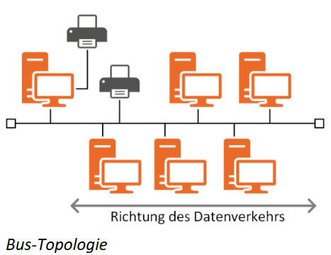
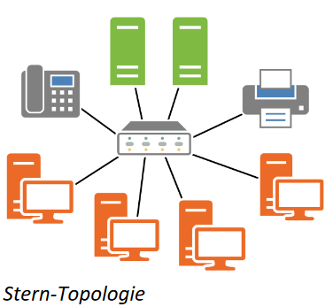
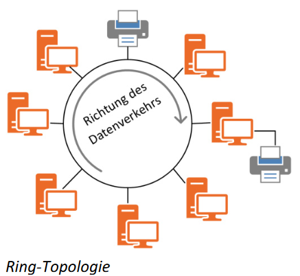
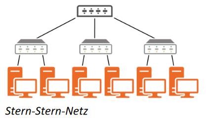
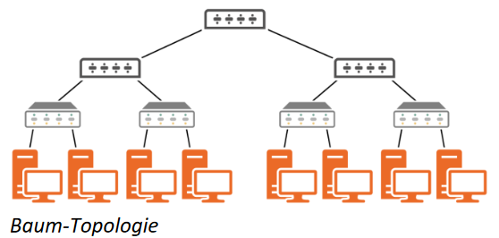
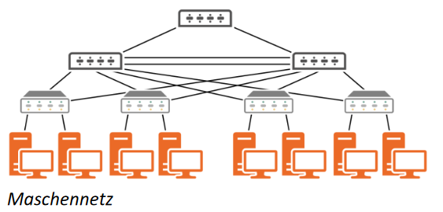

# Netzwerke

## Grundbegriffe und Konzepte zu Netzwerken
### Was ist ein Netzwerk
Das kleinstmögliche Netzwerk besteht aus zwei Endgeräten, die direkt per Kabel oder Funk
verbunden sind und Daten untereinander austauschen können. Das größtmögliche
Netzwerk ist die weltweite Variante und damit das Internet.
#### Was macht ein optimales Netzwerk aus
- jeder Benutzer kann einfach und schnell auf zentral gelagerte Arbeitswerkzeuge zugreifen
- Datenverkehr in zufriedenstellender Geschwindigkeit
- finanziell akzeptabler Rahmen für Natzwerkplanung, Umsetzung und Wartung
- ermöglicht übergreifende Kommunikation zwischen Systemen
- hohe Netzwerksicherheit
- möglichst durchgehende Verfügbarkeit und backup Möglichkeit für etwaige Serverausfälle

#### Was sind Herausforderungen bei der Planung
- Planung kosteneffektiver Erweiterbarkeit
- beste und gleichzeitig kostengünstigste Verkabelung (spätere Änderung bedeutet erheblichen Mehraufwand)

#### Was hat sich über die Jahre geändert
- Proprietäre (Hersteller eigene) Lösungen wichen Branchen weiten Standards, das bedeutet weniger individuelle und mehr genormte Hardware
- Anforderungen an Netzwerke sind deutlich gestiegen
  - müssen höhere Geschwindigkeiten aufbringen
  - müssen für intensivere Nutzung ausgelegt werden
  - benötigen erhöhte Sicherheitsstandards

### Netzwerkkonzepte
#### Peer to Peer
Das englische Wort “Peer” bedeutet “Gleichgestellte” oder “Ebenbürtige” und beschreibt das
Prinzip dieser Vernetzung. Prinzipiell sind alle Computersysteme in diesem Netz
gleichberechtigt und die Benutzer sind für die Sicherheit sowie Freigabe ihrer lokalen Daten
selbst verantwortlich.
- Lokal: Drucker- oder Netzwerksfreigaben
- Internet: Fielesharing Netze z.B. BitTorrent

*Wird genutzt für*
- Dateiverteilung und dezentrales Suchen von Daten - Verteilung von Daten führt zu
effizienterer Verbindungsauslastung
- Grid-Comupting - mehrere Computer werden lose zu einem Cluster gekoppelt, um
gemeinsam eine höhere Rechenleistung für eine bestimmte Aufgabe zu erzielen
- Cloud-Computing - bei Bedarf werden geräteunabhängig und schnell, meist über das
Internet, geteilte Dienstleistungen (Server, Datenspeicher, Applikationen)
bereitgestellt

*Vorteile*
- keine Extrakosten für Server
- Peer to Peer Vernetzung ist mit jedem gängigen Betriebssystem möglich und
vorintegriert

*Nachteile*
- keine zentrale Verwaltung von Benutzern und Ressourcen
- Sicherheitsrichtlinien nur eingeschränkt umsetzbar

#### Client Server
Wenn die Größe eines Netzwerkes die Sinnhaftigkeit des Peer to Peer Konzeptes übersteigt
und dieses unübersichtlich und schwer zu administrieren würde, kommt eine Client Server
Lösung zum Einsatz. Hierbei wird serverseitig eine Server-Anwendung oder Applikation
bereitgestellt, die passiv auf Anfragen wartet. Dem gegenüber steht die Client-Anwendung
auf dem PC des Benutzers, welche diese Anwendung aktiv anfragt. Server und Client
Anwendungen kommunizieren über das Protokoll, welches sämtliche Anweisungen und
zugehörigen Antworten definiert. Wenn mindestens ein zentraler Fileserver im Netzwerk
bereitsteht, spricht man von einem serverbasierten Netzwerk. Dieses verfügt meistens noch
über einen Domänecontroller.

*Vorteile*
- Höhere Netzwerksicherheit, da sowohl Server als auch Workstation von technischem
Personal verwaltet wird
- Client Server Vernetzung ist mit jedem gängigen Betriebssystem möglich und
vorintegriert
- Peer to Peer kann für ausgewählte Aufgaben (bspw. Filesharing) weiterhin genutzt
werden
- Einzelne Aufgaben können an speziell darauf ausgelegte Server verteilt werden -
erhöht die Sicherheit, da Server weniger Angriffsfläche bieten, je weniger Aufgaben
sie übernehmen
- Aufgaben können auf zwei Server gespiegelt werden, um den Betrieb bei einem
Ausfall weiterhin zu gewährleisten
- ermöglicht zentrale Benutzerverwaltung und Zugriffs- sowie Berechtigungskontrolle
durch Gruppenrichtlinien

*Nachteil*
- Höhere Kosten für Erstanschaffung der Server
- Notwendigkeit von Ersatz-Servern für den Fall eines Ausfalls
- Schulungskosten für Mitarbeitende in der der Administration

#### Serverarten
|Name|Beschreibung|
|:--:|:-----------|
|File Server|Eine oder mehrere schnelle und große Festplatten,  wird zur Speicherung großer Datenmengen genutzt,  verfügt im Normalfall über  ein eigenständiges Konzept zur regelmäßigen Datensicherung  z.B. auf Bändern|
|Print Server|Stellt zentrale Druckerdienste bereit,  Drucker-Steuerung über entsprechend ausgerüstete  Computer oder in Druckergerätenintegrierte PrintServer,  verminderte Druckkosten und effektivere Geräteauslastung|
|Application Server|Stellt zentral Anwendungen für das gesamte Netzwerk  bzw zugriffsberechtigte Benutzer zu Verfügung,  Programm Updates werden einmalig auf  dem Server statt jedem Client einzeln durchgeführt,  Anwendungen können entweder auf den Clients installiert oder  über webbasierte Dienste zu Verfügung gestellt und  bspw. via Remote-Desktop Lösungen genutzt werden (Terminal Server)|
|DNS Server|Auflösung von Namen zu IP-Adressen (**D**omain **N**ame **S**ystem)|
|DHCP Server|Zuweisung von IP-Adressen und Konfigurationen an Netzwerkkomponenten  (z.B. Rechner, Smartphones)  (**D**ynamic **H**ost **C**onfiguration **P**rotocol)|
|Mail Server|Netzwerke eigenes E-Mail System|
|Webserver|Hostet Websites entweder online (extern zugänglich) oder wahlweise im Firmeneigenen Intranet (nur intern zugänglich)|
|Datenbank Server|Via DBMS (**D**aten**b**ank**m**anagement**s**ystem)  können große Datenbestände gleichzeitig  für mehrere Benutzer zentral zur Verfügung gestellt werden|
|Proxy Server|Zieht Inhalte nach festgelegten Regeln aus dem Internet und  speichert diese für spätere Verwendung durch andere Clients zwischen|

### Aufwandsberechnung
#### TCO - **T**otal **C**ost of **O**wnership
Nach dem TCO Prinzip werden die Gesamtkosten eines Computer-Netzes erfasst, wozu
unter anderem die Anschaffungskosten für Hard- und Software, laufende Betriebskosten
(Energiekosten, Personalkosten, etc) sowie Ausfall- und Instandhaltungskosten gehören.

#### ROI - **R**eturn **o**n **I**nvestment
Nach dem ROI Prinzip wird eine Nutzen-Kosten-Relation aufgestellt. Das bedeutet, etwaig
zu hoch wirkende Kosten werden mit ihrem direkten praktischen Nutzen gegenübergestellt,
z.B. bedeuten Mitarbeiterschulungen zwar höhere Kosten, gleichzeitig aber auch
Zeitersparnis und verbesserte Verwaltbarkeit des Netzes.

### Netzwerkkürzel
#### LAN - **L**ocal **A**rea **Network**
- Kabelgebundenes Netzwerk mit begrenzter Reichweite von maximal ca 10km
- Netz unterliegt der Aufsicht der nutzenden Firma, in der Regel werden öffentlichen Leitungen genutzt

Definition der ISO (International Standards Organisation): “Ein lokales Netzerk dient der
bitseriellen Informationsübertragung zwischen miteinander verbundenen unabhängigenGeräten. Es befindet sich vollständig im rechtlichen Entscheidungsbereich des Benutzers
und ist auf sein Gelände begrenzt.”

#### MAN - **M**etropolitan **A**rea **N**etwork
- Kabelgebundenes Netzwerk mit regionaler Ausdehnung auf eine Stadt oder  ein Ballungszentrum, Reichweite von maximal ca 100km
- Auch Citynetz genannt

#### WAN - **W**ide **A**rea **N**etwork / GAB - **G**lobal **A**rea **N**etwork
- Kabelgebundenes Netzwerk mit unbegrenzter Reichweite
- Der Begriff GAB bezeichnet die Ausdehnung des Netzes auf globaler Ebene, sprich weltweit
- Auch Weitverkehrsnetz genannt
- Klassischer Weise ein Verbindungsnetzwerk für räumlich getrennte Rechenanlagen, 
als Verbindung mehrerer LANs
- Oftmals werden Leitungen externer Firmen hierfür angemietet

#### WLAN - **W**ireless **L**ocal **A**rea **N**etwork
- Kabellose Variante des LAN das stattdessen Funktechnologie nutzt
- Auch WaveLAN oder Wi-Fi genannt

#### PowerLAN / Powerline
- Ein PLC (Powerline Communication / PowerLAN Communication) nutzt statt eigener
Verkabelung das Stromnetz als Übertragungsweg
- Wird in der Regel im Privatbereich genutzt

#### VLAN - **V**irtual **L**ocal **A**rea **N**etwork
- unterteilt das lokale Netzwerk in logisch voneinander getrennte Netzwerke, die
weiterhin das selbe gemeinsame physikalische Netzwerk nutzen
- Nützlich für Arbeitsgruppen, die unabhängig ihres physikalischen Standort arbeiten

#### NAS - **N**etwork **A**ttached **S**torage
- Festplattenspeicher der in das lokale Netzwerk eingebunden wird
- Zugriff mit dateibasierten Protokollen wie NFS (Network File System) oder SMB
(Server Message Block) / CIFS (Common Internet File System)
- Wird im privaten und Gewerblichen Rahmen genutzt

#### SAN - **S**torage **A**rea **N**etwork
- Dient der Auslagerung der Datenspeicherung in ein eigenständiges Netzwerk
- arbeitet blockorientiert und wird wie ein normales Laufwerk dargestellt
- RAID (Redundant Array of Independent Disk) Systeme werden mit Servern
verbunden, dies geschieht über Fibre Channel oder ISCSI (Internet Small Computer
System Interface)
- ISCSI verwendet Kommandos des SCSI (Small Computer System Interface)
Standards und überträgt diese via IP (Internet Protocol)

#### VPN - Virtual Private Network
- ermöglicht eine verschlüsselte Verbindung zwischen PCs und Netzwerken

### Ziele der Vernetzung
#### Was wird von einem Computer-Netz erwartet
- Bietet Vorteile gegenüber Einzelplatzumgebung
- Ist jedoch mit eigenem Aufwand verbunden
- Der zu erwartende Nutzen muss vor der Entscheidung eines Netzwerks analysiert
werden
- Der Hauptgrund für die nicht unerheblichen Investitionen liegt letztendlich immer bei
den zu erwartenden ökonomischen und unternehmerischen Vorteilen

#### Verbesserte Kommunikation
- Dienen dem verstärkten Informationsaustausch (Kommunikation)
- Eine Anbindung an das öffentliche Internet kann zentral erfolgen und stellt damit
- eine Plattform zum weltweiten Austausch von Informationen aller Art dar.

#### Steigerung der Effektivität im Datenverbund
- Durch das Arbeiten von mehreren Personen am gleichen Thema, war der Transport
über Disketten eine gängige Lösung. Heutzutage können Daten über das Netzwerk
von einem auf den anderen Rechner kopiert werden
- Besteht ein Zugriff auf zentrale Datenbestände von jeder angeschlossenen Station
spricht man von einem Datenverbund.
- Datenverbände die räumlich getrennt auf versch. Rechnern gespeichert sind können
durch logisches Koppeln dem Benutzer als großer Datenpool erscheinen
- Effizienz des Netzes hängt stark von der Konzeption der Datenablage ab, wobei das
Suchen und Abspeichern von Daten einer vom Nutzer nachvollziehbaren und
sinnvollen Logik folgen muss
- Versionierung: Dient dazu eine ältere Version einer Datei bei Bedarf wiederherstellen
zu können (versehentliches löschen usw)

#### Einfache und effizient Datensicherung
- Da daten nur auf wenigen Rechnern abgelegt werden, ist die Datensicherung
einfacher durchzuführen
- Die Datensicherung ist Teil des Datenverbundes. Im Zusammenhang hiermit spielen
NAS und SAN eine zentrale Rolle

#### Kostensenkung im Funktionsverbund
- Über das Netzwerk kann beispielsweise ein Drucker von allen Stationen verwendet
werden
- Wird ein neues Programm installiert, kann dies zentral auf einem Rechner
geschehen und das Programm für die Nutzung durch angeschlossene Rechner
freigegeben werden, wodurch der Wartungsaufwand sinkt
- Der Betrieb eines Netzwerks bedeutet jedoch auch zusätzlichen personalaufwand,
aber auch viel Gewinn an Funktionalität für die Teilnehmer
- Funktionsverbund: verfügbare Ressourcen können mit Hilfe eines Netzwerkes allen
Beteiligten zur Verfügung gestellt werden

#### Absicherung der Verfügbarkeit
- Durch den verfügbarkeitsverbund soll das Netzwerk im Falle eines Ausfalls einzelner
Komponenten noch immer arbeitsfähig sein
- Redundanz: Andere Komponenten sollen die Funktionen der einzelnen nicht
arbeitsfähigen Geräte übernehmen wie z.B durch die Bereitstellung eines zweiten
Datenbank-Servers
- Teile des Netzwerks selbst sowie bestimmte Netzwerkkomponenten an kritischen
Stellen oft redundant ausgelegt
- Bei Ausfall eines Arbeitsplatzrechners ist es wichtig, dass ein Ersatzrechner mit
gleichen Funktionen und Software zur Verfügung steht

#### Optimierung der Rechner und Netzwerkauslastung
- Prozesse die mehr Rechenleistung übernehmen, sollen besser ausgestattete
Rechner übernehmen (Lastverbund)
- Indem mehrere Server identische Dienste bereitstellen, kann ein Client an jeweils
den Server vermittelt werden, der die geringste Netzwerklast hat

#### Optimierte Wartung
- Je großflächiger und komplexer die Komponenten des Netzwerks verteilt sind, umso
wichtiger wird es, Werkzeuge zu haben, die eine leichte Administration und Wartung
aller dezentralen Komponenten ermöglichen
- Ferndiagnos und Fernwartung unterstützen einen schnellen Service in dieser
Richtung (Hinzu kommt die zentralisierte Verwaltung von Hard- und Software)

### Ausblick
- Kein ende bei Entwicklung von Netzwerken
- Zusammenwachsen von Daten und Sprachnetzen ist in der heutigen Zeit immer
mehr gefragt (Konvergenz)
- Auch der Ruf nach einer all umfassenden Mobilität von Mitarbeitern und der damit
verbundenen ständigen Verfügbarkeit von Informationen überall auf der Welt stellt für
Netzwerke eine große Herausforderung in der Zukunft dar.
- Zugang zu Informationen sollte sehr gut geschützt werden (Sicherheitsaspekt)

### Räumliche Aufteilung und Fallbeispiel
Folgende fragen müssen bei der Planung des Netzwerks und bei der Ausstattung gestellt
werden:
- Welche Kabelwege existieren und wie können die benötigten Kabel verlegt werden?
- Welche Kabeltypen sollen verwendet werden?
- Wie werden die Daten über diese Kabel transportiert und welche Zusammenhänge
ergeben sich aus den verwendeten Bestandteilen des Netzwerkes?
- Mit welchen Betriebssystemen wird derzeit gearbeitet und wie soll der Betrieb
zukünftig aussehen?
- Wie zukunftsträchtig und wirtschaftlich ist die Planung?
## Normung und Modelle

### Gremien

#### Institute of Electrical and Electronics Engineers (IEEE)

Die IEEE ist zuständig für Standardisierung im raum Elektrotechnik. Dies beinhaltet Networking, Data Transfer und Wireless Data Networks.

| Nummer | Beschreibung                                                     | Status   |
|:------ |:---------------------------------------------------------------- |:--------:|
| 802.1  | Internetworking                                                  | aktiv    |
| 802.2  | Logical Link Control (LLC) -Teilschicht                          | inaktiv  |
| 802.3  | CSMA/CD, Ethernet                                                | aktiv    |
| 802.10 | Netzwerksicherheit                                               | aufgeöst |
| 802.11 | Drahtlose Netzwerke                                              | aktiv    |
| 802.12 | Demand Priority Access, 100VG AnyLAN                             | inaktiv  |
| 802.15 | Wireless Personal Area Network (WPAN)                            | aktiv    |
| 802.16 | Broadband Wireless Access Working Group                          | aktiv    |
| 802.17 | Resilient Packet Ring Working Group                              | aktiv    |
| 802.18 | Radio Regulatory TAG                                             | aktiv    |
| 802.19 | Coexistance TAG                                                  | aktiv    |
| 802.20 | Mobile Broadband Wireless Access (MBWA), drahtlose Breitbandnetz | aktiv    |
| 802.21 | Media Independent Handoff Working Group                          | aktiv    |
| 802.22 | Wireless Regional Area Networks, drahtlose Regionalnetze         | aktiv    |

#### International Organization for Standardization (ISO)

ISO ist eine Dachorganisation von 163 nationalen Normungsausschüssen, darunter die ANSI (American National Standards Institute) und DIN (Deutsches Institut für Normung). Die ISO ist selber aber auch teile der ITU-T.

Die Aufgaben der ISO ist, nationale Standards zu globalisieren und mit andern zu vereinen. Zum Beispiel ASCII (American Standard Code for Information Interchange) welche von der ANSI entwickelt und der ISO unter dem Namen ISO-9000 globalisierte wurde.

#### Internet Corporation for Assigned Names and Numbers (ICANN)

Sie ist primär zuständig für die Vergabe von Top-Level Domains, wie z.B. de, com, org und IP-Adressen im Internet. Sie deferieren auch die Strukturen für dienst DNS. Die Aufgaben von Verteilung von IP-Adressen haben einer Unterorganisierung weiter gegeben Namens IANA.

### OSI-Modell

#### Eine wichtige theoretische Grundlage

Das Open-System-Interconnection-Modell ermöglicht, den komplexen Ablauf bei der Übermittlung von Daten zwischen zwei Systemen logisch aufzuteilen. Der Blick auf das Netzwerk wird vereinfacht. Zudem bezieht sich jede Definition eines Netzwerkdienstes auf das OSI-Schichten-Modell bzw. auf das TCP/IP-Referenzmodell, welches ein noch weiter vereinfachtes Modell darstellt.

#### Herleitung und Übersicht

Um die Datenkommunikation in offenen System zu beschreiben, entwickelte die ISO 1977 ein abstraktes, logisch-funktionelles Architekturmodell, mit der Zielsetzung einen einheitlichen Standard zu schaffen. Erstmalig veröffentlicht wurde das Modell ISO 7498 1978. Später, 1978, wurde die heutige und somit überarbeitete Version unter dem Namen OSI-Modell veröffentlicht.

#### Überblick über das OSI-Referenz-Modell

Die gesamte Netzwerkkomunikation wird in ein Modell aus sieben Schichten eingeteilt. Die folgende Tabelle gibt, von oben nach unten, einen Überblick über die englischen und deutschen Bezeichnungen der einzelnen Schichten sowie eine kurze Beschreibeng der jeweiligen Aufgabe.

**Image Space**

Wie funktioniert das OSI-Modell? Wenn man beispielsweise eine E-Mail versendet, durchläuft diese alle sieben OSI-Schichten, bis zum Empfänger.

****

**Eine gute Erklärung des OSI-Modells findet ihr unter [folgendem Link](https://www.youtube.com/watch?v=_kDogzR0-4Q)**

****

**Gehen wir einmal weiter auf die einzelnen Protokolle ein:**
Im TCP/IP Schichten-Modell wird zwischen Application-, Transport-, Internet- und Netzwork Access Layer unterschieden. Im Application Layer gibt es Protokolle wie SMTP was z.B Emails empfängt.

****

**Unterschiede zwischen TCP und UDP:** 
​​​​​​*Wichtig zu Wissen:* 
Im OSI-Modell entspricht jede Schicht einer genau definierten Funktion. Zudem soll zwischen den Schichten der Informationsfluss so gering wie möglich sein. Außerdem kann eine Schicht nur mit der darüber oder darunterliegenden Schicht kommunizieren. Die Anzahl der Schichten soll dennoch so gering wie möglich sein, da neue Schichten einen neuen und höheren Abstraktionsgrad darstellen.

****

**Vorteile des OSI-Modells:** 
Der wichtigste Vorteil ist, dass das Verfahren innerhalb einer Schicht durch ein anderes ausgetauscht oder ergänzt werden kann, ohne dass Änderungen auf anderen Schichten vorgenommen werden müssen.

*Header* 
Beim Weitergeben stellt jede involvierte Schicht des Senders (mit Ausnahme von Schicht 1) den erhaltenen Daten einen Header voran, der von der entsprechenden Schicht auf der Seite des Empfängers interpretiert und wieder entfernt wird. Der Header die vom Kommunikationspartner in der jeweiligen Schicht wichtigen Steuerinformationen und stellt den wichtigen Teil der virtuellen Kommunikation zwischen den Instanzen gleicher Schichten her.

#### 1. Physical Layer (Bitübertragende-Schicht)

Der Physical Layer meint alles, was für die Übertragung (Senden-Empfangen) einzelner Datenbits über ein Medium notwendig ist.

Dazu werden im mechanischen Teil die physikalischen Eigenschaften des Interface zu einem Übertragungsmedium (z. B. Steckergeometrie, Pinbelegung) bestimmt.

Der elektrische bzw. optische Bereich wiedergibt, wie die Datenbits auf dem Medium dargestellt werden. Daraus ergibt sich eine maximal erreichbare Datenübertragungsrate.

Die funktionalen Bestimmungen befassen sich mit dem Aufbau von Verbindungen, wie z. B. der Unterscheidung zwischen Datenleitung – Steuerungsleitung oder Taktgebung.

Die verfahrenstechnischen Bestimmungen definieren u. a. den Übertragungsmodus (Halb-, Vollduplex).

#### 2. Data Link Layer (Sicherungs-/Datenverbindungs-Schicht)

Der Data Link Layer wandelt die Daten des Network Layers in Frames (Daten[1]rahmen unterschiedlicher Größe) oder Zellen (Datenrahmen fester Größe) um und reicht sie an die Bitübertragungs-Schicht weiter und auch umgekehrt.

Zu den Aufgaben gehört ebenfalls das Zerlegen von Frames in Bits für die Übertragungs-Schicht und das Zusammensetzen der Bits. Der Data Link Layer verbindet somit zwei an ein gemeinsames Medium angeschlossene Teilschichten (Network Layer/Physical Layer).

Ein Frame besteht bei Ethernet aus einem Header (den Adressen von Empfänger und Sender sowie Steuerinformationen), den Daten sowie einem angehängten Trailer. Ebenfalls darin ent[1]halten ist die Frame Check Sequence (FCS), um zu erkennen, ob die Daten fehlerfrei übertragen wurden. Für die Berechnung der Frame Checksum wird in der Regel ein Cyclic Redundancy Check (CRC) Algorithmus verwendet.

#### 3. Network Layer (Vermittlungs-/Netzwerk-Schicht)

Die als besagte Schicht ist für die Wegfindung (Routing) der Pakete über verschiedene Netzwerkknoten. Andere Aufgaben sind die Kontrolle der Pakete und schließlich der Transport der Pakete zu den Zielknoten (Messages Forwarding). Auf Layer 3 finden sich auch wichtige Protokolle für die Wegefindung (Internet Protocol Version 4 und 6 (IPv4/IPv6)) und Statusmitteilungen (Internet Control Message Protocol (ICMP/ICMPv6)).

#### 4. Transport Layer (Transport-Schicht)

Der Transport Layer realisiert eine verbindung von Endsystemen über eine transparente Verbindung (Ende-zu-Ende-Kommunikation). Weitere Aufgaben sind die Teilung des Datenstroms, die Anregung des erneuten Sendens von fehlenden Datensegmenten, falls keine Empfangsbestätigung vom Empfänger eintrifft (bei Verwendung des Transmission Control Protocols (TCP)) und die Überwachung der Netzlast (Congestion Control) zwischen den benachbarten Netzknoten. Die Transport-Schicht vermittelt den darüber liegenden, Anwendung-Schichten und den darunterliegenden, transportorientierten Schichten.

#### 5. Session Layer (Kommunikationssteuerungs-/Sitzungs-Schicht)

Im OSI-Kommunikationsmodell verwaltet die Sitzungsschicht (Session oder manchmal auch Port Layer genannt) den Auf- und Abbau der Verbindung zwischen kommunizierenden Endgeräten. Eine Verbindung wird aufrechterhalten, während sich die beiden Endpunkte miteinander unterhalten. 

#### 6. Präsentation Layer (Darstellungs-/Präsentations-Schicht)

Der Präsentation Layer wandelt die Daten in ein allgemeines, vereinbartes und für die beteiligten Computer verständliches Standardformat (Abstract Syntax Notation One (ASN.1)) um. Dies ist notwendig, da sich die innere Darstellung von Daten (z. B. in den Zeichencodes ASCII, ANSI, EBCDIC) je nach eingesetztem System unterscheidet. Sie komprimieren Daten und kodieren.

#### 7. Application Layer (Anwendungs-Schicht)

Der Application Layer erstellt die Schnittstelle zwischen den Anwendungen (Programmen) und dem darunterliegenden Netzwerk. Zu diesem Zweck stehen den Anwendungen diverse Protokolle zur Verfügung. Zwei der bekanntesten sind das Hypertext Transfer Protocol (HTTP) und das Simple Mail Transfer Protocol (SMTP).

### Frames Der Aufbau eines Ethernet-V2-Rahmens (nach IEEE 802.3)

Grundsätzlich werden größere Datenmengen nicht in einem Stück verschickt, da es zeitweise den Netzwerk-Zugriff für alle anderen Teilnehmer sperren kann. Um dieses Problem zu vermeiden, werden größere Datenmengen in kleinere Einheiten, sogenannte Frames, Rahmen oder Datagramme, zerlegt. Mehrere Benutzer können abwechselnd Rahmen verschicken, wodurch ein nahezu zeitgleicher Netzwerkzugriff möglich wird.

Bei der Konfiguration eines Netzinterfaces kann eine sogenannte Maximum Transmission Unit (MTU) angegeben werden. Sie definiert die maximale Größe eines Datagramms. Daten, die diese Länge überschreiten, werden immer in mehrere Frames aufgeteilt und danach über das Netzwerk versendet.

Um sicheren Datenverkehr zu gewährleisten, müssen die Daten mit entsprechenden Informationen versehen werden. Der Aufbau eines Rahmens nach IEEE 802.3 ist dabei immer:
   
Ein Ethernet-V2-Rahmen hat, ohne VLAN-Tag, eine Rahmengröße zwischen 64 und 1518 Bytes und folgenden Aufbau:

- Die Präambel enthält ein Bitmuster, das es den Netzwerkkarten ermöglicht, ihre Empfangs- Elektronik zu synchronisieren. Sie endet mit dem sogenannten Start Frame Delimiter (SFD), der den Beginn des eigentlichen Frames anzeigt.
- Als Ziel- und Ursprungs-Adresse werden die MAC-Adressen der beteiligten Netzwerk- Schnittstellen eingetragen.
- Im Typ-Feld wird die Art des darüber liegenden Protokolls angegeben, zum Beispiel ob es für IPv4 oder IPv6 bestimmt ist.
- Der Daten-Teil hat eine Größe zwischen 46 und 1500 Bytes.
- Als Frame-Kontroll-Sequenz (FCS) wird ein CRC-Algorithmus eingesetzt. Anhand der FCS kann erkannt werden, ob der Rahmen korrekt übertragen wurde.
- Wenn ein Netzwerk über einen oder mehrere Switche in virtuelle Netzwerke aufgeteilt ist, erhält jeder Frame im Datenteil, zur Identifizierung der VLANs, zusätzlich ein 4 Byte großes Feld, das VLAN-Tag
- ein Frame zu groß, erhält der Absender eine Fehlermeldung per ICMPv6, damit er die MTU reduziert

Es existieren neben dem Ethernet-V2 noch andere Frame Definitionen, die veraltet sind. Ethernet-V2 besitzt kein Längenfeld, dafür ein Typfeld mit Informationen über das Protokoll der Nutzdaten im Datenteil.

## Netzwerkkomponenten

### Übersicht

Die Verschiedenen Komponenten können nach dem OSI-Modell verschiedenen Schichten zugeordnet werden. Mit den Schichten steigt auch die Komplexität dieser Geräte.

### Repeater und Hub (Schicht 1)

*Repeater:* Verstärkt ein Signal (drahtlos oder kabelgebunden), sodass eine Längenbeschränkung eines Mediums erweitert werden kann. Bei Umwandlung eines Signals von drahtlos zu kabelgebunden oder umgekehrt nennt man diesen auch Medienkonverter.

*Hub:* Stellt mehr Ports zur Verfügung, allerdings handelt es sich um eine Bus-Topologie, und somit ein Shared Medium. Zu Lastspitzen wird die Bandbreite also stark ausgebremst, was ein Grund für die Ablösung von Hubs durch Switches ist.

*OSI-Einordnung:* Beide Komponenten arbeiten auf Schicht 1, d.h. sie regenerieren ausschließlich Bits, sie haben keinerlei Einblick in den Inhalt.

### Bridge (Schicht 2)

Verbindet lokale Netzwerksegmente über zwei Ports miteinander und nutzt dabei MAC-Adressen, die bei "Learning Bridges" für effizienteren Datenverkehr gespeichert werden

### Switch (Schicht 2)

#### Definition

Ein Switch bringt alle Vorteile eines Multiport-Bridge auf mehrere Ports. Des weiteren läuft es auch auf Schicht 2 des OSI-Modells. Durch das Schalten von Verbindungen ist es für miteinander kommunizieren von Geräten wie eine direkt Verbindung.
Per Kaskadierung lässt sich mit Switch eine Vergrößerung der Gesamtportanzahl ermöglichen. Das verursacht einen Flaschenhals für Datenverkehr und die Latenzzeit erhöhen sich. Dieses Problem wird mit Stacking gelöst. Vor allem bei einer Kaskadierung können sehr viele Geräte miteinander verbunden sein, daher verfügen bereits Desktop-Switches über internen Speicherplatz für 1000 und mehr MAC-Adressen

Es gibt zwei Sorten an Switches. 
**Managed Switches** 
Die meist per Webinterface Konfiguriert werden können. 
**Desktop Switches** 
Sie sind meistens ungemanaged und daher nicht Konfigurierbar, aber dafür sofort einsetzbar. 

#### Arbeitsweise

### Router (Schicht 3)

**Definition:** Router oder Netzwerkrouter sind Netzwerkgeräte, die Netzwerkpakete zwischen mehreren Rechnernetzen weiterleiten können.

**Funktionen:** Ein Router besitzt mehrere Schnittstellen und nimmt Datenpakete über diese in Empfang. Anschließend wertet er die Netzwerkadressen der Pakete aus und fällt anhand dieser die Entscheidung, über welche Schnittstelle er dstas Paket weiterleitet. Für die Entscheidungsfindung nutzt er seine lokale Routing-Tabelle.

### Firewall

Zum Schutz des lokalen Netzes ist eine Firewall unabdingbar und kann je nach Funktionsumfang auf den Layern 2 bis 7 anhand festgelegter Regeln mit drei Aktionen filtern

**Allow** Verkehr wird durchgelassen 
**Deny** Firewall verwirft Daten, keine Fehlermeldung 
**Reject** Daten werden abgelehnt mit Fehlermeldung

Es gibt Verschiedene Implementierungsverfahren je nach Anforderung. Man unterscheidet zwischen:

<u>**Paketfilter**</u> sind die einfachste Variante einer Firewall dar. Hierbei wird der Header bei Layer 3 und 4 Protokolle überprüft und je nach Filter zugelassen oder gesperrt
Nachteile sind z.b. der Missbrauch von Protokollfunktionen oder eine Verschleierung durch Verwendung von erlaubter Ports für auf Port x nicht erlaubte ohne dass diese Gefiltert werden

**<u>Stateful Inspection Firewall</u>** ist eine Weiterentwicklung des Paketfilters und kann sich zusätzlich benei Status und Kontextinformationen merken

## Kopplung von Netzwerken

### Sind die folgenden Geräte „aktiv“ oder „passiv“?

| Gerät                                                 | Aktiv/Passiv    |
| ----------------------------------------------------- | --------------- |
| Hub (Schicht 1)                                       | Passiv          |
| Bridge (Schicht 2)                                    | Passiv          |
| Switch (Schicht 2)                                    | Passiv, (Aktiv) |
| Router (Schicht 3)                                    | Aktiv           |
| Staeful-InspaStateful-Inspection-Firewall (Schicht 4) | Aktiv           |
| Layer-4-Switch (Schicht 4)                            | Aktiv           |
| Application Layer Firewalls (Schicht 7)               | Aktiv           |
| Proxy (Schicht 7)                                     | Aktiv           |
| Gateway (Schicht 7)                                   | Aktiv           |

### Funktionsweisen der verschiedenen Netzwerkgeräte

<u><strong>Hub</strong>:</u> zentraler Verteiler basierend auf der klassischen Bustopologie, arbeitet wie Repeater auf der 1. Schicht des OSI-Modells, für andere Geräte transparent (nicht sichtbar)

<u><strong>Bridge</strong>:</u> verbindet lokale Netzwerksegmente miteinander, arbeitet auf der 2. OSI-Schicht, leitet Frame-Informationen anhand der MAC-Adresse weiter, im Unterschied zu Repeatern, Hub kann eine Bridge unterschiedliche Übertragungsraten, oder Zugriffsverfahren umsetzen, transportiert Datenframes anhand der MAC-Adresse

Eine Learning-Bridge erstellt und aktualisiert Adresstabellen automatisch, lernt die Adressen durch Mitlesen der Absenderadressen (Quell- und Source Adresse) aller ankommenden Frames, Zuordnung dieser zu den entsprechenden Ports.

<u><strong>Spanning-Tree-Algorithmus</strong>:</u> Verfahren um redundante Verbindungen im Netzwerk ohne Schleifen zu betreiben. Die Bridges haben feste Routen zwischen Endpunkten und bei Störungen alternative Routen

<u><strong>Switch</strong>:</u> Multiport-Bridge, welcher Vorteile der Bridge auf mehrere Ports verteilt, durch „switchen“ ist es für angeschlossene Geräte so, als ob sie direkt miteinander verbunden wären, durch „Kaskadierung“ Vergrößerung der Gesamtportanzahl möglich, viele Geräteverbindungen bei „Kaskadierung“ möglich à Desktop-Switche Speicherplatz für 1000 und mehr MAC-Adressen, Managed-Switche können per Webinterface konfiguriert werden (bspw. VLANs), interne Verdrahtung mit sehr hoher Geschwindigkeit erforderlich, um Frames schnell zwischen Ports zu vermitteln.

<u><strong>Router</strong>:</u> koppelt getrennte Netzwerke mit unterschiedlichen Adressräumen, oder verschiedenen Netzwerktechnologien, kann Netzwerke in Subnetze aufteilen à Kopplung kann Verbindung zwischen zwei oder mehr lokalen Netzen, oder Verbindung zwischen LAN, WAN, bzw. WAN und WAN sein, à Vermittlung wesentliche Funktion, einfachste Funktion ist PC mit mehreren Netzwerkadaptern, die jeweils Kontakt zu unterschiedlichen Netzwerken haben, multiprotokollfähig, Hauptfunktion besteht in Pfadbestimmung (Routing) à Schicht 3

<u><strong>Firewall</strong>:</u> sowohl zum Schutz des lokalen Netzes, als auch zwischen Intranet und Internet Filterung unabdingbar, kann Abhängig von Funktionsumfang ein- und ausgehenden Datenverkehr auf Layern 2-7 anhand festgelegter Regeln filtern. Drei Funktionen sind erlaubt: Allow, Deny, Reject

Thema NAT spielt wichtige Rolle im Bezug darauf, wie Firewalls anderen Netzwerkteilnehmern erscheinen

<u><strong>Stateful Inspection Firewall</strong>:</u> (erstmals vom Hersteller Checkpoint vorgestellt), Weiterentwicklung des Paketfilters, merken von aktuellen Status- und Kontextinformationen, bzw. diese bei der Filterung zu berücksichtigen, durch spezielle Filterregeln kann Schutz vor DOS-Attacken erreicht werden

<u><strong>Gateway</strong>:</u> verbindet Netzwerke mit unterschiedlichen Protokollen und Adressierungen, steht als Oberbegriff für Vermittlung und Umwandlung aller 7 Schichten des OSI-Modells, kann inkompatible Netze miteinander verbinden und im Extremfall ankommende Nachrichten bis auf Schicht 7 entpacken, wird teilweise auch als Synonym für Router verwendet         à wandelt real ein Protokoll in ein anderes um

<u><strong>Multifunktionsgeräte</strong>:</u> enthalten mehrere Komponenten, bspw. DSL-Router, wie Fritz-Box bestehen nicht nur aus DSL-Modem und einem Router, sondern bieten daneben noch weitere Funktionalitäten, wie ein Switch, ein Access Point für WLAN-Verbindung. Daneben sind oft auch Features, wie eine Telefonanlage mit DECT-Basis, Druckserver, USB-Anschluss, sowie Funktionen als Media-Server (NAS), DNS- und DHCP-Server mit einem solchen Multifunktionsgerät möglich.

## Topologien

### Begriff Topologien

**Physikalische Topologie:** der Weg, auf dem Daten durch Kabel transportiert werden.

-Verkehrswege

-Netzaufbau Beschreibung

-Struktur der verbundenen Netzwerkkomponenten

**Logische Topologie:** hingegen beschreibt, nach welchen Regeln diese Daten transportiert werden

-beschreibt die grundlegenden Verkehrsregeln

-Regeln der Netzwerkzugriffsverfahren auf das Übertragungsmedium

Die Wahl der physikalischen Topologie bestimmt welche Kabel verwendet werden können oder wie flexibel das Netzwerk für weitere Benutzer ausbaufähig ist.

**Weitere Aspekte:**

- Ausfallsicherheit

- Geschwindigkeit

- Verfügbare Bandbreite  

- Anfallende Kosten

### Bus

**Die Bus-Topologie:**

Ein einzelnes zentrales Kabel -> Bus.

Alle Geräte daran angeschlossen und teilen sich dieses Medium (Shared Medium, auch Shared Media genannt)

Die Bus-Topologie ist eine passive Topologie

-> Die angeschlossenen Stationen führen keine Wiederaufbereitung des Signals durch. Sie greifen die Signale vom

Die Bus-Topologie:

Ein einzelnes zentrales Kabel -> Bus.

Alle Geräte daran angeschlossen und teilen sich dieses Medium (Shared Medium, auch Shared Media genannt)

Die Bus-Topologie ist eine passive Topologie

-> Die angeschlossenen Stationen führen keine Wiederaufbereitung des Signals durch. Sie greifen die Signale vom

Kabel ab oder senden auf das Kabel, wo sich das Signal in beide Richtungen ausbreitet. ---> Diffusionsnetz

Die Bus-Enden müssen mit speziellen Abschlusswiderständen (Terminatoren) versehen werden, um ein rücklaufendes Signal, welches das Nutzsignal überlagert, auszuschließen.

**Nachteil:**  
Eine Störung des Übertragungsmediums an einer einzigen Stelle im Bus (defektes Kabel, lockere Steckverbindung etc.) blockiert den gesamten Netzstrang.

### Stern

**Stern-Topologie:** 

Bei Netzen in Stern-Topologie sind an einen zentralen Teilnehmer alle anderen Teilnehmer mit einer Punkt-zu-Punkt-Verbindung angeschlossen.

**Merkmal**:

- Jedes Gerät nutzt ein eigenes Kabel

 **Vorteile**

- Der Ausfall eines Endgerätes hat keine Auswirkung auf den Rest des Netzes.

- Hohe und verschiedene Übertragungsraten möglich

- Leicht erweiterbar

- Leicht verständlich

- Leichte Fehlersuche

- Sehr gute Eignung für Multicast-/Broadcastanwendungen

- Einfaches Routing im Sternverteiler
  
  **Nachteile**

- Durch Ausfall des Verteilers wird Netzverkehr unmöglich

### Ring

**Ring-Topologie:**

Bei der Vernetzung in Ring-Topologie werden jeweils zwei Teilnehmer über Zweipunktverbindungen miteinander verbunden, so dass ein geschlossener Ring entsteht.

**Merkmal**:

- Jedes Gerät ist mit zwei Nachbarn verbunden.

- Es gibt keinen Kabelanfang und kein Kabelende.

- Jede Station hat einen eindeutigen Vorgänger und einen eindeutigen Nachfolger.

- Datenverkehr findet immer nur in eine Richtung statt.

**Vorteile**

- Deterministische Rechnernetzkommunikation ohne Paketkollisionen-Vorgänger und Nachfolger sind definiert
- Alle Stationen arbeiten als Verstärker
- Alle Rechner haben gleiche Zugriffsmöglichkeiten
- Garantierte Übertragungsbandbreite
- Skaliert relativ gut, Grad bleibt bei Erweiterung konstant
- Reguläre Topologie, daher leicht programmierbar
- Kostengünstig
- wenig Verkabelung und Installationsaufwand

**Nachteile**

- Niedrige Bisektionsweite und Konnektivität
- Bei Verwenden eines Ringverteilers lange Signalwege mit häufigem Empfangen und Weitersenden, d. h. hohe Latenzen zu entfernten Knoten
- Datenübertragungen können leicht abgehört werden.
- Langsamere Datenübertragung bei vielen angeschlossenen Endgeräten.
- Relativ hoher Energieaufwand
- Ohne Ringverteiler hoher Verkabelungsaufwand, da das Bilden eines echten Rings häufig der (Büro-)Raumaufteilung entgegensteht.

### Mischformen

**Topologie-Kombinationen**

- Bei größeren Netzwerke können Kombinationen der aufgeführten Topologien entstehen

**Backbone**

- physikalische Verbindung mehrerer Teilnetze
- Hintergrundnetz, z. B. die Verbindung verschiedener Gebäude oder Etagen und deren jeweiliger Einzelnetze

**Stern-Stern-Netz**

- Switche bilden jeweils das Zentrum eines Sterns und diese sind wiederum über Kabel mit einem zentralen Switch oder Multilayerswitch verbunden

**Baum**

- eine Menge von Verzweigungen zu weiteren Verteilungsstellen
- Erweiterung eines Stern-Stern-Netzes auf mehrere Ebenen
- eignet sich gut für die Vernetzung eines Firmengeländes auf mehreren etagen

**Maschennetz**

- zwischen den einzelnen Netzknoten jeweils mehrere Verbindungen
- bei Ausfall einer Verbindung auf redundante Verbindung zurückgreifen
- benötigen viel mehr Verkabelung

## Wolke (Cloud)

- Cloud = bestimmten Vernetzungen, wie Asynchronous Transfer Mode (ATM)
- von außen nicht zu erkennen, welches Gerät in einem Netzwerk die Daten transportiert oder wo diese gespeichert sind

## Erweiterung eines Netzwerkes

### Allgemein

Eine Erweiterung von Netzen ist erforderlich, wenn die Anzahl der Nutzer oder die Anforderung an das Netz (z.B. Datenmenge) steigt.

Bei einer Erweiterung stellen sich auch fragen bezüglich neuen Aspekten:

- Soll das Netz in mehrere Einzelsegmente unterteilt werden

- Welche Komponenten werden benötigt um eine Erweiterung physikalisch zu realisieren

- Planung der Topologien un den Netzwerkverkehr effizienter zu gestalten

- Maßnahmen um gesteigerten Sicherheitsanfordungen gerecht zu werden

### Verkabelung

Grundsätzlich bei einer neuen Verkabelung gilt es die Zukunfssicherheit mit einzuplanen, da die Kosten für eine regelmäßigen Verkabelungen zu hoch wären

<u>Strukturierte Verkabelung</u>:

Zu verkabelung von Gebäuden hat sich in Europa die Norm EN 50173 etabliert, sie sieht eine Dreiteilung der Gebäudeverkabelung in den primären, sekundären und tertiären Bereich vor.

Die <u>primäre Verkabelung</u> verbindet einzelene Gebäude, meist über Lichtwellenleiter miteinander, sie soll hohe Datenraten über größer Entfernung realisieren.

Bei der <u>sekundären Verkabelung</u> handelt es sich um die Verkabelung zwischen den Etagen in einem Gebäude, welche auch vorrangig durch LWL realisiert werden sollte.

Mit dem <u>Tertiären Bereich</u> ist das Netzwerk in einer Etage gemeint, welches hauptsächlich Twisted-Pair Kabel nutzt.

Vorteil:

-  Die Verkabelung ist anwendungsneutral, d.h. es können alle Informationen über das gleiche Medium übertragen werden

- Ist aufgrunde Struktur flexibel erweiterbar und ausfallsicher

<u>Collapsed Backbone</u>

Bei dieser Art der Verkabelung werden alle Netzsegmente an einem einzigen Gerät angeschlossen, was nicht der Norm EN 50173 entspircht.

Der größte Vorteil liegt im einfachen Netz-Management, da man die Verwaltung nun zentral an einem Gerät dürchführen kann.

Allerdings kann es bei einem Ausfall dieses zentrale gerät zu einem kompletten Ausfal des Netverkehrs in einem Gebäude kommen.

### VLAN (Virtual Local Network)

Ein VLAN ist eine geschlossen logische Gruppe innerhalb eines physikalischen Netzwerkes,

so kann man z.B. Gruppe trennen, die eigentlich an einem Switch angeschlossen sind und damit physikalisch verbunden sind. Das funktuniert auch dann, wenn zwischen den zugehörigen Geräten mehrere Switches liegen, damit kann man einen Arbeitsplatz verlegen und trotzdem im gleichen VLAN verbunden sein.

Bei einem portbasierten VLAN, werden einem Switch zugewiesen, d.h. die Geräte einer Gruppe müssen an diesen Ports angeschlossen sein.

MAC-Adressenbasite VLANs arbeiten mit dem physischen Adressen der Geräe um sie dem Netzwerk zuzuweisen, was einen einfachen Umzug der Geräte innerhalb eines Gerbäudes ermöglichen, da man hierbei nicht den Port beibehalten oder einen neuen hinzufügen muss. 

Allerdings ist diese Zuordnung unsicher und somit nicht für sicherheitsrelevante Aufgabe zu gebrauchen. 