# Protokolle und Dienste

## 2 Netzwerkmodelle

*Lukas*

## Die TCP/IP-Protokollsammlung

*Erin, Peter, Aron*

### Protokolle

#### IP (Internet Protokoll) Protokoll: (OSI Layer 3)

das wichtigste Protokoll der TCP/IP Protokolle. Es existiert in den Versionen 4 und 6. Ist für die Übermittlung von TCP und UDP Datagrammen zuständig und kümmert sich auch um die Vermittlung im Netzwerk.

#### ARP/ReverseARP (Adress Resolution Protocol) (OSI Layer 2)

Das ARP Protokoll wird zur Ermittlung von Hardware-Adressen (MAC-Adressen) benutzt. Mit Reverse ARP wird einer Bekannten MAC-Adresse eine IP Adresse Zugeordnet. Hierfür wird ein MAC Broadcast versendet in dem das System mit Zugehöriger IP-Adresse aufgefordert wird dem anfragenden System seine MAC-Adresse mitzuteilen.

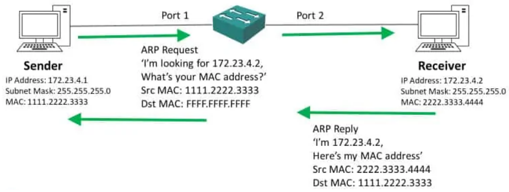

#### ICMP (Internet Control Message Protocol) (OSI Layer 3)

Das ICMP wird bei der Ermittlung von Fehlern bei der Übertagung von IP-Paketen benutzt. Die bekannteste Anwendung findet es hierbei an dem PING Befehl.

#### TCP (Transmission Control Protocol) (OSI Layer 4)

Das TCP Protokoll wir bei dem Verbindungsorientieren Datentransport verwendet. Das Protokoll führt bei einem Dateitransport eine Sequenzielle Empfangsbestätigung durch. Sollte bei einer Datei diese nicht erfolgreich sein, werden diese nochmals versendet.

#### UDP (User Datagram Protocol) (OSI Layer 4)

Auch UDP ist für den Datentransport zuständig, jedoch führt dieses Protokoll keine Empfangskontrolle der Dateien durch.

### Interaktion zwischen Protokollen und Diensten

#### SAP (Service Access Point)

Bei der Netzwerkkommunikation benötigen wir mehrere Protokolle die den Transport von Daten sicherstellen. Damit die Daten von der jeweiligen Schicht an den richtigen Dienst weitergeleitet werden müssen die dafür zuständigen Ports angesprochen werden. Diese werden als SAP (Service Access Point) betitelt.

#### Standardisierte Ports

Bei der Portfreigabe gibt es drei Gruppierungen: Well known Ports (0-1023), registrierte Ports (1024-49151) und Private Ports (alle ab 49152).

#### Well known Ports

| Port | Service  | Protokoll | Beschreibung                                  |
| ---- | -------- | --------- | --------------------------------------------- |
| 20   | FTP-data | TCP/UDP   | File Transfer Protocol Data                   |
| 21   | FTP      | TCP/UDP   | File Transfer Protocol Control                |
| 22   | SSH      | TCP       | SSH Remote Login Protocol                     |
| 23   | Telnet   | TCP       | Telnet                                        |
| 25   | SMTP     | TCP       | Simpler Mail Transfer Protocol                |
| 53   | DNS      | TCP/UDP   | Domain Name System                            |
| 80   | http     | TCP       | Hypertext Transfer Protocol                   |
| 110  | Pop3     | TCP       | Post Office Protocol 3                        |
| 143  | Imap4    | TCP       | Interner Message Access Protocol 4            |
| 443  | https    | TCP       | Hyper Text Transfer Protocol over TLS/SSL     |
| 993  | IMAPS    | TCP       | Internet Message Access Protocol over TLS/SSL |
| 995  | POP3s    | TCP       | Post Office Protocol 3 over TLS/SSL           |

#### Die MAC-Adresse

Die MAC-Adresse (Media Access Control) ist im Gegensatz zu der IP-Adresse nicht vorgesehen verändert zu werden. Sie ist eine Physikalische Adresse welche der Netzwerkschnittstelle seitens des Herstellers zugewiesen wird. Sie besteht aus 48 Bit und wird als ein 12-stelliger Hexadezimal-Wert dargestellt bspw. 00:3C:DE:12:34:56. Die MAC-Adresse sollte weltweit eindeutig und einmalig sein. Falls es z.B. in einem Netzwerk eine MAC-Adresse doppelt geben sollte kann es bei einem DHCP-Server zu einem Datenbankkonflikt führen.

## Das Internet-Protokoll IP

*Jan, Timo*

### Vergleich mit dem Aufbau einer IP- Adresse:

Eine IPv4- Adresse Lautet z.B. 73.152.132.197

Diese ist die Dezimale schreibweise für die binäre Adresse:

0100 1001. 1001 1000. 1100 0101.

### Netzwerkklassen

Netzklassen waren eine von 1981 bis 1993 verwendete Unterteilung des IPv4-Adressbereiches im Internet Protocol in Teilnetze für verschiedene Nutzer. Von der Netzklasse konnte die Größe eines Netzes abgeleitet werden, d. h. bei IPv4 die Anzahl der Bits für den Netzanteil in der IP-Adresse

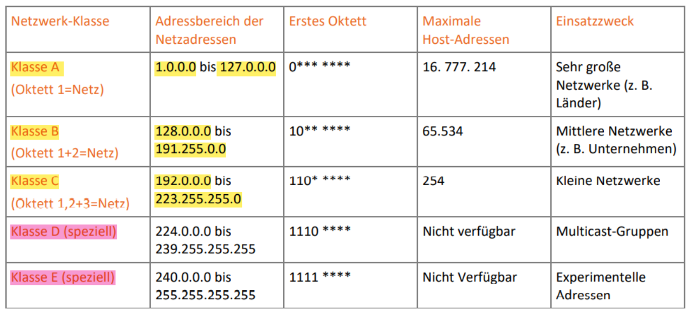

### Subnetzmaske

Die Netzmaske, Netzwerkmaske oder Subnetzmaske legt in Rechnernetzen in Verbindung mit der IP-Adresse fest, welche IP-Adressen ein Gerät im eigenen Netz ohne die Zuhilfenahme eines Routers erreichen

Eine Subnetzmaske besteht aus einer Reihe von binären Einsen gefolgt von einer Reihe von binären Nullen. Sie ist – wie jede IP-Adresse – 32 Bit lang und wird in vier Oktette aufgeteilt, die wiederum mittels Punkten voneinander getrennt sind, z. B.

1111 1111. 1111 1111. 0000 0000. 0000 0000. Bzw. dezimal 255.255.0.0

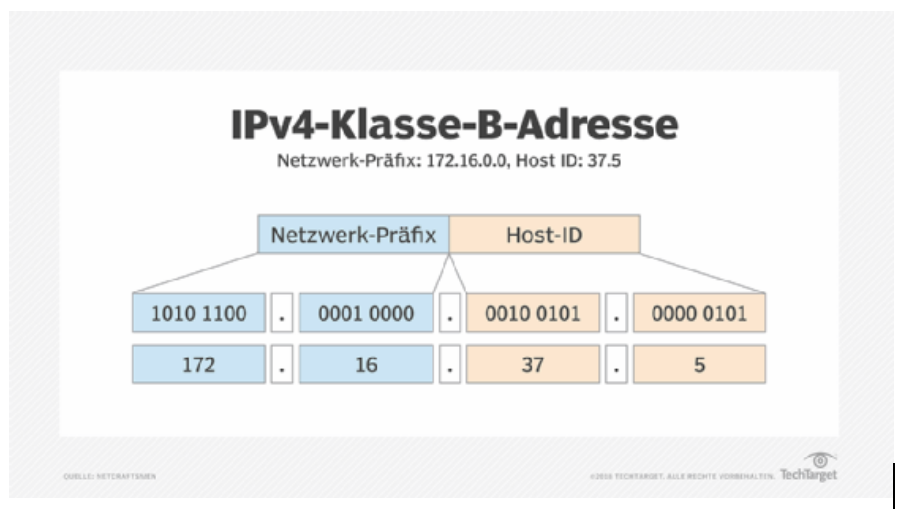

### Private Netze

In den Bereichen der Klasse-A-, Klasse-B- und Klasse-C-Netze sind jeweils Bereiche für den privaten Einsatz in LANs reserviert. Diese Adressen zeichnen sich dadurch aus, dass sie im Internet nicht geroutet werden.

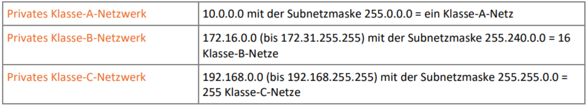

### Subnetting

Man unterteilt das bestehende Netzwerk in diverse logische Bereiche, die die benötigte Anzahl an Adressen enthalten, indem man eine Adresse mit einer erweiterten Subnetzmaske ausstattet. So kann z. B. das Netz mit der Adresse 192.168.1.0 Subnetzmaske 255.255.255.0 mittels der Subnetzmaske 255.255.255.192 in die vier Netze 192.168.1.0, 192.168.1.64, 192.168.1.128 und 192.168.1.192 unterteilt werden

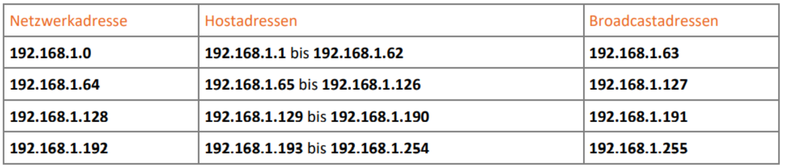

### Subnetzadressen

Ein Subnetz ist ein **Adressraum in einer IP-Adresse**. Unterschiedliche Subnetzadressen, werden mittels einer Subnetzmaske, die als Präfix vorangestellt wird, zu einem Subnetz zusammengefasst. Alle IP-Adressen innerhalb eines Subnetzes benutzen die gleiche Netzwerkadresse.

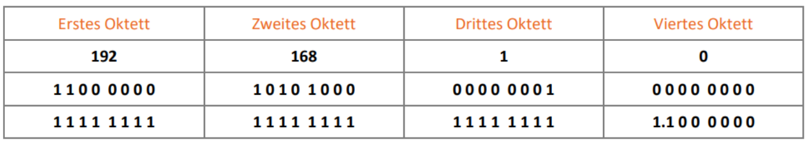

### Broadcast-Adresse

Die Broadcast-Adresse ist eine **spezielle IP (Internet Protocol) Adresse, die für die Übertragung von Nachrichten und Datenpaketen an Netzwerksysteme genutzt wird**. Mithilfe der Broadcast-Adresse ist es Netzwerkadministratoren möglich, die erfolgreiche Übermittlung der Datenpakete zu überprüfen.

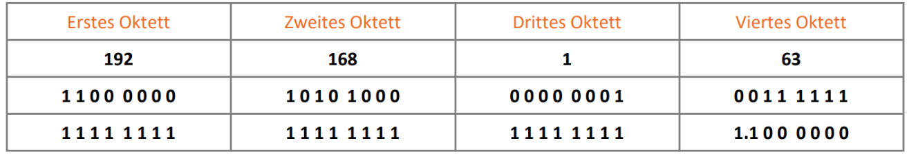

### Supernetting

Unter Supernetting versteht man das **Zusammenfassen von mehreren Netzen mit teilweise gleichem Netzwerkanteil zu einer einzigen Route**. Die zugrundeliegende Technik ist das Gegenteil zum Subnetting und bedeutet prinzipiell ein Verfahren zur Adressierung einer größeren Hostzahl innerhalb eines IP-Netzes.

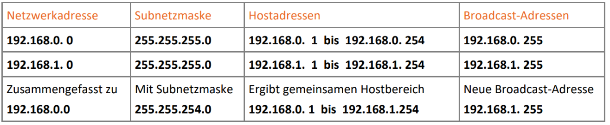

### IPv4-Header

Die Größe eines Headers von IP-Paketen beträgt in der Regel 20 Byte. Jedoch kann die Größe im Bereich zwischen 20 Byte und 60 Byte variieren. Bei IPv6 erreicht der Header die doppelte Größe.

Im folgenden Block kann man erkennen, wie jede Zeile für einen 32-Bit-Block steht.

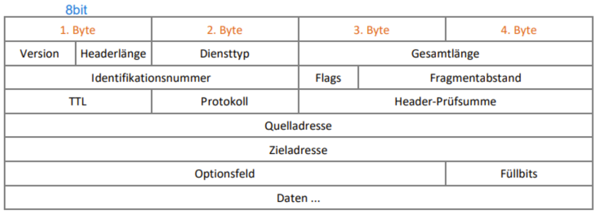

Im Versionsfeld steht die IP-Protokollversion, welche verwendet wird. Aktuell ist das noch IPv4 in der Regeln, allerdings kann man davon ausgehen, dass sich IPv6 in der nächsten Zeit immer weiter durchsetzen wird.

Auch die Länge des Headers muss angegeben werden, da IPv4 mit einer variablen Hader-Länge arbeitet, abhängig davon, welche Optionen verwendet werden. Die Angabe erfolgt in 32-Bit-Worten. Die größte Länge des Feldes von vier Bit bestimmt dabei den Maximalwert von sechzehn 32-Bit-Worten, also 60 Byte.

Unter dem Punkt Diensttyp lassen sich die Prioritäten von 0 bis 7 definieren. Mit diesen können Pakete vorrangig bearbeitet werden. Mit den Flags D, T und R kann der Host definieren, worauf er bei der Übertragung am meisten Wert legt.

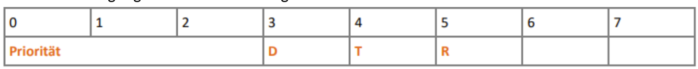

Ein Beispiel für den Einsatz von Prioritäten ist etwa die Datenübertragung während einer Telnetsitzung. Normalerweise würden zur effizienten Bandbreitennutzung Daten gesammelt, bis sich ein Paket von ausreichender Größe ergäbe. Somit wäre die Telnetsitzung nicht mehr durchführbar, da eine übermäßige Anzahl von Zeicheneingaben erfolgen müsste. Stattdessen ist es hier nötig, die Übertragung von einzelnen Eingaben sofort durchzuführen, auch wenn dadurch mehr Headerdaten als Nutzdaten transportiert werden. Um dabei die Mindestübertragungsgröße nicht zu unterscheiden, werden die Pakete aufgefüllt.

Subnetzmaske: 255.255.255.0

Binär dargestellt 1111 1111.1111 1111.1111 1111.0000 0000

                                                 Netzwerkteil                     Hostteil

### Fragen

192.168.20.8 /24  Netzklasse? A

1100 0000. 1010 1000.0001 0100.0000 1000

Netzwerkadresse: 192.168.20.0

Broadcastadresse: 192.168.20.255

192.168.38.17/24 Netzklasse? A

1100 0000. 1010 1000.0010 0110.0001 0001

Netzwerkadresse: 192.168.38.0

Hostadressen: 192.168.38.1- 192.168.38.254

Broadcastadresse: 192.168.38.255

172.16.5.0 /16    Netzklasse? B

Subnetzmaske: 1111 1111.1111 1111.0000 0000.0000 0000

Netzwerkadresse: 172.16.0.0

Hostadresse: 172.16.0.1- 172.16.255.254

Broadcastadresse: 172.16.255.255

172.16.8.0 /20   Netzklasse? B

Subnetzmaske: 1111 1111.1111 1111.1111 0000.0000 0000

Subnetzmaske: 255.255.240.0

Netzadresse: 172.16.0.0

Hostadresse: 172.16.0.1 – 172.16.15.254

Broadcastadresse: 172.16.15.255

## TCP und UDP

*Luis, Mike, Jonas*

### Aufgaben von TCP und UDP

Das Transport Control Protocol (TCP) und das User Datagram Protocol (UDP) sollen innerhalb der TCP/IP Protokoll-Familie den Transport von Daten gewährleisten

#### TCP Liegt auf dem layer 4 Transport-Layer

TCP hat im Gegensatz zu UDP viele komplexe Eigenschaften welche den Datentransport absichern sollen

Jedoch kann auch ein Deutlicher Protokoll Overhead bewirkt werden

- Protokoll Overhead:  TCP Header müssen Zum Beispiel IP-Pakete Quell-IP, Ziel-IP und weitere Daten mitführen. Dadurch wird mehr daten Traffic generiert als die Rohdaten eigentlich hätten

**Eigenschaften sind Beispielsweise:**

- Verbindungsorientiertheit

- Zuverlässigkeit

- Flexibilität in der Bandbreitnutzung

Überprüft immer ob alle Datenpakete ankommen oder nicht und wiederholt den Vorgang, bis alle Pakete angekommen sind. Bei langsamen Verbindungen kann es zu einem Timeout kommen.
Immer vollständige Sendung oder gar keine Sendung

Verwendung des Three Way Handshake 

### Weiter Aufgaben von TCP

 Verwaltung des Datenstroms zwischen den Protokollen der Anwendungs und Netzwerkschicht Segmentierung des Datenstroms (Sammlung der Datenpakete in der Anwendungschicht um für die Übertragung geeignete Pakete zu „schnüren“ und anschließend noch mit einem Header zu versehen
Pufferung der Daten
Parallelisierung der Daten

TCP verwendet für den Verbindungsaufbau zwischen zwei kommunizierenden Systemen den Three- Way Handshake

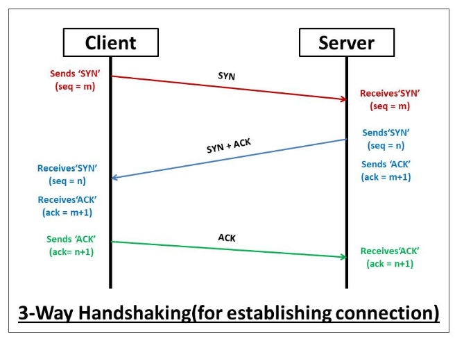

Im ersten Paket übermittelt der Sender eine Synchronisationsanforderung (SYN) mit einer Sequenznummer "Seq = m" 

Im zweiten Schritt schickt der Empfänger eine Synchronisationsbestätigung (acknowledgment, ACK). Dazu wird die empfangene Synchronisationsnummer um 1 erhöht und als "Ack = m + 1" mitgesendet. Gleichzeitig fordert der Empfänger seinerseits eine Synchronisation (SYN) an, die ebenfalls eine Synchronisationsnummer enthält ("Seq = n").

Im dritten und letzten Schritt übermittelt der Sender eine Bestätigung (ACK). Dieses Paket enthält die eigene Synchronisationsnummer ("Seq = X+1") und eine Bestätigungsnummer ("Ack = Y+1")

### Weitere facts zu TCP

1. Mithilfe der Sequenz-Nummern können Datagramme in die korrekte Reihenfolge gebracht werden. Außerdem kann ein Sender erkennen, wenn innerhalb einer bestimmten Zeit kein Acknowledgment für ein gesendetes Datagramm eintrifft. Dieses Datagramm wird dann erneut gesendet, um so Datenverlusten bei der Übermittlung vorzubeugen.

2. Als verbindungsorientiertes Protokoll muss TCP am Ende eines Kommunikationsstranges auch die Verbindung wieder beenden. Dazu wird mit der letzten Empfangsbestätigung eines Paketes auch eine Anforderung zum Verbindungsabbau übermittelt, die von der Gegenseite bestätigt wird

3. TCP wird immer dann verwendet wenn es wichtig ist das alle Pakete vollständig ankommen zb Emails, Datenbankzugriff, Remote Computing

4. Flusskontrolle: Bei der Informationsübermittlung kann es vorkommen, dass ein Sender einem Empfänger mehr Daten übermittelt, als dieser zu einem gegebenen Zeitpunkt verarbeiten kann. Die Daten werden in einem Puffer zwischengespeichert.  Da dieser Puffer nur eine begrenzte Größe hat, kann es zu einem Pufferüberlauf kommen. Um dies zu verhindern, schickt ein System, dessen Verarbeitungspuffer voll ist, ein ECN-Echo (explicit congestion notification echo, auf Deutsch etwa: ausdrückliche Datenstau-Information). Daraufhin halbiert das sendende System seine Sendegeschwindigkeit, bis das empfangende System durch das CWR-Flag (congestion window reduced, auf Deutsch etwa: reduziertes Übertragungsfenster wegen Datenstau) signalisiert, dass die Übertragung wieder in normaler Geschwindigkeit erfolgen kann.

### Erklärung zu Begriffen

**Segmentierung**

Sammlung der Datenpakete in der Anwendungschicht um für die Übertragung geeignete Pakete zu „schnüren“ und anschließend noch mit einem Header zu versehen

**Pufferung**

Damit daten zu Segmenten zusammengefasst werden und die Segmente an die 7. Schicht des OSI-Modells (Anwendungsschicht) in der richtigen Reihenfolge weitergeleitet werden können, muss die Transportschicht auf einen eigenen Speicher (Puffer) zurückgreifen

**Parallelisierung**

Wenn für eine Anwendung eine schnellere Datenübertragung benötigt wird, als ein einzelner Kanal aufbringen kann, ist es TCP möglich mehrere Verbindungen gleichzeitig zu nutzen
Die Parallelisierung ist kein fester Bestandteil von TCP, sondern ein zusätzliches Feature, welches von modernen Betriebssystemen bereitgestellt wird

### Erklärung des TCP-Header

Der Header (Protokoll-Kopf) enthält alle Informationen sowie weitere Felder, die bei der Kommunikation gebraucht werden können. Die Informationen des Headers sind dabei in Blöcken zu 32 Bit (vier Byte) zusammengefasst. Auch wenn ein Header länger wird, beträgt die Länge immer ein Vielfaches von vier Byte.

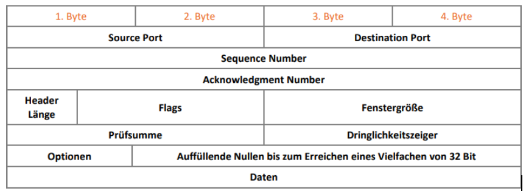

**Source Port (16bit)**

Der Source Port (Quellport) gibt an, von welchem Port auf Schicht 5 die Daten stammen, die (in Datagramme zerlegt) übermittelt werden.

**Destination Port (16 Bit)**
Der Destination Port (Zielport) gibt an, an welchen Port auf Schicht 5 die zusammengesetzten Daten der Datagramme weitergereicht werden sollen. 

**Sequence Number (32 Bit)**
Die Sequenz-Nummer dient dazu, die empfangenen Datagramme in die richtige Reihenfolge zu bringen, den Kommunikationsfluss zu kontrollieren und etwaige Fehler zu erkennen. 

**Acknowledgment Number (32 Bit)**
Die Acknowledgment Number (Bestätigungsnummer) gibt an, welche Sequenznummer das empfangende System zur Bestätigung des einwandfreien Erhalts des oder der Datagramme verwenden soll. 

**Header Length (4 Bit)**
Die Längeninformation des Headers gibt an, wie viele 32-Bit-Wörter dieser umfasst. Dies ist notwendig, weil sich die Länge des Headers verändern kann, z. B. wenn zusätzliche Optionen für die Flusskontrolle vereinbart werden müssen. 

**Flags (12 Bit)**
Auch wenn im Moment erst acht Bit = acht Flags definiert sind, ist das System an dieser Stelle bereits für Erweiterungen vorbereitet. So können etwa Sonderformen von TCP für den Satellitentransfer spezielle Informationen enthalten. 

**Fenstergröße**
Hier ist festgelegt, wie viele Bits ein Gerät maximal auf einmal empfangen kann. 

**Prüfsumme** 
Anhand der Prüfsumme kann ein Empfänger bestimmen, ob Daten während des Transportes verändert worden sind. 

**Dringlichkeitszeiger**
Wenn bei den Flags eine Kennzeichnung des URGENT-Flags (Dringend-Kennzeichen) vorliegt, werden die Daten nicht in den Puffer gelegt, sondern es wird sofort mit der Verarbeitung begonnen. Der Dringlichkeitszeiger verweist auf das Ende der dringend zu verarbeitenden Daten. 

**Optionen**
Hier ist derzeit in der Standardversion von TCP nur die maximale Größe für TCP-Segmente definiert. Der Rest des 32-Bit-Wortes muss mit Nullen aufgefüllt werden, um so der Längeninformation zu entsprechen.

### UDP (Schicht 4 Transport Layer)

**Name:** User Datagram Protocol

#### Eigenschaften

Geschwindigkeit
Geringer Overhead
Vermeiden redundanter Transportkontrolle

#### UDP

Das User Datagram Protocol (UDP) stellt ebenfalls Dienste der Transportschicht bereit, ohne allerdings die Fehlertoleranz und die Verbindungsorientiertheit von TCP aufzuweisen. Daher kommt UDP vor allem dann zum Einsatz, wenn Dienste anderer Schichten die Verbindungskontrolle und die Fehlerkorrektur übernehmen.
Der Vorteil von UDP liegt in dem gegenüber TCP deutlich verringerten Overhead. So kommt der Protokoll-Header von UDP mit der festen Größe von acht Byte aus und durch den Wegfall der Acknowledgment-Sendungen wird zusätzliche Bandbreite gespart.
Ein weiterer Vorteil besteht dabei im Wegfall von Verbindungsaufbau und -abbau. Im Vergleich zu TCP werden so drei Pakete für den Three-Way-Handshake und eines für das Sitzungsende eingespart.
Damit ist UDP vor allem für die Übertragungen geeignet, bei denen es zu wenig oder keinen Datenverlusten kommt. Dies gilt insbesondere für Netzwerk-Dienste.

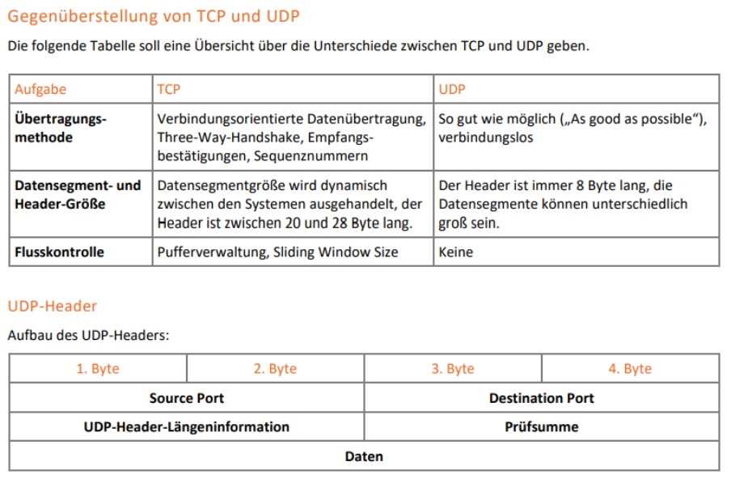

## NAT (Network Address Translation)

*Alex*

### NAT Definition

NAT übersetzt private IP-Adressen in öffentliche IP-Adressen und weist temporär Ports für die Kommunikation im Internet zu.

### NAT-Funktionsweise (anhand eines Beispiels)

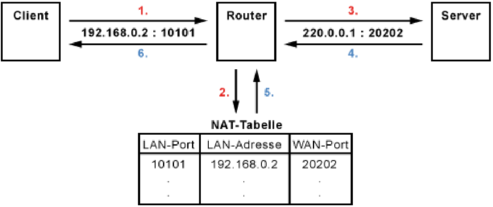

1. Der Client schickt seine Datenpakete mit der IP-Adresse 192.168.0.2 und dem TCP-Port 10101 an sein Standard-Gateway, bei dem es sich um einen NAT-Router handelt.

2. Der NAT-Router tauscht IP-Adresse (LAN-Adresse) und TCP-Port (LAN-Port) aus und speichert beides mit der getauschten Port-Nummer (WAN-Port) in der NAT-Tabelle.

3. Der Router leitet das Datenpaket mit der WAN-Adresse 220.0.0.1 und dem neuen TCP-Port 20202 ins Internet weiter.

4. Der Empfänger (Server) verarbeitet das Datenpaket und schickt seine Antwort zurück.

5. Der NAT-Router stellt nun anhand der Port-Nummer 20202 (WAN-Port) fest, für welche IP-Adresse (LAN-Adresse) das Paket im lokalen Netz gedacht ist.

6. Er tauscht die IP-Adresse und die Port-Nummer wieder aus und leitet das Datenpaket ins lokale Netz weiter, wo es der Client entgegen nimmt.

### Vorteile eines NAT

Durch eine öffentliche IP-Adresse (public-IP) werden weniger öffentlich IP-Adressen zur Kommunikation im Internet benötigt.  

Sicherheitsgewinn durch keinen direkten Zugang über private IP-Adressen sondern „Umweg“ über public-IP. Die temporären Ports werden nach der Kommunikation wieder geschlossen.

### Nachteile eines NAT

Kommunikation über Header-Integritätsabhängige Protokolle z.B. IPSec nicht möglich. Erschwerte Verbindungsmöglichkeiten von außen z.B. auf Netzwerkspeicher.

## Routing

*David, Metin, Lukasz*

### Statisches Routing

#### Routing

Routing ist das Vermitteln von Paketen eines Rechners in ein anderes Netzwerk. Dabei wird das routende System (egal, ob es sich um einen Rechner mit aktiviertem Routing-Dienst oder einen Hardware-Router handelt) von dem sendenden System adressiert, indem dieses mittels seiner Hardware-Adresse angesprochen wird. 

Um zu ermitteln, ob ein Router eingesetzt werden muss, um ein Remotesystem anzusprechen, kommt ein logischer UND-Vergleich zum Einsatz. Der gesamte Vorgang soll anhand des folgenden Beispiels erläutert werden:

Ein Rechner hat die IPv4-Adresse 192.168.0.1 und die Subnetzmaske 255.255.255.0. Er soll ein ICMP-Paket an das System mit der Adresse 172.16.0.1 schicken.

Anhand der Subnetzmaske findet das System heraus, ob sich die Zieladresse im eigenen Netzwerksegment befindet. Ist dies der Fall, kann das Paket direkt übermittelt werden. Andernfalls muss das Paket an einen Router übermittelt werden, der den Weg bzw. einen Teil des Weges zum Ziel kennt. Der angesprochene Router ist im einfachsten Fall das in der Routing-Tabelle aufgeführte Gateway.

#### Routing Tabelle

In der Routing-Tabelle sind die logischen Verknüpfungen für die Adresszuordnung gespeichert. Hier werden den Adaptern die passenden Adressen, Netzwerke, Broadcasts und Routen zugeordnet. In der folgenden Darstellung ist ein Ausdruck der Routing-Tabelle eines Microsoft Windows 2019-Servers mit zwei Netzwerkadaptern dargestellt:

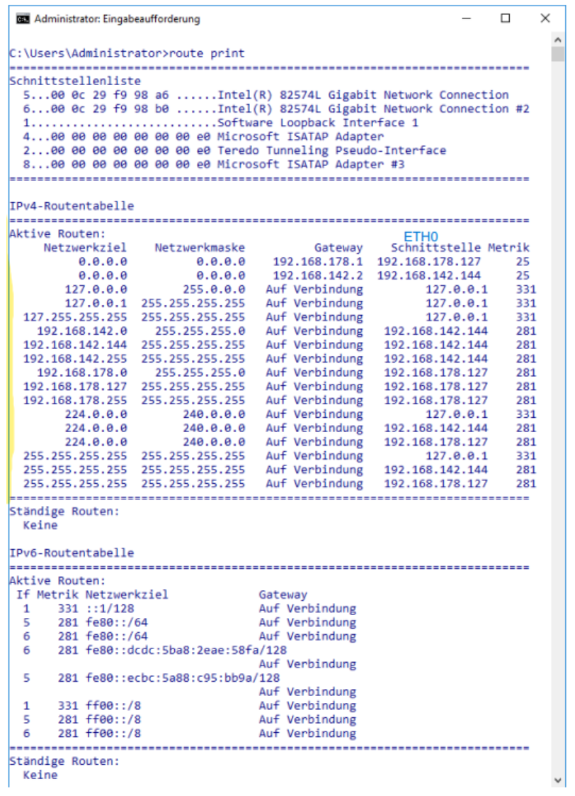

#### Aktive Routen

Aktive Routen Die aktiven Routen sind nach folgendem Schema dargestellt:

In der ersten Spalte stehen die Zieladressen. Dabei kann es sich um eine Host-, eine Netz- oder um eine Broadcast-Adresse handeln. In der zweiten Spalte ist die anzulegende Netzwerkmaske dargestellt. Dabei markieren binäre Einsen den Bereich, der nicht geändert werden darf. So steht 192.168.0.255 255.255.255.255 etwa für die NetBIOS-BroadcastAdresse im Netz mit der Adresse 192.168.0.0.

Die dritte Spalte gibt Auskunft darüber, ob dieses Ziel über eine eigene Adresse oder ein Fremdsystem angesprochen werden soll. Handelt es sich bei diesem Eintrag um ein Fremdsystem, wird vor dem Senden des Frames die MAC-Adresse des entsprechenden Rechners ermittelt und als MAC-Ziel in den Header des Frames eingetragen.

An der vierten Stelle steht, über welche Adresse der Gateway-Partner angesprochen werden soll. Steht hier ein Remote-Gateway, wird dieses über einen der Netzwerkadapter adressiert, handelt es sich dabei um eine eigene Adresse, wird diese über Loopback angesprochen. Und in der letzten Spalte steht die Metrik einer Verbindung. Unter Metrik versteht man einen Wert, der einer Route zugeordnet ist. Ein niedriger Wert führt dazu, dass die Route vom System bevorzugt wird, falls zwei Routen zu demselben Ziel existieren. Metriken können etwa Kosten darstellen oder sie weisen auf Faktoren wie Bandbreite, Geschwindigkeit, Zuverlässigkeit, Pfadlänge oder Verzögerung von Routen hin.

### Dynamisches Routing

#### Einsatzgebiet

In kleinen Netzwerken mag es sinnvoll sein, die Routing-Tabellen von Hand zu editieren, denn dies hat den Vorteil, dass das Netzwerk nicht durch das Versenden von Paketen zur Routenermittlung und Überwachung belastet wird.

Eine veränderte Situation tritt jedoch auf, wenn die Netzwerkumgebung auf häufig wechselnde Gegebenheiten reagieren muss. In Netzwerken, die über mehrere Teilnetze verfügen, welche über redundante Routen angesprochen können werden sollen, benötigt man entsprechende Mechanismen, um das Erstellen und Verwalten der Routen zu automatisieren. Dafür verwendet man Routing-Protokolle.

Routing-Protokolle sind für das Ermitteln der Routen in Netzwerken und ihre Überwachung zuständig. Geroutete Protokolle sind für die eigentliche Übermittlung von Paketen zwischen den Netzwerken (Paket-Switching) zuständig.

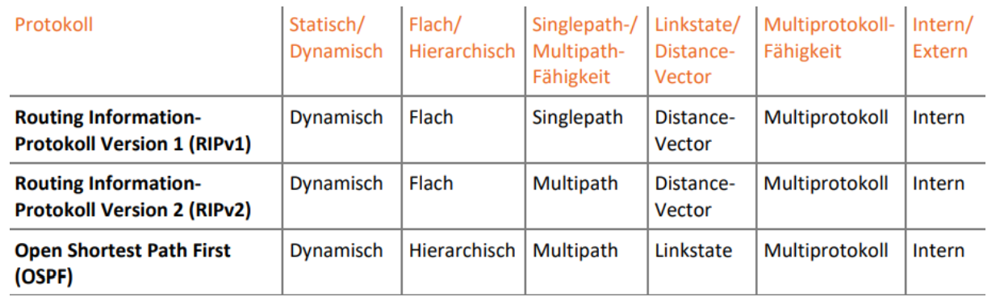

### Distance-Vector-Protokolle

Distance-Vector-Protokolle übermitteln benachbarten Routern ihre gesamte Routing-Tabelle. Diese setzen im Anschluss die Hop Counts (Sprungzähler) um den Wert 1 hoch und vergleichen die Ergebnisse mit der eigenen Routing-Tabelle. Ergibt sich nun ein kürzerer Weg zu einem Netzwerkziel als zuvor in der Tabelle vorhanden, wird der neue Weg als besser erkannt und in die Routing Tabelle übertragen.

Maximum Hop Count

Der sogenannte Maximum Hop Count (Maximaler Sprungzähler) soll verhindern, dass ein Paket endlos lange im Netz kreist (Counting-to-Infinity). Bei jeder Verarbeitung eines Paketes durch einen Router wird der Sprungzähler um eins hochgesetzt. Dieser Wert lässt sich verwenden, um die Dauer, die ein Paket bereits durch das Netzwerk transportiert wurde, zu messen. Indem man die maximale Distanz im Netzwerk ermittelt, lässt sich verhindern, dass ein Paket über Schleifen weitertransportiert wird. Dabei wird der Sprungzähler allerdings schon beim Konfigurieren der Routing-Tabelle ausgewertet, sodass der eigentliche Transport der Pakete über Schleifen im Vorfeld verhindert werden kann.

Dies bewirkt jedoch, dass Routingprotokolle wie RIP nur in kleinen Netzwerken verwendet werden können. Der Maximum Hop Count bei RIP ist auf 15 Sprünge limitiert, was den Einsatz in größeren Netzwerken unmöglich macht.

Route Poisoning und Hold Down Timer

Wenn ein Router bemerkt, dass ein Netzwerk nicht mehr erreichbar ist, kann er es als unerreichbar markieren und diese Information im Netzwerk verteilen. Gleichzeitig akzeptiert er für dieses Netzwerkziel keine Aktualisierungen, bis die Router im Netz konvergiert sind. Man spricht bei diesem Verfahren von Route Poisoning (Pfade vergiften). Route Poisoning kommt in der Regel gemeinsam mit einem Hold Down Timer zum Einsatz. Ein Router, der eine Network-Unreachable-Nachricht (Netzwerk nicht erreichbar) von einem anderen Router erhält, akzeptiert für einen gewissen Zeitraum keine weiteren Aktualisierungen für diese Route, es sei denn, sie kämen vom Gerät, das ursprünglich das Ziel als nicht erreichbar markiert hat

### Linkstate-Protokolle

Funktionsweise

Linkstate-Protokolle verwenden ein grundsätzlich anderes Verfahren, um Routing-Informationen zu übermitteln. Sie übermitteln nicht die komplette Routing-Tabelle, sondern nur die direkt angeschlossenen Netzwerke. Dafür werden diese Informationen aber nicht nur an die benachbarten Geräte übermittelt, sondern an alle Router des Netzwerkes oder der autonomen Verwaltungseinheit. Auf diese Weise lernen alle Router das gesamte Netzwerk kennen und können so die idealen Routen zu jedem Netzwerkziel ermitteln.

Bei diesem Verfahren können Routing-Schleifen nicht auftreten, da die Systeme diese selbstständig erkennen würden. Andererseits werden die Geräte-Ressourcen (Speicher und CPU-Leistung) erheblich belastet. Dies lässt sich am besten durch eine sinnvolle hierarchische Strukturierung des Netzwerkes in autonome Verwaltungseinheiten begrenzen.

So wäre es etwa sinnvoll, dass zwischen Standorten nicht jedes Mal die kompletten Routing-Informationen übermittelt werden, sondern die Standorte als autonome Einheiten definiert werden. So kann die Verarbeitungslast deutlich gesenkt werden.

### Fragen

**Was ist Routing?**

Routing ist das Vermitteln von Paketen eines Rechners in ein anderes Netzwerk.

**An was findet das System heraus ob sich die Zieladresse im eigenen Netzwerksegment befindet?**

durch die Subnetzmaske.

**Welche Aktiven routen gibt es in der Routing Tabelle?**

Netzwerkziel Subnetzmaske Gateway Schnittstelle

**Was soll der Maximum Hop Count verhindern?**

dass ein Paket endlos lange im Netz kreist

## 8 Namensdienst DNS

*Natalie*

## Netzwerkkonfigurationsdienste

*Julio, Linus, Marcel*

### DHCP (Dynamic Host Configuration Protocol)

Grundsätzlich dient DHCP zur Zuweisung von IP-Adressen an (neue) Clients bzw. Teilnehmern in einem Netzwerk, diese Aufgabe übernimmt der sogenannte DHCP-Server. Die IP-Adressen werden aus einem festgelegten Raum vergeben.

Es gibt drei Arten von Adresszuweisungen über DHCP:

    **Permanent:** Dem Client wird eine freie IP zugewiesen und diese kann er für eine                             unbegrenzte Zeit behalten

    **Dynamisch:**  Dem Client wird eine IP für einen begrenzten Zeitraum zugewiesen

    **Statisch:** Dem Client wird eine für ihn reservierte Adresse zugewiesen, allerdings                       muss diese Reservierung regelmäßig erneuert werden

Neben IP-Adressen werden den Clients auch andere Konfigurationen zugewiesen, darunter:

- DNS-Server

- Subnetzmaske

- Standard-Gateway

#### DHCP-Lease

Dynamische IP-Adressen sind nur für einen begrenzten Zeitraum gültig, diesen Zeitraum bezeichnet man als Lease-Dauer und er wird vom DHCP-Server vorgegeben.

**Renewal Time:**  Nach Ablauf versucht der Client seinen Lease beim gleichen                               DHCP-Server zu erneuern

**Rebinding Time:** Falls der Lease bei T1 nicht erneuert wird, versucht der Client sich an                                 einen neuen DHCP-Server zu binden

#### DHCP-Handschake (Beantragen neuer Lease)

Der DHCP-Client sendet ein **DHCP-Discover** Datagramm über die Broadcastadresse, um den DHCP-Server im Netzwerk zu finden. Dabei wird die Hardwareadresse (MAC/Adresse) mitgesendet, da der Client noch keine eigene IP besitzt.

Der Server antwortet auch über die Broadcastadresse mit dem sogenannten **DHCP-Offer**. Er bietet dem Client also eine IP-Adresse (Lease) und andere Parameter an.

Der Client bestätigt über die Broadcastadresse die Annahme des Lease-Angebot, also werden alle DHCP-Server über die Annahme des Lease informiert. (**DHCP-Request**)

Der DHCP-Server bestätigt über die Broadcastadresse den Lease. (**DHCP-Ack**)

### Grundlagen von APIPA

Wenn der DHCP-Server zeitweise unerreichbar ist, so tritt die APIPA Funktion in Kraft, mit der jeder lokale Computer sich selbst eine IP sowie Subnetzmaske zuweist. Das erlaubt Netzwerktransfer in dem lokalen Subnetzwerk, jedoch keinen Datenaustausch mit externen Netzen/Internet.  Die Geräte senden über einen Broadcast eine Anfrage an alle Computer, ob die vorgeschlagene IP-Adresse bereits vergeben ist. Solange kein Einwand eines anderen Gerätes kommt, eignet sich dann der Computer die vorgeschlagene IP-Adresse an.

### Fragen

**Was wird durch den DHCP-Server konfigurieren?**

Standard-Gateway, DNS-Server, Subnetzmaske

**Welche drei Arten von Adresszuweisungen gibt es?**

Permanent, dynamisch, statisch

**In welchem Bereich weisen sich Geräte eigene IP-Adressen zu?**

169.254.0.1 bis 169.254.255.254

**Wie wird sichergestellt das keine IP-Adresse doppelt vergeben wird?**

Sie verwenden ein Broadcast, um sicherzustellen, dass die IP frei ist.

## Virtual Private Network

*Ziyu, Emina*

### Was ist VPN?

VPN ist ein privater Tunnel, der Daten von einem Standort zum anderen  verschlüsselt übermittelt. Die IP-Adressen werden dadurch geschützt.

### Nutzen eines VPN

- Es erhöht Ihren Online-Datenschutz.

- Es bietet Ihnen mehr Online-Sicherheit.

- Es erlaubt Ihnen mit mehr Freiheit im Internet zu surfen

- Es macht öffentliche WLAN Netze sicherer.

### Die Arten von VPN

- Site to Site

- Site to End

- End to End

### VPN Protokolle

#### OpenVPN

- OpenVPN ist eine freie Software zum Aufbau eines Virtuellen Privaten Netzwerkes

- OpenVPN ist eines der am häufigsten verwendeten VPN-Protokolle. Die meisten VPN-Dienste unterstützen OpenVPN und es ist für viele verschiedene Plattformen verfügbar  z.B. Windows, Android, Linux, Router.

- Der einzige Nachteil ist, dass es unter Mac OS und iOS nicht funktioniert

#### IPsec/L2TP

- IPsec (Internet Protocol Security) ist ein Protokollen, der gemeinsam zum Aufbau von verschlüsselten Verbindungen zwischen Geräten verwendet wird. Es macht die über öffentliche Netzwerke gesendeten Daten sicherer.

- L2TP Layer 2 Tunneling Protocol ist ein von Cisco Systems entwickeltes Protokoll zur Tunnelung von Daten im LAN  (OSI-Schicht 2)

- Dieses Protokoll kombiniert IPsec für die Verschlüsselung von Daten mit L2TP für die sichere Verbindung.

Die Idee eines Virtual Private Network (VPN) : besteht darin, den meist günstigen lokalen Internetzugang zu verwenden, um den Kontakt zur Firmenzentrale herzustellen

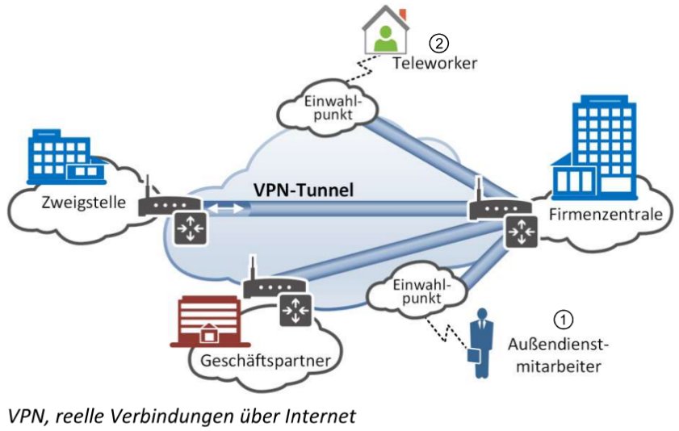

**Die Abbildung zeigt:**

Ein Außendienstmitarbeiter  erhält über die Einwahl bei einem Internetprovider über das Internet Zugang zu Ressourcen in der Firmenzentrale, auch ein Teleworker  kann per Internet-Flatrate angebunden sein.

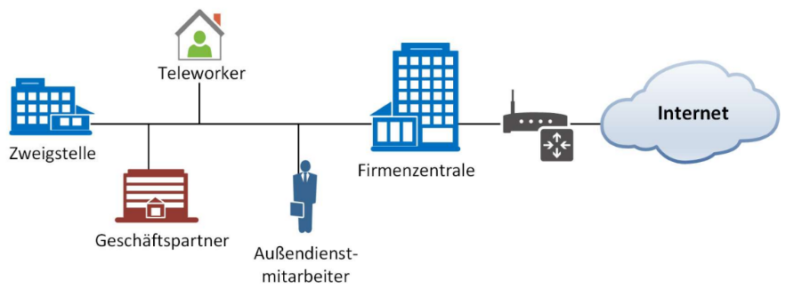

Eine Kopplung von zwei LANs (z. B. Firmenzentrale und Zweigstelle) ist mit einem VPN realisierbar. In diesem Fall müssen Pakete, je nach Bedarf, von der einen auf die andere Seite geschickt werden. Als Transportmedium kommt hier wieder eine Internetverbindung zum Einsatz.

### Vorteile von VPN

- Sicheres, verschlüsseltes und privates Surfen im Internet

- Anonymes Herunterladen und Hochladen

- Umgehen von Geoblocking

### Fragen

**Welche 3 Arten von VPN gibt es?**

- End to End

- Site to Site

- End to Site

**Wofür steht das Kürzel VPN?**

- Visual Personal Network

- Visual Private Network

- *Virtual Private Network*

- Virtual Public Network

**Was ist VPN?**

Ein VPN ist ein sicherer Tunnel für das Surfen im Internet. Die Technologie ermöglicht sichere, verschlüsselte Verbindungen zwischen Geräten und Servern über das Internet. Sie maskiert die Identität der Geräte und verschlüsselt die Daten, die PCs oder Mobiltelefone ins Internet übertragen.

**Nennen Sie die 3 Vorteile von VPN.**

- Sicheres, verschlüsseltes und privates Surfen im Internet

- Anonymes Herunterladen und Hochladen

- Umgehen von Geoblocking

## Firewall und DMZ

*Nicolas, Leopold, Julian*

### Wie Firewalls Arbeiten

#### Aufgaben

Der Englische begriff Firewall steht für eine Wand bzw. Mauer aus nicht brennbarem Material. Die wird genutzt um Brände in Gebäuden einzuschränken damit sie sich nicht verbreiten können. Jetzt kann man sich es besser vorstellen da die Firewall sich zwischen dem eigenen Netzwerk und dem Internet. Eine Firewall schützt vor unerwünschten Netzwerkzugriff. Und sie Kontrolliert den Netzwerkverlauf.

Die Firewall hat ihre eigenen Regeln die den Datenverkehr einzuschränken. Hätte eine Firewall nicht solche Regeln das wäre sie Relativ nutzlos.

Wenn man eine Firewall hat reicht sie nur für gewisse Schutzmaßnahmen gegen Angriffe aus, dafür gibt es noch weitere Firmen für Schutzmaßnahmen. Zum Beispiel ein Vieren Scanner, Netzwerkbereiche mit Zugangskontrolle und Verschlüsselung nötigt.

Es ist auch sehr gut zu der Firewall an der eignen Grenze des eignen Netzwerks eine lokale Firewall zu betreiben. Die nennen sich „Personal Firewall“. Zum Beispiel haben Aktuelle Windows Betriebssysteme „Windows Firewall mit erweiterter Sicherheit“.

#### Hard- oder Software

Firewalls können entweder als Hard- oder Softwarelösung sein verfügbar sein. Die Bandbreite überstreckt sich von der Open Source Linux Firewall über Microsoft Firewall with Advanced Secrurity bis zu Hardware Appliances wie z.B. der Cisco ASA Firewall.

Appliances sind speziell angepasste Betriebssysteme zum Einsatz, die für die Verwendung als Firewall „Gehärtet“ wurden. Das bedeutet, dass das Firewallbetriebssystem nur über die optimierte Funktionalität der Dienste verfügt und so gegen Sicherheitslücken effizienter geschützt ist. Eine Firewall ist nur so stabil wie das Betriebssystem, auf dem sie aufsetzt. Gelingt es einem Angreifer von außen, Systemrechte auf einem Firewallsystem aufgrund eines Fehlers im Betriebssystem zu erlangen, so ist die Firewall nutzlos.

Wenn man sich Entscheiden sollte zwischen Hard- und Software sollte man wissen das Software viel leichter zu warten oder  zu aktualisieren ist. Dafür haben Hardware Lösungen den Vorteil, vom Betriebssystem eines normalen Rechners abgekoppelt zu sein.

#### Firewall-Konzepte

Je nach Schutzbedarf kann man in sein Netzwerk eine oder mehrere Firewalls Platzieren. Wichtig ist das auf jeden Fall eine Firewall von deinem eigenen Netzwerk und Internet gibt.

Die einfachste Lösung besteht aus einer Firewall, die am Übergabepunkt vom Intranet zum Internet den Datenverkehr überwacht.

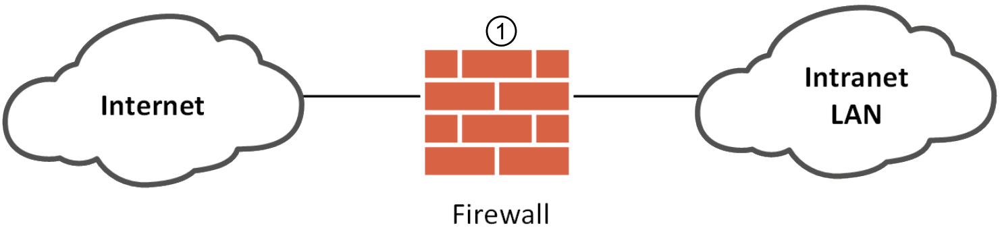

Die Lösung ist ziemlich einfach und die Sicherheit ist zu anderen möglichen Lösungen eher bescheiden. Sollte hier die Firewall angegriffen werden so steht dem Angreifen das Intranet Frei zur Verfügung.

Als Antwort auf die Problematik, dass das Intranet geschützt werden sollte, bestimmte Rechner aber weiterhin von außen erreichbar sein sollen, werden die von außen zugreifbaren Server in einen vorgelagerten Bereich des Intranets verlagert. Die Rechner mit diesen speziellen Server aufgaben (Bastion-Host, da sie besonders gesichert werden sollten) befinden sich also im Niemandsland zwischen dem Intranet und dem Internet.

Als Fachausdrücke für dieses Niemandsland haben sich die Begriffe „Perimeternetzwerk“ oder „Demilitarisierte Zone“ (DMZ) durchgesetzt.

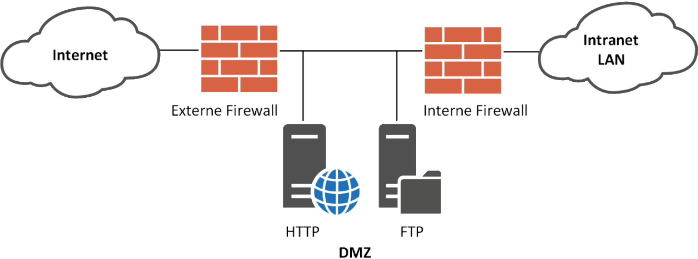

Dies Firewall funktioniert identisch wie die Zweistufige Firewall mit DMZ aus das stattdessen nur eine Firewall verwendet wird. Die Vorteile ist das man nur eine Firewall brauch und sich die Hardware von einer zweiten sparen kann.

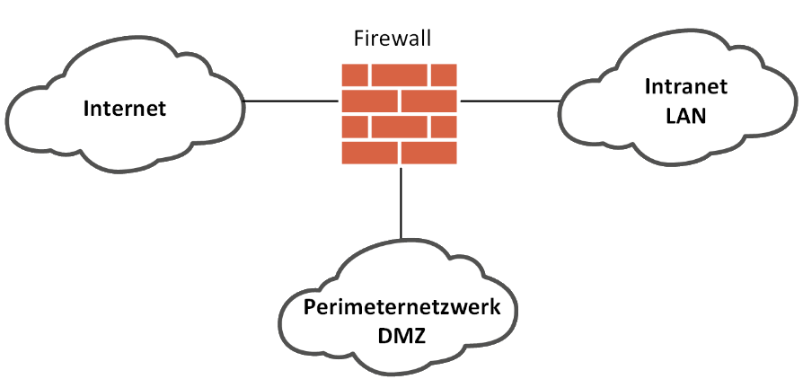

### Proxy Level / Application Level Firewall

Werden in den Datenströmen neben der Paketinformation auch die Informationen der höheren Schichten ausgewertet, ist es so technisch möglich, einen Datenstrom bis zur 7. Schicht, also der Anwendungsschicht des OSI-Modells, wieder zusammenzufügen. Logisch gesehen bedeutet dies, dass wenn mit Datenpaketen eine E-Mail versendet wird, die Firewall die Pakete zusammenbaut, bis diese komplett auf dem Firewall-System vorliegt. Die Firewall wertet den enthaltenen Datenverkehr nicht mehr nur auf Netzwerk- oder Transportebene aus, sondern überprüft diese Informationen nun bis zur Applikationsschicht. Durch diese Prüfung kann auch der Dateninhalt vollständig überprüft werden. Erst nachdem die E-Mail der Firewall komplett vorliegt, kann entschieden werden, ob die Weiterleitung in Abhängigkeit von Absender, Empfänger, Betreff, Inhalt oder gar angehängten Dateien erlaubt oder getrennt behandelt wird. Dieses Konzept stellt eine sog. Application Level Firewall bzw. Proxy-Firewall dar. Diese Vorgehensweise ermöglicht je nach Protokoll durch entsprechend konfigurierte Regeln beispielsweise das Sperren von E-Mails von bestimmten Absendern oder definierten Inhalten, sowie das Blockieren von Webseiten mit bestimmten Inhalten, wie Active-Scripting. Mit dieser Methode können auch Werbebanner und Poup-Fenster gefiltert, der restliche Inhalt der Website aber zugelassen werden.

Wenn also Application Level Firewalls quasi als Stellvertreter für Clients, den eigentlichen Server im Internet erreichen, werden diese Firewalls als                        **Proxy-Firewalls** bezeichnet. (engl. Proxy: Stellvertreter, Bevollmächtigter)

Doch diese Methode hat einen entscheidenden Nachteil. Und zwar, den großen Ressourcenaufwand der nötig ist, um diese Protokolle in der Firewall nachzubilden, sowie entsprechende Filterregeln anzuwenden. Des Weiteren benötigt jede Anwendung, bzw. jedes Protokoll eine entsprechend kompatible Proxy-Firewall. Anders sieht das bei Firewalls auf Paketebene aus. Sie arbeiten im Gegensatz dazu anwendungsunabhängig.

#### Zugriff auf eine Webseite im Internet

Möchte ein Client eine Internetseite eines bestimmten Servers, so wird diese Verbindung zunächst mit der Firewall aufgebaut. Diese prüft zuerst die Zulässigkeit der Verbindung und baut anschließend Ihrerseits die Verbindung zum gewünschten Server auf. Nun wird die HTML-Seite übertragen und ihr Inhalt von der Firewall analysiert. Sollen mithilfe der Firewall z.B. Werbebanner gefiltert werden, so werden aus den empfangenen HTML-Seiten alle Anweisungen entfernt, welche einen Popup-Aufruf oder eine Bannermeldung, wie z.B. Werbung enthalten. Diese von der Firewall so konfigurierte Seite wird im Anschluss an den Client weitergeleitet, welcher die HTML-Seite auswertet und im Anschluss die nötigen Grafiken/Bilder nachlädt, welche zu deren Darstellung nötig sind. Diese werden von der Firewall schon einmal vorsorglich vom Webserver heruntergeladen und an den Client weitergereicht. Das Ergebnis der Aktion ist eine werbefreie Website. Zudem wird die Bandbreite geschont, da Bannergrafiken gar nicht erst im Vorfeld durch den Client heruntergeladen werden müssen. Diese Aufgabe wurde bereits durch den Webserver übernommen.

#### Flexible Einsatzmöglichkeit

Eine den Anforderungen entsprechend konfigurierte Firewall bietet flexible Einsatzmöglichkeiten. Beispielsweise können je nach Aufbau und Einrichtung der Regelsets, ganz einfach Webseiten, FTP-Dienste, sowie beliebige andere Internetprotokolle und -anwendungen gefiltert und überwacht werden, bevor deren Nutzung für interne Clients zugelassen wird. Proxies bieten zwar umfassende Möglichkeiten zur Filterung des Datenverkehrs, sind allerdings aufwendig, da für jede Anwendung die Proxyfunktionen angepasst sind. Einige **Proxyanwendungen** der Applikationen werden zudem **zusammengefasst**, um die **Performance** der **Application** **Level Firewall** **zu gewährleisten**. Dieser Vorgang wird als **„****Generic** **Proxy“** bezeichnet.

### Personal Firewall

#### Firewalls auf dem Desktop

Firewall auf dem Desktop nennt man Personal Firewall, solche Systeme agieren wie Firewall-Router, aber auf deinem eigenen PC. Ein solches System gibt dir extra Sicherheit von außen, selbst im eigenen Heimnetz. Daraufhin kann es auch ausgehende Anfragen blockieren und somit kontrolliert Programme hindern Daten von deinem PC zurück an die Firma zu senden.

#### Personal Firewalls in der Firma

Der einzige einsetz von Personal Firewalls in der Firma ist als eine zusätzlich Sicherheit, da die eingeschränkte Konfigurationsmöglichkeit und das fehlen von einem Zentralen Managementtool es schwer macht eine Konkrete Sicherheit für jeden PC aufzubauen. Deshalb werden meist explicite Netzwerk weite Firewalls für Firmen verwendet. Dennoch können Personal Firewalls die Firma schützen von inneren Bedrohungen, zum beispiel Schachsoftware die ein mitarbeitet von zuhause bringt.

### Sicherheitskonzept Firewall

Das beste Sicherheitskonzept wäre ein mehrstufiges Sicherheitskonzept, den das Schützt jedes einzelne gerät von Inneren Bedrohungen wie auch das gesamte Netzwerk von äußeren Bedrohungen schützt.

### Fragen

**Was ist eine Firewall?**

Eine Firewall schützt und reguliert den Netzwerkverkehr mit bestimmten Regeln.

**Was ist eine Proxy Firewall?**

Eine Proxy Firewall ist mit entsprechende Regeln für Webseiten mit bestimmten Inhalten wie zum Beispiel werbe Banner oder Pop up Fenstern gefiltert .

**Wie nennt man eine Firewall auf dem Desktop?**

Personal Firewall

**Nenne ein Firewall Konzept?**

- Einfaches Firewallkonzept

- Zweistufige Firewall mit DMZ 

- Firewall mit frei konfigurierbaren Interfaces

**Für was steht DMZ?**

Demilitarisierte Zone
