# PC Technik

## Hauptplatine, Netzteil und Gehäuse

### Chipsatz

#### Entwicklung

Der Chipsatz bezeichnet eine Gruppe von Bauteilen, welche gemeinsam zahlreiche Steueraufgaben zur Zusammenarbeit der PC-Komponenten übernehmen.

Ursprünglich bestanden diese Chipsätze aus einzelnen Schaltkreisen, die über das Motherboard verteilt waren. Mit der Zeit wurden sie jedoch aufgrund der unterschiedlichen Geschwindigkeiten der Komponenten immer mehr zusammengeführt. Als Resultat entstanden zwei integrierte Schaltkreise, welche ober- und unterhalb der CPU auf dem Motherboard platziert wurden. Diese wurden als Northbridge und Southbridge bekannt. Durch diese Weiterentwicklung entstanden viele verschiedene neue Architekturen.

#### Bridge-Architektur

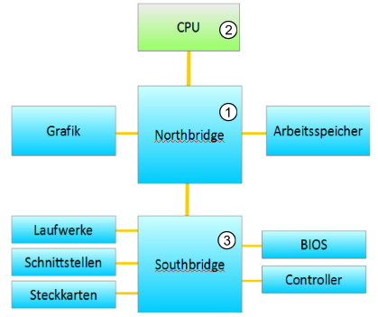

Die älteste Form der Architektur für Computer-Hauptplatinen, die sogenannte Bridge-Architektur, sah vor, dass alle Komponenten, die eine höhere Arbeitsgeschwindigkeit benötigten, wie zum Beispiel die Grafikkarte oder der Arbeitsspeicher, an der Northbridge angeschlossen wurden. Die CPU hingegen wurde über den **F**ront **S**ide **B**us (**FSB**) an die Northbridge angebunden. Alle anderen Komponenten waren an der Southbridge angeschlossen.

#### Hub-Architektur

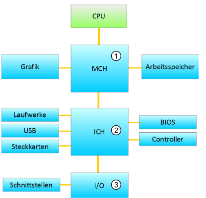

Mit der technischen Weiterentwicklung kamen neue Architekturen auf. Eine davon war die Hub-Architektur, die die Northbridge durch den MCH (Memory Controller Hub) ersetzte. Zusätzlich gab es auch die GMCH (Graphics Memory Controller Hub), die manchmal speziell für Grafikkarten entwickelt wurde.

Darüber hinaus gab es den ICH (I/O Controller Hub), der sich um alle anderen Anbindungen kümmerte, wie z.B. USB, Laufwerke, BIOS und mehr.

Um jedoch die Möglichkeit für klassische Erweiterungen zu bieten, gab es auch den I/O Chip, welcher funktionale Erweiterungen ermöglichte.

#### Erweiterte Hub-Architektur

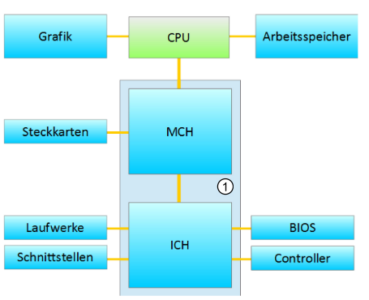

Aufgrund der stetig steigenden Leistungsanforderungen wurde eine neue Architektur entwickelt, bei der Grafik- und Arbeitsspeicher direkt an die CPU angebunden sind. Außerdem wurden MCH und ICH in einem Gehäuse namens "Einchip"-Chipsatz vereint. Da der Einbau externer Grafikkarten immer beliebter wird, wurde der Steckkartenanschluss von ICH zur MCH verlegt. Moderne Beschreibungen und Darstellungen zeigen auch die PCH, die speziell entwickelt wurde, um unterschiedliche Funktionen auszuführen, die für Overclocking, zusätzliche PCI-Lanes, USB 2.0, M.2 usw. benötigt werden.

### CPU

Das Motherboard eines Computers kann aufgrund seiner Architektur nur eine bestimmte Reihe an CPUs nutzen. Aus diesem Grund ist es immer ratsam, im Vorfeld zu überprüfen, ob das Motherboard mit der ausgewählten CPU kompatibel ist. Wenn man nicht-kompatible Geräte zusammenführt, kann es zu Schäden an den Komponenten kommen. Inkompatibilitäten können sich durch verschiedene Faktoren ergeben, wie beispielsweise unterschiedliche Sockel, verschiedene BIOS-Versionen oder sogar durch eine andere Pin-Verlegung. Es ist daher wichtig, sorgfältig zu überprüfen, ob alle Komponenten miteinander harmonieren, um die optimale Leistung des Computers zu gewährleisten und Beschädigungen zu vermeiden.

#### Prozessor-Produktlinien

CPUs gibt es in verschiedenen Formen und mit unterschiedlichen Funktionen. Eine besondere Verwendung finden CPUs in Smart Home Systemen, welche auch als IoTs oder Internet der Dinge bezeichnet werden. Es ist daher wichtig, genau darauf zu achten, wofür die CPU gedacht ist. Ein Beispiel dafür sind die vielen verschiedenen CPUs von AMD, wie die Reihen Ryzen und Ryzen Threadripper/Pro, die speziell für Desktops und Workstations konzipiert sind.

### CPU Prozessorsockel

Ein entscheidender Faktor bei der Auswahl einer CPU ist der Sockel, da nicht jedes Motherboard jede CPU unterstützt. Es ist daher ratsam, immer einen Blick in das Handbuch des Motherboards zu werfen, um sicherzustellen, welche CPUs unterstützt werden. Denn obwohl manche Sockel ähnlich aussehen, können sie dennoch unterschiedlich sein. Wenn man versucht, eine nicht unterstützte CPU in einen solchen Sockel einzusetzen, kann es zu Schäden kommen, wie beispielsweise einem tödlichen Kurzschluss an der CPU, der das gesamte Gerät unbrauchbar machen würde.

### Weitere Komponenten

Nicht alle Komponenten werden vom Motherboard unterstützt, weshalb es wichtig ist, darauf zu achten, dass die gewünschten Features verfügbar sind. Beispielsweise werden integrierte Grafiken oder Grafikkarten möglicherweise nicht unterstützt, ebenso können auch PCI- und PCIe-Schnittstellen nicht verfügbar sein. 

Auch Laufwerke und externe Schnittstellen wie USB könnten unter Umständen nicht unterstützt werden. Es ist daher empfehlenswert, vor dem Kauf der Komponenten die Kompatibilität mit dem Motherboard zu überprüfen, um Kompatibilitätsprobleme zu vermeiden.

#### BIOS-Chip

Obwohl er kein direkter Bestandteil des Chipsatzes ist, gehört dieser Chip zu den wichtigsten Komponenten eines Computers. Ohne ihn wäre der Startvorgang des Computers nicht möglich.

Der BIOS-Chip enthält die Sequenz und Software zur Initialisierung des Systems.

Der Speicher des BIOS-Chips ist als sogenannter ROM-Speicher ausgeführt, was für "Read-Only-Memory" steht.

### Steckplätze

#### Arbeitsspeicher (Hauptspeicher)

Die Steckplätze für den Arbeitsspeicher des Computers (auch Hauptspeicher genannt, vgl. Kapitel 5 und Abschnitt 13.3) nehmen die RAM-Module auf. Diese Haben sich, ebenso wie die Steckplätze für Prozessoren, weiterentwickelt und sind untereinander nicht Kompatibel. Die Anzahl der Anschlusskontakte hat in den letzten Jahre zugenommen. Um das Einsetzen falscher Module zu verhindern, sind die Sockel mit einem Steg versehen.

Für Ältere Speichermodule verfügen einige Mainboards aus Gründen der Abwärtskompatibilität zusätzlich über Steckplätze. Aus dem Handbuch des Motherboard-Herstellers entnehmt man ob ein Mischbetrieb möglich wäre und welche Einschränkungen sich daraus ergeben. Dort steht auch welche Speicherkapazitäten durch Kombination, welche Module, in welchem Steckplatz erreicht werden können.

Um den Spektrum und damit auch den Datendurchsatz zu erhöhen, sollten bei neueren Board die Speichermodule immer Paarweise (Dual Channel) bzw. zu dritt/zu viert eingesteckt werden (Triple Channel/Quad Channel) Dazu sind paare (Steckplätze) oft farbig gekennzeichnet. Im Beispiel oben sollten die ersten zwei Speichermodule in die Blauen Steckplötze gesteckt werde. 

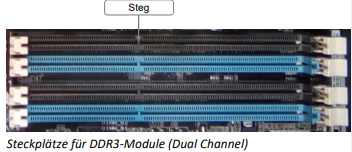

Viele Speichermodulen-Hersteller bieten für die Einrichtung der unterschiedlichen Channel-Konfigurationen spezielle Kit-Varianten ihrer Speichermodule an, wo mit Kit mehrere Speichermodule gemeint sind. Im Lieferumfang befinden sich zwei identische Speichermodule wodurch eine optimale Leistung erreicht wird.

#### Erweiterungssteckplätze von ISA zu PCI

Mit den Erweiterten Steckplätzen des integrierten Bussystems, auch **Slots** genannt kann man den Computer um zusätzliche Funktionalitäten erweitern, zum Beispiel eine Netzwerkkarte.

Der Standartbus war in der PC-Welt der PCI (Peripheral Component Interconnect) im Jahre 1995 bis 2003. Bei diesem parallelen Bus teilen sich alle angeschlossenen Geräte die nutzbare Bandbreite von etwa 133 MB/s (PCI2.0). In laufe der Zeit sind immer schnellere Versionen erschienen, die bis zu 533 MB/s und bei speziellen Ausführungen aus dem Serverbereich bis zu 4 GB/s transportierten /PCI-X-533. Zwischen 1 und 6 PCI-Steckplätze befanden sich auf einem Mainboard.

In seltenen Fällen gab es in Kombination mit dem PCI-Bus noch einen schwarzen Steckplatz für den sogenannten ISA-Bus (Industry Standard Architecture) auf dem Mainboard. Alte Karten des XT-oder AT-Busses konnten so weiterverwendet werden. Der ISA Bus arbeitete in der Regel mit einer Taktfrequenz von 8,33 MHz und erreichte in einem 16 Bit System eine Datentransferrate von 5,33 MB/s.

Die ersten IBM gefertigten 8Bit Personal Computer wurden als XT (e**X**tended **T**echnology) bezeichnet, die neueren 16bit Versionen wurde dann als AT (**A**dvanced **T**echnology) bezeichnet.

Gegen Ende der 90er Jahre wurde **AGP** (Accelerated Graphics Port) für eine schnellere Anbindung der Grafikkarte eingeführt. Obwohl AGP auf PCI-Protokoll basiert, handelt es sich nicht um ein Paralleles Bussystem, sondern um eine Punk zu Punkt Verbindung. Dieser Steckplatz ist oft braun. Die Übertragungsgeschwindigkeit ist wischen 0,266gb/s und 2,1 GB/s. Seit circa 2006 ist diese Grafikschnittstelle veraltet und wurde durch den **PCI Express** (PCIe) ersetzt.

#### PCI Express (PCIe)

PCI Express verwendet genau wie die AGP Punkt-zu-Punkt Verbindung. Diese Verbindungen werden **Lanes** genannt. Zur Erhöhung können 16 Lanes der Übertragungsbandbreite an einem Steckplatz angeschlossen werden. Die Anzahl der Lanes wird mit einem ,,x" und einer gefolgten Zahl bestimmt. Mögliche Steckplötze wären mit x1, x4, x8 und x16. PCIe 4.0 ist im Jahre 2017 erschienen. Im Jahr 2020 hätte PCIe 5.0 erscheinen sollen. Für welches Jahr die jeweiligen PCIe Spezifikationen vorgesehen sind und die Höhe der jeweiligen Übertragungsraten, kann den nachfolgenden Tabellen entnommen werden.

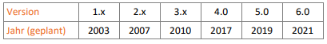

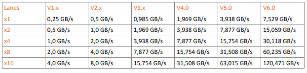

2017 wurde bereits der PCIe 4.0 Standard Ratifiziert, die Hersteller halten sich mit dem Einsatz dieses Anschlusses aber weiterhin zurück. Erst 2020 nimmt die Anzahl der Boards mit PCIe 4.0 Unterstützung zu. Der PCIe 3,x bleibt weiterhin Standard, weil es am breiten Angebot von Grafikkarten fehlt.

Viele neue Motherboards verfügen über eine ganze Reihe unterschiedliche PCI-Express-Steckplätze, die je nach Leistungsfähigkeit der Erweiterungskarten Verwendung finden. 

Der sogenannte **PEG**\-Steckplatz (PCIE Express for Graphics) ist im Prinzip wie ein normaler PCIe-x16-Slot, der PEG-Steckplatz ist jedoch stärker, da er mehr Leistung aufnehmen kann (kann 75W statt 25W). Mit einem Zusatz Stecker von der Stromversorgung zu einer PCIe-Karte, den **PEG-Connector**, kann die maximale Leistung der Grafikkarte höher sein. Über einen 6-poligen Anschluss kann die Leistung um bis zu 75W höher sein und ein 8-poliger bis zu 150W. Dies sollte aber bei der Auswahl der PSU (Netzteil) berücksichtigt werden!

Bei den neusten Prozessoren ist der anfängliche PCI-Bus nicht mehr ein Bauteil des Chipsatzes und sollt mit einer PCIe-to-PCI-Bridge nachgebaut werden.

Die Aktuellen Motherboards verfügen nahezu ausschließlich über PCIe-Slots. Stellen sie daher vor dem Kauf eine Erweitertungssteckkarte unbedingt den Typ des Motherboards und dessen Anschlussmöglichkeiten fest. 

### Anschluss

#### Interne Laufwerke

Bei neuen Desktop Mainboard sind die Controller für Festplatten und optische Laufwerke auf der Platine integriert. Damals waren IDE- bzw. EIDE-Controller der Standard, heutzutage sind sie nahezu vollständig durch SATA oder M. 2 abgelöst worden.

Sata (Serial ATA) ist der gängige Standard auf neune Motherboards. Auch dieser Anschluss hatte sich über die Jahre entwickelt und unterstützt heute drei Betriebsarten, die abwärtskompatibel zueinander sind. Diese sind:

SATA I                                     150 Mbyte/s  
SATA II / SATA 300                  300 Mbyte/s  
SATA III / SATA 600                 600 Mbyte/s  

Berücksichtigen Sie bei Anschluss einer Festplatte die interne Geschwindigkeit der HDD. Erst bei der Verwendung eines SSD (Solid State Drive) ist es möglich, das Leistungspotenzial von SATA II oder SATA III vollkommen auszunutzen.

#### M.2/U.2

Obwohl der M.2 Steckplatz für die Verwendung unterschiedlicher Erweiterungsmodule erstellt wurde, wird dieser häufig mit dem Betrieb von M.2-SSD Laufwerken oder einem Intel Optane Memory Modul in Verbindung gebracht. 

#### Peripheriegeräte

Bei ATX-Mainboards sind die externen Anschlüsse am Rand der Platine aufgelötet und so direkt von außen nutzbar.

Externe Schnittstellen bei einem Pentium-4-Board von 2003:

1) PS/2-Anschlüsse für Tastatur und Maus  
2) Digitalsound optisch und koaxial (SPDIF)  
3) Parallelschnittstelle  
4) Serielle Schnittstelle  
5) USB-Anschlüsse  
6) Netzwerkanschluss (RJ45)  
7) Sound-Anschlüsse analog 

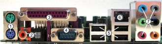

Auf aktuellen Mainboards finden sich eventuell noch Anschlüsse für FireWire (IEEE 1394) oder wie in der folgenden Abbildung Monitoranschlüsse, falls ein Onboard-Grafikchip vorhanden ist.

Externe Schnittstellen von einem aktuelleren Board:

1) USB 2.0  
2) Kombi-PS/2-Anschluss Tastatur/Maus  
3) Monitorausgang analog VGA  
4) Monitorausgang digital DVI  
5) Sound digital (SPDIF) optisch  
6) Monitor/TV-Ausgang digital HDMI  
7) Monitor/TV-Ausgang digital DisplayPort  
8) FireWire 400  
9) eSATA (externes SATA)  
10) Gigabit Ethernet  
11) USB 3.x  
12) Sound-Anschlüsse analog

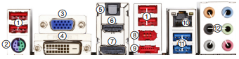

#### PS/2-Anschlüsse

Der Anschluss für die Maus ist grün, der für die Tastatur violett. Die PS/2-Anschlüsse für Tastatur und Maus sind zwar baugleich, unterscheiden sich aber in ihrer Funktion. Bei den Peripheriegeräten (interne oder externe Geräte) sind die Stecker meist in der entsprechenden Farbe hergestellt, sodass das Verwechslungsrisiko erniedrigt ist.

Wenn die Anschlussbuchsen nicht farbig gekennzeichnet sind, weist ein Symbol für Tastatur und Maus neben dem entsprechenden Steckplatz auf das anzuschließende Gerät hin. Außerdem befindet sich der Anschluss für die Maus in aller Regel über dem PS/2-Tastaturanschluss (siehe 1) Schnittstellen-Anschlüsse an einem ATX-Board von 2003). Sind auf einem neuen Board noch PS/2 Anschlüsse vorhanden, ist dies meist ein Kombi-PS/2-Anschluss.

Möchten Sie weiterhin Ihre Tastatur und Maus an PS/2 betreiben, benötigen Sie einen Y-Adapter für PS/2-Geräte

### Baugrößen von Mainboard und Gehäuse

#### Mainboard-Formfaktoren

Bei Mainboards gibt es mehrere funktionale Abmessungen oder Formfaktoren. Der Formfaktor bestimmt die Abmessungen des Mainboards sowie Art und Lage der Bauteile und Anschlüsse.  
Im Laufe der Entwicklung haben sich verschiedene Formfaktoren gebildet, die jeweils für bestimmte Prozessorgenerationen und die entsprechende Peripherie geeignet sind:

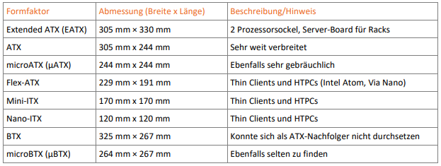Der Formfaktor eines Mainboards bestimmt außerdem den Gehäusetyp und das verwendbare Netzteil. Der Wechsel zu einem neuen Mainboard kann deshalb auch ein neues Gehäuse erforderlich machen. Grundsätzlich passen ATX- und microATX-Mainboards nicht in ein BTX- oder ITX-Gehäuse und umgekehrt auch nicht.

#### ATX

Das ATX-Format (AT Extended) von 1996 ist der Nachfolger des Baby-AT-Formats (Advanced Technology) aus den 80er-Jahren. Entwicklungsziele für diesen Formfaktor waren unter anderem eine bessere Übersicht und Praxis sowie verbesserte Kühlung und eine abnehmende Lautstärke.

Das ATX-Konzept ist inzwischen sehr optimiert und hat sich auf dem Markt erfolgreich durchgesetzt. Weitere Vorteile und Features des ATX-Formfaktors sind:  
\-Auf der Board-Unterseite befindet sich ein aufgelötetes Input/Output-Panel, wodurch externe Peripheriegeräte (Maus, Tastatur, Drucker etc.) direkt angeschlossen werden können.  
\-Die Kabelanschlüsse für Gehäusekomponenten (Lautsprecher, Reset, Power-On) sind seitlich sehr übersichtlich in einer Reihe angebracht.  
\-Die Stromversorgung des Mainboards erfolgt mit einem verpolungssicheren Steckanschluss und kann daher auch von unerfahrenen Benutzern fachgerecht angeschlossen werden.  
\-CPU und Speicherbänke sind zueinander versetzt. Die Steckplätze bzw. Sockel sind oft so angeordnet, dass sie leicht erreichbar sind, ohne dass bei der Aufrüstung Erweiterungskarten ausgebaut werden müssen.  
\-ATX-Mainboards können die CPU-Temperatur oder Lüfterdrehzahl überwachen. Der Nutzer kann diese Daten über eine mitgelieferte Software jederzeit am Bildschirm verfolgen. Falls die Temperatur einen schlimmen Schwellenwert übersteigt, schaltet sich der Rechner automatisch ab.  

Der ATX-Standard schreibt für Mainboards ein Zonenmodell vor, in dem festgelegt wird, in welchen Bereichen des Mainboards, bestimmte Bauteile und Funktionsgruppen untergebracht werden müssen. Alle möglichen Maße vom Freiraum rund um den CPU-Sockel bis hin zu den Positionen der Befestigungslöcher sind geregelt. So ist sichergestellt, dass jedes ATX-Board in jedes ATX-Gehäuse passt.

#### microATX

Das microATX-Format ist eine Weiterentwicklung des ATX-Formats. Die Position der Steckplätze und externen Anschlüsse wurden beibehalten, um eine Verträglichkeit mit bestehenden ATX-Gehäusen zu ermöglichen. Nur ein Teil der Montagebohrungen wurde an die geringere Größe des microATX-Mainboards angepasst. 

Die geringere Boardgröße ermöglicht insgesamt kleinere PC-Gehäuse und kann helfen, die Systemkosten zu erniedrigen. Der dichte Aufbau kann allerdings zu Problemen bei der Wärmeabfuhr von leistungsfähigeren Prozessoren führen und setzt engere Grenzen bei der Erweiterung durch Steckkarten.

Die schnelle Evolution, besonders der Prozessoren und Chipsätze, zwingt auch bei Mainboards zu ständiger Weiterentwicklung. Dabei stehen die fortschreitende Integration von elektronischen Bauteilen und eine Beschränkung der mechanischen Bedienelemente (Jumper) im Vordergrund. Um ständig aktuellen Trends gerecht werden zu können, besitzen Mainboards oft nur minimal längere Produktzyklen als die eingesetzten CPUs.

#### BTX-Format

Das BTX-Format (Balanced Technology Extended) wurde 2003 von Intel mit dem Ziel vorgestellt, ein MainboardDesign festzuschreiben, das die Hauptwärmequellen (Prozessor, Grafikkarte und Chipsatz) so platziert, dass eine nutzvolle Kühlung auch extrem heißer Prozessoren und Grafikkarten möglich ist. Dabei wurde der Aufbau und Führung des Luftstroms im Gehäuse mit einbezogen, sodass in einigen Fällen nur ein einzelner großer Lüfter zur Kühlung des Computers benötigt wird. Dies führt zu einer deutlichen Lärmreduzierung und macht das BTXFormat prinzipiell überall dort interessant, wo leise Geräte benötigt werden. 

Das BTX-Format konnte sich jedoch kaum etablieren und wurde im Jahr 2007 wieder vom Markt genommen.

#### Mini-ITX-Format

Das ursprüngliche ITX-Format wurde 2001 von VIA vorgestellt und später um die Formate Mini-ITX, Nano-ITX und Pico-ITX ergänzt. 2008 kam die Version 2.0 heraus. Vor allem Mini-ITX ist recht erfolgreich und wird z. B. für Thin Clients (ein Thin client ist ein Gerät, über das Nutzer auf virtuelle Desktops zu greifen) verwendet. Mini-ITX-Boards lassen sich prinzipiell mit einem ATX-Netzteil betreiben und passen auch in ATX-Gehäuse.

#### Computergehäuse

Passend zu den verschiedenen Mainboard- und Netzteil-Formfaktoren werden unterschiedliche Gehäuse angeboten. Da die externen Anschlüsse in die entsprechende Aussparung im Gehäuse passen müssen, können nur bestimmte Formfaktoren in den Gehäusen befestigt werden. 

### Netzteil

Ein Netzteil ist notwendig, um den Computer am Stromnetz nutzen zu können. Der PC wird an die übliche Haushaltsspannung von 230 V mit 50 Hz angeschlossen. Im Rechner selbst werden allerdings deutlich kleinere Spannungen benötigt.

Die Aufgabe des Netzteils ist es, die von außen angelegte Wechselspannung von 230 V auf verschiedene Gleichspannungen von 3.3 V, 5 V und 12 V umzuwandeln. Aus diesen Spannungen erzeugen die Spannungswandler auf dem Mainboard alle weiteren benötigten Betriebsspannungen.

Bei dem in einem Computer eingesetzten Netzteil handelt es sich um ein Schaltnetzteil. Bei Schaltnetzteilen wird die Eingangsspannung zuerst gleichgerichtet (Umwandlung einer Wechselspannung in eine pulsierende Gleichspannung) und anschließend in Wechselspannung einer höheren Frequenz (meistens im kHz-Bereich) gewandelt. Diese Spannung wird dann in eine Spannung mit geringerer Amplitude (Schwingungshöhe einer Wechselspannung) umgewandelt. Zum Schluss wird die Niedrigspannung wieder gleichgerichtet und die gewünschte Gleichspannung ist hergestellt.

Die Gleichrichtung wird bei modernen Netzteilen durch einen aktiven oder passiven Leistungsfaktorkorrekturfilter (PFC, Power Factor Correction) erreicht. In hochwertigen Netzteilen wird mit einer Kombination aus aktiver PFC und passivem Filter gearbeitet.

Das Netzteil ist ein eigeständiges elektrisches Gerät, welches keine zu reparierende teile hat. Im inneren des Netzteils sind lebensgefährliche Berührungsspannen zu finden. Falls etwas mit dem Netzteil an sich nicht stimmt dann versuchen sie es nicht zu reparieren tauschen sie es als ein Komplettes teil aus.

#### Anschluss der Stromversorgung

Jedes Motherboard braucht einen Anschluss, über den dann die Spannung zugeführt wird. Bei den ATX-Mainboards wurde der Stecker verpolungssicher hergestellt.

Das Mainboard, Netzteil und das Gehäuse müssen aufeinander abgestimmt sein. Für ein ATX-Mainoard brauchen sie ein ATX-Netzteil und ein ATX-Gehäuse. Am anfang wurden ATX-Mainboards über 20-polige Anschlüsse mit Strom versorgt (ATX 1.0 u. 1.3). Wegen modernen Grafikkarten wurden die Stromanschlüsse um 4 weiter Pins erweitert.

Durch den hohen Strombedarf der Prozessoren und Grafikkarten hat die Leistungsfähigkeit der Netzteile immer mehr zugenommen. 

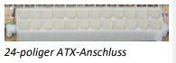

#### Zusätzliche Stromversorgung für Prozessoren

Mainboards mit neuen Prozessoren reicht der ATX-Stromanschluss nicht mehr aus, um ihn mit dem benötigten Strom ausreichend zu versorgen.

Aus dem Grund befindet sich seit der ersten Revision des ATX-Standards auf diesen Mainboard noch ein wieterer, meist quadratischer 12-Volt-Stromanschluss, der verpolungssicher ausgeführt ist. Der 4-polige Anschluss wird ,,ATX12V" oder ,,Intel-P4-fähig" genannt.  

Bei Serverboards oder stromhungirge Prozessoren wird manchmal auch der 8-polige zusätzliche EPS12V-Stromanschluss verwendet, auch in Form von zwei 4-poligen ATX12V-Stecker, die nebeneinander eingesteckt werden.

#### ATX-Netzteilstandards

Der ATX-Standard wurde 2000 in ATX12V umbenannt. Version 1.0 brachte den zusätzlichen vierpoligen Stromanschluss.

Mit Version 2.0 wurde 2003 der Anschluss für die Stromversorgung auf 24 Pole verbreitert. Anschlüsse für die SATA-Stromversorgung wurden zwingend erforderlich. Außerdem wurde die Leistungsabgabe der 12V-Schienen verstärkt.

Version 2.1 und 2.2 brachten die 6-poligen und 8-poligen PCIe-Stecker (75 W bzw. 150 W zusätzlich für die Stromversorgung der Grafikkarte). Zusammen mit den 75 W des PEG-Slots kann eine einzelne Grafikkarte nun bis zu 300 W ziehen. Version 2.3 machte kleine Änderungen bei der geforderten Energieeffizienz, die mindestens 70 % fordert und 80 % empfiehlt. Im Zusammenhang mit der Einführung der Intel Haswell Microarchitektur  
wurde die ATX Version auf 2.4 erhöht.

#### Auswahl des passenden Netzteils

Nachdem fast ausschließlich Netzteile im ATX Format in den Desktop PCs verbaut wurde, haben sich mittlerweile andere Formfaktoren auf dem Markt fest gefügt.

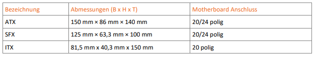Ein Grund dafür wäre, weil es Trend geworden ist kleinere und kompaktere Computer auf dem Arbeitsplatz zu haben.

#### Kabelmanagment

Bei Netzteilen unterscheidet man Geräte, bei denen die Anschlusskabel direkt aus dem Netzteilgehäuse kommen (non-modular) und solche, die anstelle von festen Kabeln Steckverbindungen verwenden (modular). Der Vorteil der modularen Geräte liegt in einer ordentlicheren Kabelverlegung und dem Verzicht auf nicht benötigte Kabel, was die Luftzirkulation innerhalb des Gehäuses verbessern kann.

#### Leistung

Moderne PCs haben einen großen Energiebedarf, der bei Einsatz mehrerer Grafikkarten unter Volllast in den Bereich von 1.000 Watt und mehr reichen kann. Normal ausgestattete Büro- oder Heim-PCs brauchen jedoch selten mehr als 400 W. Die Angabe der Gesamtleistungsaufnahme ist meist nur ein Richtwert, denn je nach Anwendung und Motherboard werden die Leitungen mit 12 V und 5 V unterschiedlich stark belastet. Je nach Anwendungsgebiet und Ausstattung muss das Netzteil den Anforderungen stets gewachsen sein, sonst drohen Instabilitäten und Abstürze. 

#### Energieeffizienz

Alle Netzteile sind im Bereich zwischen 40 % und 80 % ihrer Maximalleistung am effizientesten. Die Energieeffizienz sollte so nah wie möglich an 100 heranreichen. Achten Sie beim Kauf auf das „80 PLUS“-Logo, das es in mehreren Stufen gibt: 80 PLUS (weiß), Bronze, Silber, Gold, Platinum. Das Logo wird allerdings erst ab einer Leistung ab 350 W vergeben, sodass schwächere Netzteile, die für den Aufbau besonders sparsamer Computer interessant sind.

#### Wege zum Leisen PC

Bei jeder PC-Komponente sollten Sie auf eine niedrige Lärmentwicklung achten. Dazu gehört die Auswahl angemessen leistungsfähiger Bauteile mit möglichst leiser Kühlung.

Neben besonders leisen Silent-Netzteilen können auch normale Netzteile leise sein. Für einen leisen Betrieb sollten Sie den Energieverbrauch des Computers im Auge behalten.

Das größte Sparpotenzial ergibt sich bei der Auswahl der Grafikkarte und der CPU. Hier lassen sich 50 W und mehr schon im Leerlauf und Teillastbereich einsparen.

Moderne Prozessoren und Grafikkarten verfügen über ausgeklügelte Stromsparmechanismen. Erst wenn die volle Leistung abgefordert wird, schnellt der Stromverbrauch in die Höhe. So kann bei Grafikkarten der Stromverbrauch im Leerlauf bei 20 W liegen, bei Volllast dagegen bei über 300 W. Bei Prozessoren reicht diese Spanne von 20 W bis 140 W.

Wenn die Leistung der integrierten Chipsatz- oder Prozessorgrafik ausreicht, sollten Sie auf eine eigenständige Grafikkarte verzichten. 

Nicht zu unterschätzen ist auch der Stromverbrauch von mechanischen Festplatten. Jede Desktop-Festplatte im üblichen 3,5"-Format benötigt im Betrieb zwischen 6 W und 12 W.  Die günstigste Lösung ist ein Solid State Drive (SSD), dass schnell, lautlos und stromsparend ist (0,3 bis 4 W).

#### Ausfallsicherheit und Redundanz

Bei Workstations und vor allem Servern werden oft redundante Netzteile eingesetzt, um die Ausfallsicherheit zu erhöhen. Auch werden besonders für Serverracks USV-Anlagen installiert.

### Unterbrechungsfreie Stromversorgung

Eine USV überbrückt im fall eines Stromausfall die Zeit bis zum Anschalten eines Notstromaggregates oder des Speichern und saubere Herunterfahren des Computers. Davon gibt es 3 Unterschiedliche formen.

#### Online-USV

**Anderer Name:** Voltage and Frequency Independent

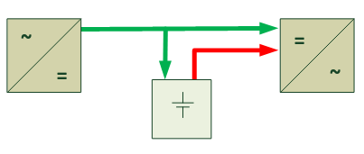
*In der Schaltskizze fehlt ein Schalter der es dir erlaubt die Batterie zu Wechseln.*

Im Normalen Betrieb werden die 230V Wechselspannung in Gleichspannung gerichtet und lädt eine Bakterie und an der ausgangsseitig wieder in Wechselspannung gewandelt. In der Schaltskizze ist es die Grüne Leitung.

Aber im fall eines Stromausfalls, repräsentiert in Rot, Zieht er die Gleichspannung gleich aus der Batterie und wandelt sie um zu Wechselstrom.

| Vorteile                                                           | Nachteile       |
| ------------------------------------------------------------------ | --------------- |
| Konstante saubere und Gleichförmige Wechselspannung am Verbraucher | teuerste Lösung |

#### Line Interactive USV

 **Anderer Namen:**

* Voltage Independent
* netzinteraktiv
* aktiver Mitlaufbetrieb

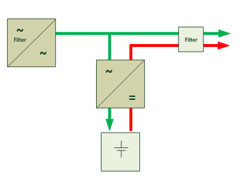Im Normalendbetrieb, in Grün, werden die 230V Wechselspannung gefiltert, dass beseitigt Spannungsspitzen. Vor der Batterie hängt dann ein Spannungsrichter welcher die Batterie lädt.

Aber im fall eines Stromausfalls, Rot, Wird die Gleichspannung zurück in Wechselstrom verwandelt und in das System gefüttert.

| Vorteile                           | Nachteile                 |
| ---------------------------------- | ------------------------- |
| Günstiger als die Online-USV       | keine Frequenzanpassungen |
| Schutz vor Über- und Unterspannung | Umschaltzeit 2-4ms        |

#### Offline-USV

 **Anderer Namen:** Voltage and Frequency Dependent

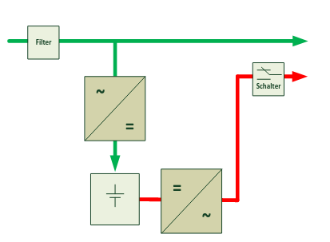
Im Normalen betrieb wird die Wechselspannung am Eingang gefiltert und an den USV Ausgang sofort weitergeleitet. Ein teil davon wir in Gleichstrom gerichtet und in eine Batterie geleitet.

Im Fehlerfall (Rot) wird die Gleichspannung von der Batterie über eine Wechselrichter in Wechselspannung gerichtet und über ein Relay an den Ausgang geleitet. 

| Vorteile                  | Nachteile                                                                |
| ------------------------- | ------------------------------------------------------------------------ |
| Günstigste Lösung         | Kein wirksamer Schutz von Frequenz- und Spannungsschwankungen am Eingang |
| Schutz vor Überspannungen | lange Umschaltzeit von bis zu 10ms                                       |

#### Alle USV-Typen

Alle USV-Typen haben einen Anschluss über den der Computer Zeitgleich über den Fehler Informiert werden kann, um ein Herunterfahren zu Initialisiere. 

**Geschrieben von Metin, Nathalie, Julian**

## CPU

Derzeit bis zu 8,43 Milliarden Transistoren als elektronische Schalter
auf einem nur wenige Quadratzentimeter großen Träger aus
Halbleitermaterial.

Zum Schutz vor mechanischen Belastungen werden die Mikrochips in einem
Gehäuse aus Kunststoff oder Keramik ummantelt. Moderne Prozessoren
besitzen meist eine Abdeckung aus Metall welche die entstehende Wärme
auf eine größere Fläche abführt und das empfindliche Prozessor-Die
schützt. Eine Verkleinerung erlaubt eine Reduzierung der Spannung sowie
eine Erhöhung des Taktes und der Transistorzahl.

### Eigenschaften

- Anzahl der CPU-Kerne im Prozessorgehäuse (Single- und
  Multi-Core-Prozessoren)
- Taktfrequenz und Möglichkeiten zur parallelen Abarbeitung von
  Befehlen (Multi-Threading)
- Funktionen zur Takterhöhung und Energiemanagement Größe der Caches,
  Vorhandensein von Level-3-Cache
- Virtualisierungsfunktionen (VT-x/AMD-V, VT-d)
- Prozessorarchitektur, Breite von Busverbindungen, Anbindung an den
  Chipsatz und Arbeitsspeicher
- Vorhandensein von Befehlssatzerweiterungen zur Beschleunigung
  bestimmter Berechnungen (SSE, AVX2, früher MMX und 3DNow!)
- Eingebaute Sicherheitsmechanismen

### CISC, RISC

CISC ist die Abkürzung für **Complex Instruction Set Computing** und
bezieht sich auf die Anzahl verschiedener Befehle, die ein Prozessor
versteht.

RISC steht für **Reduced Instruction Set Computing**, sie verfügen über
einen eingeschränkten Befehlssatz, können diese meißt mit wenig
Taktzyklen ausführen. Umfangreichere Befehle werden vor der Bearbeitung
in einfachere Teile mit fester Länge zerlegt und nacheinander
verarbeitet. Die Befehle sind sehr einfach und es gib keinen Microcode
wie bei CISC-Prozessoren. Entsprechende Programmierung vorausgesetzt,
können RISC-Prozessoren eine Leistung erreichen, die deutlich über der
von vergleichbaren CISC-Prozessoren liegt.Alle Prozessoren enthalten
Elemente aus beiden Welten. Die Anzahl der Register ist kontinuierlich
gestiegen, wie bei RISC, außerdem werden komplexe Befehle während der
Laufzeit in RISC-Befehle übersetzt. Mikrocode wird kaum noch verwendet.

### Auswahl der Prozessorkerne

Singlecore Prozessoren haben gleich mehrer Probleme. Die Erhöhung des
Systemtakts führt zu einer höheren Leistungsaufnahme und in dessen Folge
zu einer stärkeren Wärmeentwicklung. Zusätzlich eingebaute Kühlmaßnahmen
in Form von Lüftern machen das System lauter. Um Platz für neue
technische Merkmale zu haben, muss die bisherige Prozessorkonstruktion
verkleinert werden. Zusätzliche in den Kern eingebrachte Schaltkreise
verstärkten wiederum die Wärmentwicklung. Multicore Prozessoren
begrenzten diese Probleme, da sie deutlich niedriger getaktet werden als
Singlecore Prozessoren, dafür aber über mehrere Recheneinheiten
verfügen. Dennoch lösen sie das Problem nicht vollständig, da die
Rechenleistung nicht addiert werden kann. Die effiziente Ausnutzung der
Rechenleistung macht es erforderlich, dass vonseiten der Software das zu
lösende Problem gleichzeitig in mehreren Kernen verarbeitet wird.
Softwareentwickler den Programmablauf in mehrere kleinere Teilaufgaben
zerlegen, was nicht immer möglich ist. Stärke der Multicore Prozessoren
liegt daher in der gleichzeitigen Abarbeitung mehrerer Programme oder
Teilstränge (Threads).

#### Taktfrequenz/CPU-Geschwindigkeit

Jede Anweisung eines Programms, die von der CPU ausgeführt wird,
erfordert eine bestimmte Anzahl von Taktimpulsen (Taktzyklen). Je höher
die Taktfrequenz (auch Taktrate genannt) ist, desto schneller können
einzelne Programmanweisungen bearbeitet werden. Eine Aufgabe, die von
einer CPU mit 1 GHz in 30 Sekunden ausgeführt wird, kann theoretisch auf
einer baugleichen 2-GHz-CPU in 15 Sekunden ablaufen. Die tatsächliche
Leistung einer CPU hängt aber auch davon ab, wie viele Befehle je
Taktzyklus gleichzeitig verarbeitet werden können.

Die Prozessoren tauschen ihre Daten zwar mit der Taktgeschwindigkeit der
Hauptplatine aus, können intern jedoch mit einem Vielfachen dessen
rechnen. Der variable Taktgeber wird auf die benötigte
Taktgeschwindigkeit der Hauptplatine eingestellt. Bei älteren
Prozessoren ist dies der Front-Side-Bus-Takt (FSB), bei neueren
Prozessoren mit integriertem Speichercontroller übernimmt diese Rolle
ein Referenz- oder Systemtakt. Die interne Trotz der unterschiedlichen
Bezeichnungen erlauben beide Techniken dem Prozessor das automatische
Absenken des Multiplikators, um Energie einzusparen. Die Einstellung
(aktiv/inaktiv) wird in den BIOS Einstellungen vorgenommen.

#### AMD Turbo Core/Intel Turbo Boost

Da sich die Anwendungssoftware nur sehr langsam Richtung multithreading
entwickelt, spielt die Rechenleistung eines einzelnen Kerns noch immer
eine große Rolle. Daher haben sowohl Intel als auch AMD in ihren
Prozessoren eine automatische Takterhöhung eingebaut. Sind mehre Kerne
nicht in Verwendung, werden diese abgeschaltet und die arbeitenden Kerne
bis an die Belastungsgrenze übertaktet, um die Verarbeitung zu.

#### Hyper-Threading

Intel führte 2002 die Hyper-Threading-Technologie ein (HTT). Dabei wird
dem Betriebssystem vorgegaukelt, dass es sich bei einem Prozessorkern um
zwei Kerne handelt. Mit dieser Prozessorerweiterung ist es dem Prozessor
möglich, mehrere Arbeitsschritte (Threads) gleichzeitig abzuarbeiten,
sofern die Software dies unterstützt.

#### Multi-Threading

Früher verfügte jeder Prozessor nur über einen Kern und konnte jeweils
nur einen Prozess (Thread) zum Zeitpunkt X bearbeiten. Wenn jedoch im
System mehrere Prozessoren/Prozessorkerne vorhanden sind oder ein
Prozessor mehrere Threads (Prozesse) gleichzeitig verarbeiten kann, wird
dies als Multi-Threading bezeichnet.Verarbeitungsgeschwindigkeit erhöht

#### Cache

Die CPU ist mit schnellen Zwischenspeichern versehen, in denen häufig
verwendete Daten (Data Cache) und Befehle (Code Cache) abgelegt werden.
Der Cache kann mit höheren Taktraten angesprochen werden als der externe
Arbeitsspeicher. In diesem Fall wird der langsame Hauptspeicher vor dem
Prozessor versteckt. So lassen sich die Zugriffszeiten auf benötigte
Daten deutlich reduzieren und die CPU wird für bestimmte Anwendungen
leistungsfähiger. Ein kleiner Level-1-Cache ist auf dem CPU-Chip selbst
untergebracht (on-die) und erlaubt maximale Zugriffsgeschwindigkeiten.
Ein deutlich größerer Level-2-Cache kann entweder on-die oder im
Prozessorgehäuse angeordnet sein. Bei modernen Multi-Core-Prozessoren
gibt es für jeden Kern eigene L1- und L2-Caches. Smart Cache
repräsentiert einen gemeinsamen Speicher, der allen Prozessorkernen zur
Verfügung steht (Shared) und als höchster Level benutzt wird. Verfügt
die CPU über L1- und L2-Cache, wird Smart Cache als L3-Cache betrieben.

**Beispiele für kommerzielle Typ1 Hypervisatoren (Bare-Metal
Hypervisor):**

- Microsoft Hyper-V Server
- VMware VCenter Server
- Citrix Xen Server

**Beispiele für Typ 2 Hypervisatoren:**

- Microsoft Hyper-V (in Windows 10 Pro enthalten)
- VMware Workstation/Workstation Player (für privaten, nicht
  kommerziellen Gebrauch frei)
- Oracle Virtualbox (für privaten Gebrauch frei)

Virtualisierungsfunktion wird im BIOS aktiviert, kann sich je nach
System in den Erweiterten Einstellungen, der Einstellungen der CPU, als
auch in den Sicherheitseinstellungen befinden. (Intel: VT-d, AMD:
AMD-V). VT-d (Intel Virtualization Technology for Directed I/O neues
Feature für Intel-CPUs, um physikalische PCI-Geräte (z.B. Netzwerkkarte)
in virtuelle Umgebung einzubinden. -\> Gerät steht direkt in virtueller
Maschine zur Verfügung.

#### Pipelining

Befehlsausführung einer CPU kann in mehrere Abschnitte unterteilt
werden:

- Ein Befehl wird geladen.
- Der Befehl wird decodiert.
- Erforderliche Daten (Operatoren) werden geladen.
- Im Befehl beschriebene Operation wird ausgeführt.

Abschnitte werden in Von-Neumann-Architektur in einem einzelnen
Taktzyklus nacheinander von CPU ausgeführt. Für Ausführung eines
kompletten Befehls sind im einfachsten Fall fünf Taktzyklen
erforderlich.

Pipelining stellt somit in CPU, Funktionseinheiten bereit, die jeden der
einzelnen Schritte, unabhängig voneinander, bearbeiten. Wird Befehl im
ersten Zyklus von einer Funktionseinheit geladen, wird im nächsten
Zyklus von zweiter Funktionseinheit decodiert. Erste Funktionseinheit
kann parallel bereits nächsten Befehl laden. Es entsteht nach dem
Prinzip der Eimerkette ein System, bei dem jede Funktionseinheit in
jedem Taktzyklus ihre Aufgabe erledigt und nicht auf andere Abschnitte
warten muss. Befehlsverarbeitung dadurch erheblich effektiver.
Allerdings nach wie vor wird je Taktzyklus nur ein Befehl von der CPU
geladen.

### 64-Bit-Prozessoren

- 2003 Einführung 64-Bit-Technologie (AMD64) im Desktop-Bereich mit
  Athlon-64-Prozessoren durch AMD
- Aufgrund des Markterfolges zog Intel 2004 mit Befehlssatz Intel64
  nach
- Mit Einführung der 64-Bit-Technologie konnte
  4-GB-Arbeitsspeichergrenze überwunden werden
- Heutige CPUs auch 64-Bit Prozessoren

**Gebräuchliche 64-bit-Server- und Desktop-Betriebssysteme sind**

**Desktop:** UNIX, Linux, Windows-Generationen seit XP Professional 64 Bit

**Server:** nahezu alle Linux-Distributionen, Windows-Server seit Server
2003

Beim Einsatz von 64-Bit-Betriebssystemen werden entsprechende
64-Bit-Treiber benötigt. Ist besonders bei älterer Hardware und
Peripherie problematisch.

### Superskalare Architektur

CPU mit superskalarer Architektur kann je Taktzyklus mehrere Befehle
entgegennehmen. Dazu wird Anzahl der Funktionseinheiten erhöht.
Superskalare Prozessoren besitzen Hardware für jeden Abschnitt der
Verarbeitung mehrmals. Wird beispielsweise Anzahl der Funktionseinheiten
vervierfacht, können vier Befehle gleichzeitig ausgeführt werden.
Moderne CPUs verwenden eine Kombination aus Pipelining und superskalarer
Architektur.

### Benchmarks

Benchmarking (Benchmark = engl. Maßtab) von Hardware bezeichnet die
Messung der Leistungsfähigkeit der einzelnen Komponenten. Die zu
vergleichenden Komponenten werden dabei nacheinander in denselben
Computer eingebaut und mit verschiedenen Benchmark-Programmen getestet.
Im Testcomputer ist hochwertige, schnelle Hardware verbaut, um
Leistungsfähigkeit der der zu testenden Hardware nicht einzuschränken
(Bottleneck). Viele Programme sind besonders auf das CPU-Sortiment eines
bestimmten Herstellers optimiert. Prozessor kann für bestimmte
Aufgabenbereiche geeignet sein, der unter den üblichen Benchmarks nicht
Spitzenreiter ist. Neben der Gesamtleistung des Systems sind auch
Anschaffungskosten, Energieverbrauch, sowie Garantieleistung und
Herstellersupport wichtige Faktoren. Bekannte Benchmark-Programme sind
z.B. PassMark, SiSoftware Sandra. Besonders für die Messung der
Spiele-Performance eignet sich der 3dMark, oder für die Gesamtleistung
PCMark.

### Intel-Prozessoren

Die Reihe der Intel-Core Prozessoren besteht aus den bekannten Modellen
i3, i5, i7. Seit der 7. Generation hinzugekommen ist der i9, der
mittlerweile schon in der 10. Generation produziert wird. Weiterhin ist
auch der bereits bekannte Celeron in der 10. Generation zu finden.
Heutiges Segment an verschiedenen Modellen bietet eine große Vielfalt,
was nicht zuletzt auf deutlich gewachsene Konkurrenz von AMD
zurückzuführen ist. Alle Modelle der 10. Highend-Desktop Generation von
Intel, verfügen über keinen Grafikchip, unterstützen bis zu 4
Speicherkanäle und 256 GB DDR4 mit einer Standard-Taktrate von 2933 MHz.
Weiterhin verwenden sie den PCIe 3.0 Standard und können außerdem bis zu
48 PCIe Lanes verwenden. Aktuelle Celeron-Prozessoren werden ebenfalls
in 14nm Technologie gefertigt. Sie besitzen kein Hyper-Threading. Zum
Einsatz kommt, wie in den vorherigen Modellen eine Intel UHD Graphics
610 Grafikeinheit, der einen maximalen Grafikspeicher von 64 GB
unterstützt. Die Standardmäßige Taktfrequenz liegt hier bei 350 MHz,
welcher jedoch auf 1,0 bzw. 1,05 GHz gesteigert werden kann.

### TDP (Thermal Design Power)

- beschreibt die maximale thermische Verlustleistung des jeweiligen
  Prozessors. Dies bedeutet, dass im Volllastbetrieb auch diese
  Leistung aufgenommen und in Wärme umgesetzt wird.

#### Intel Optane Speicher

*Was ist Intel Optane?*

- Beim Intel Optane Speicher handelt es sich um ein Hardwaremodul, das
  einen M2-Steckplatz verwendet und sich so mit dem PCI Express Bus
  des Motherboards verbindet.
- Sie ist eine intelligente Technik, die PCs mit Intel Core
  Prozessoren entsprechend beschleunigt.
- Sie merkt sich, welche Dokumente, Bilder, Videos und Anwendungen die
  Benutzer am häufigsten aufrufen und hält sie für den schnellen
  Zugriff bereit -- sogar nach dem Abschalten des PCs.
- Technisch basiert Optane auf dem sogenannten
  3D-XPoint-Speicherverfahren, das besonders schnellen Datenzugriff
  verspricht.
- Vorteile der Intel Opatane: das schnelle Laden der Benutzterdaten
  von der SSD und die großen Speicher
- kapazitäten mechanischer Festplatten.

#### Vpro

- Intel vPro:  Sie bieten die reaktionsschnelle Leistung und
  zuverlässige Konnektivität, die Geschäftsanwender benötigen, um
  länger mobil zu bleiben -- und den ganzen Tag produktiv zu sein.
- Der Prozessor, der mit vPro integriert, erlaubet es per Fernzugriff
  , Statusinformationen abzurufen, Konfigurationsänderungen
  vorzunehmen und das System ein-/auszuschalten
- Kritik: mit dieser Technologie eine nur schwer zu kontrollierende
  Hintertür geschaffen zu haben.

### AMD-Prozessoren (Advanced Micro Devices):

- AMD Highend-Desktop-Prozessoren (Threadripper 3970X )

- AMD bietet momentan seine Threadripper- und Threadripper
  Pro-Prozessoren für den High-End-Desktop- und Workstation-Bereich
  an. 

- AMD-Standard-Prozessoren
  
  - Ryzen 5, 7 und Ryzen 9
  
  - Ryzen 4000er G-Serie.

- Auch gibt es den Ryzen und Athlon als PRO Version für die Zielgruppe
  der gewerblichen Anwender.

- Das PRO Programm stellt einen einheitlichen Funktionsumfang aller
  Modelle bereit, gibt eine Verfügbarkeits garantie für Ersatzteile
  und stellt eine verschlüsselte Speicherung der Daten im
  Arbeitsspeicher (Echtzeit) bereit.

### CPU-Kühler

- Sie absorbieren Wärme von der CPU und leiten sie von der Hardware
  ab.

- Die vom Prozessor selbst erzeugte Wärme wird auf den Metalldeckel
  der CPU verteilt, das sogenannte Wärmeverteilblech (Integrated Heat
  Spreader, IHS).

- Die Wärme wird auf die Grundplatte des CPU-Kühlers übertragen. Diese
  Wärme wird, entweder durch Flüssigkeit oder per Wärmerohr, an einen
  Lüfter abgegeben, wo sie vom Kühler weggeblasen und schließlich vom
  PC abgeleitet wird.

- Luftkühlung des Prozessors
  
  - Bei einem Luftkühler wird die Wärme vom IHS der CPU über
    die aufgebrachte Wärmeleitpaste auf eine leitfähige Grundplatte
    übertragen, die in der Regel aus Kupfer oder Aluminium besteht.
  
  - Von der Grundplatte gelangt diese thermische Energie in die
    angeschlossenen Wärmerohre.

- Die Effektivität eines Luftkühlers kann in Abhängigkeit von
  verschiedenen Faktoren variieren, etwa
  
  - nach den für die Konstruktion verwendeten Materialien (Kupfer
    ist z. B. leitfähiger als Aluminium, auch wenn Aluminium
    günstiger ist) sowie
  
  - nach der Größe und Menge der Lüfter, die am CPU-Kühlkörper
    befestigt sind.

- Wasserkühlung des Prozessors
  
  - Bei der Wasserkühlung führt der Wasserkreislauf die Abwärme aus
    Prozessor, Chipsatz und Grafikprozessor ab.
  
  - Das erwärmte Wasser durchläuft einen Radiator und wird dort
    mithilfe eines Lüfters wieder abgekühlt.
  
  - effektiver abwärmen leistungsfähiger und leiser als eine
    Luftkühlung.
  
  - aufwendiger zu warten und ist teurer als eine Luftkühlung

### Betriebsmodi des Prozessors

- Mit der Einführung des ersten 386er Prozessors konnte erstmalig der
  maximal 4 GB große Arbeitsspeicher linear adressiert werden (Flat
  Memory).

- Mit Einführung der 64 Bit-Prozessoren wurde dieses Modell in
  modifizierter Form beibehalten, jedoch versucht man, mögliche
  Sicherheitslücken durch neue Hardwareerweiterungen wie NX-Bit
  (NoExecute) oder SMEP (Supervisor Mode Execution Protection) zu
  beseitigen.

- Es gibt 3 Prozessormodi
  - Real Mode
  - Protected Mode
  - Virtual Protected Mode (Real Mode und Protected Mode vereint)

## Bussysteme

### PCI-Bus – Der langjährige Standardbus auf dem Mainboard

Der PCI-Bus (Peripheral Component Interconnect Bus) war bis zur Einführung von PCIe der standardmäßig verbaute Slot auf allen gängigen Mainboards (vgl. Abschnitt 2.9, Steckplätze). Er wurde 1991 von Intel vorgestellt und war seit der Markteinführung der Pentium Prozessoren 1993 auf Mainboards zu finden. Heutige Desktop Motherboards bringen diesen Bus-Steckplatz nicht mehr mit.

Durch sogenannte Brücken (Bridges) stehen alle notwendigen PCKomponenten mit allen anderen Bussystemen in Kontakt. Die Anbindung des PCI-Busses an den prozessorinternen Bus wird durch die sogenannte Host Bridge im PCI-Chipsatz gewährleistet. Diese passt unterschiedliche Taktfrequenzen an und koordiniert die Schreib- und Leseanforderungen für den PCI-Bus. Durch die hiermit vorhandene Entkopplung kann der Prozessor weitere Berechnungen ausführen, während gleichzeitig beispielsweise Daten vom Hauptspeicher zur Grafikkarte transportiert werden.

Für die Ankopplung anderer Bussysteme werden interne und externe Brücken (PCI to N.N.) unterschieden. Sowohl Bus-Mastering als auch der Plug-&-Play-Modus wird vom PCI-Bus unterstützt. An den PCI-Bus können maximal 10 Geräte angeschlossen werden, die als Master oder als Slave betrieben werden können. Der Master kann bei Bedarf die Kontrolle über die Kommunikation auf dem Bus übernehmen. Bei mehr als 10 PCI Geräte, kann ein weiterer PCI Bus über eine PCI-PCI-Bridge realisiert werden.

Bus-Mastering beschreibt eine Technologie, bei der der Mikroprozessor zeitweilig die Kontrolle über den Bus an eine Komponente (den Busmaster) abgibt. Mithilfe von Plug-&-Play werden Erweiterungskarten im PCI-Slot automatisch erkannt und konfiguriert.

Der PCI-Bus ist ein gänzlich neues Buskonzept, welches sich stark vom ISA-Bus unterscheidet. Einige Merkmale sind:

- Die Verbindung zwischen Prozessor und Bus erfolgt über eine Bridge.
- Die Busbreite beträgt 32 Bit oder 64 Bit.
- Adress- und Datenleitungen sind nicht mehr voneinander getrennt.
- Möglichkeit für Burst-Transfers (siehe nachfolgenden Abschnitt - Burst-Transfer)
- Unterstützung für den ISA-Bus über eine PCI-to-ISA-Bridge

Der Bus wird über einen separaten Chip gesteuert, welcher PCI-Bridge genannt wird. Die Datenübermittlung erfolgt zwischen CPU und PCI-Bridge, während die Bridge den Datentransfer auf dem Bus steuert. Eine weitere Aufgabe der PCI-Bridge ist die Umsetzung der I/O-Zugriffe des Prozessors auf die PCI-Buszugriffe.

### Busbreite

Die Busbreite des PCI-Busses war anfangs bei 32 Bit für Adressen und Daten. Mit einem Bustransfer können 4 Datenbyte übertragen und ein Speicherbereich von maximal 4 GB angesprochen werden. Mit der PCI-Version 2.1 1994 war eine Erweiterung auf 64 Bit möglich. 64-Bit-PCI ist abwärtskompatibel zu 32-Bit-PCI, sodass in einem System beide PCI-Arten nebeneinander existieren können.

### PCI-Extended (PCI-X)

Die 64-Bit-Version von PCI diente bei der Entwicklung von PCI-X (Extended) als Basis. PCI-X Version 1.0 erlaubt einen Takt von 66 MHz oder 133 MHz, Version 2.0 macht 266 MHz und sogar 533 MHz möglich. Dies entspricht Transfergeschwindigkeiten von 532 MB/s, 1064 MB/s, 2,15 GB/s und 4,3 GB/s. Obwohl die Geschwindigkeit der jüngsten Versionen PCI-X 266 und PCI-X533 mit dem aufkommenden PCIe konkurrenzfähig war, fanden sie kaum Verwendung und wurden bald durch PCI Express (PCIe) ersetzt. PCIe ist weniger komplex und anfällig, außerdem sind die neuen Slots viel kürzer, benötigen weniger Platz und können aus weniger Material gefertigt werden.

### PCI-Slot-Varianten

Die Slots für PCI, PCI-X und PCI Express verfügen über Kerben, die das

Einstecken ungeeigneter Karten verhindern sollen:

**BILD HIER**

In einen PCI-X-Slot passen auch PCI-Karten mit 32 Bit, wobei dann alle Karten auf dem PCI-X-Bus mit Standard PCI-Geschwindigkeit betrieben werden. Kürzere PCIe-Karten passen auch in die längeren Slots, also z. B. eine x1-Karte in einen x4-Slot.

### Adressen- und Daten-Multiplex

Im PCI-Bus sind die Adress- und Datenleitungen nicht voneinander getrennt, sondern teilen sich die gleichen Leitungen. Dadurch ist zwar die Übertragungszeit für Daten länger, aufgrund der hohen Taktrate und der großen Datenbusbreite konnte allerdings immer noch ein, im Vergleich zum ISA-Bus, sehr hoher Datendurchsatz erreicht werden. Übliche Übertragungsraten im PCI-Bus sind:

 

- 133 MB/s bei einem 32-Bit-Bus und 33 MHz Bustakt (PCI 2.0).
- 266 MB/s bei einem 32-Bit-Bus und 66 MHz Bustakt (PCI 32 Bit 2.1).
- 533 MB/s bei einem 64-Bit-Bus und 66 MHz Bustakt (PCI 64 Bit 2.1, PCI 2.2–3.0).
   

In älteren Desktop-PCs sind fast ausschließlich Standard PCI-Slots vorzufinden. Die schnelleren PCI-Varianten sind in der Regel auf Workstations- und Server-Boards beschränkt

### Burst-Transfer

Beim PCI-Bus gibt es einen Burst-Modus. Er beschleunigt Lese- und Schreiboperationen. Die Startadresse wird nur ein einziges Mal übertragen und danach von der Bridge und der Einsteckkarte selbstständig erhöht. Anschließend genügt es, die Daten über den Bus zu übertragen. Bei einem 32-Bit-Bus mit 33 MHz Bustakt erhöht sich so die Transferrate beim Burst-Zugriff auf 133 Mbit/s. Der
Burst-Transfer wird von der PCI-Bridge automatisch umgesetzt. Selbst nicht sequenzielle Zugriffe werden zwischengespeichert und soweit wie möglich sequenziell abgearbeitet.

### Unterstützung für andere Bussysteme

Der PCI-Bus kann durch Bridges zu anderen Bussystemen kompatibel gemacht werden, z. B. durch eine PCI-ISABridge. Somit besteht grundsätzlich kein Problem, in einem Rechner mit PCI-Bus auch noch vorhandene ISAKarten zu betreiben. Allerdings müssen die entsprechenden Steckplätze vorhanden sein, denn eine ISA-Karte kann nicht in einem PCI-Steckplatz betrieben werden.

### Lesevorgang über den PCI-Bus

Die Übertragung von Daten an eine Einsteckkarte läuft über den PCI-Bus folgendermaßen ab:

- Der Schreibtransfer wird über die Konfigurationsleitungen initiiert.
- Die I/O-Adresse wird über die Adress-/Datenleitungen übertragen.
- Anschließend werden die Daten über die Adress-/Datenleitungen an die Einsteckkarte übertragen.
- Die Einsteckkarte übernimmt die Daten und verarbeitet diese weiter.

### Schreibvorgang über den PCI-Bus

Die Übertragung von Daten an eine Einsteckkarte läuft über den PCI-Bus folgendermaßen ab:

- Der Schreibtransfer wird über die Konfigurationsleitungen initiiert.
- Die I/O-Adresse wird über die Adress-/Datenleitungen übertragen.
- Anschließend werden die Daten über die Adress-/Datenleitungen an die Einsteckkarte übertragen.
- Die Einsteckkarte übernimmt die Daten und verarbeitet diese weiter.

### Interrupts im PCI-Bus

Die IRQ-Leitungen (vgl. Abschnitt 6.4) des ISA-Busses entfallen beim PCI-Bus. Als Ersatz gibt es pro Slot vier INTLeitungen, nämlich INTA, INTB, INTC und INTD. Gewöhnlich wird nur die Leitung INTA verwendet. Benötigt eine Einsteckkarte mehr als eine Interrupt-Leitung, so kann sie auf die verbleibenden drei Leitungen zurückgreifen. Jeder Steckplatz besitzt separate INT-Leitungen.

 

Aus Kompatibilitätsgründen werden diese Interrupt-Leitungen auf die IRQ-Leitungen des ISA-Busses abgebildet. Die Umsetzung findet in der PCI-Bridge statt. Die Vergabe der IRQ-Leitungen ist beim PCI-Bus nicht mehr starr, wie das noch beim ISA-Bus der Fall war. Die Zuordnung wird vom BIOS durchgeführt. Aufgrund dieser Technologie ist es möglich, dass sich zwei Einsteckkarten einen IRQ teilen.

 

Sollten Sie feststellen, dass ein IRQ doppelt vergeben ist, liegt nicht unbedingt ein Ressourcenkonflikt vor, falls es sich bei den Einsteckkarten um PCI-Geräte handelt. Dieses sogenannte IRQ-Sharing steht allen PCI-, AGP- und USB-Komponenten zur Verfügung.

### Nachfolger vom PCI

Als wichtigste Neuerung wurde die PCIe-Schnittstelle im Vergleich zum parallelen PCI-Bus auf eine serielle Punkt-zu-Punkt-Verbindung umgestellt. Die Daten können die Leitungen in beide Richtungen unabhängig voneinander passieren (vollduplexfähig).

Die Daten gehen zu einem zentralen Switch im Chipsatz, der sie an das Zielgerät weiterleitet. Dennoch können zwei Geräte auf diese Weise direkt miteinander kommunizieren, ohne dabei von anderen Geräten gestört zu werden. Dies ist vor allem für die Koppelung von mehreren Grafikkarten von Bedeutung.

Die Daten werden über sogenannte Lanes (Wege, Pfade) ausgetauscht. Auf jeder Lane werden die Bits seriell übertragen. Der Chipsatz des Mainboards stellt dabei um die 40 Lanes zur Verfügung, die z. B. so aufgeteilt sind:

- zwei 16-Lane-Steckplätze für Grafikkarten (PEG x16) ①
- ein 4-Lane-Steckplatz PCIe x4 ②
- vier 1- Lane - Steckplätze PCIe x1③
- Bereits in der ersten PCIe-Version 1.0/1.1 konnten 250 MB/s übertragen werden, was etwa dem Doppelten einer PCI-Schnittstelle (133 MB/s) entspricht. Bereits in der ersten PCIe-Version 1.0/1.1 konnten 250 MB/s übertragen werden, was etwa dem Doppelten einer PCI-Schnittstelle (133 MB/s) entspricht. 

Dennoch gibt es bereits Eckdaten für die nächste Generation, die im Vergleich zu den bisherigen Versionen nachfolgend aufgeführt ist:

 

| Version | Nettotransferrate je Lande | Codierung       | Verfügbar seit/ ab |
|:-------:|:--------------------------:|:---------------:| ------------------:|
| 1.x     | 250 MB/s                   | 8b10b           | 2004               |
| 2.x     | 500 MB/s                   | 8b10b           | 2007               |
| 3.x     | 985 MB/s                   | Scrambling      | 2011               |
| 4.x     | 1969 MB/s                  | Scrambling      | 2017               |
| 5.x     | 3938 MB/s                  | Scrambling      | 2019               |
| 6.x     | 7529 MB/s                  | PAM-4 (geplant) | 2021               |

### Codierung

Bis zur PCIe Version 3.x wurde als Leitungscodierverfahren 8b10b verwendet. Anschließend folgte Scrambling, wird auch als 128b/130b bezeichnet.

Der Leitungscode definiert, wie digitale Daten physisch übertragen werden. Vergleichbar mit physikalischen Größen, die für andere Systeme gelten.

### 8b10b

Beim 8b10b-Verfahren werden 8-Bit-Nutzdaten über einen Algorithmus mit 10 Bit codiert.

Bedeutet, dass nach der Codierung sowohl die Daten, als auch weitere, für die Übertragung wichtige Informationen in einem 10 Bit großen Datenwort enthalten sind.

Auf der Empfangsseite erfolgt die Decodierung. Mit zusätzlichen Informationen ist es möglich, bestimmte Parameter der Übertragung zu ermitteln. Ein Nachteil der 8b10b-Codierung ist das erhöhte Datenvolumen, wodurch der erzeugte Datenstrom 20 % Overhead (Verwaltungsdaten) enthält.

### Scrambling

Beim Scrambling handelt es sich, um ein Codierungsverfahren. Die Daten werden dabei so umgestellt, dass sich der Wechsel von mit 0 bzw. 1 beginnenden Zahlenreihen regelmäßig wiederholt. Das Verfahren ist umkehrbar, sodass die Nutzdaten auf der Empfängerseite wieder in die korrekte Reihenfolge gebracht werden können.Vorteil des Verfahrens ist der sehr geringe Overhead von weniger als 2 %. Dieser entsteht, weil jeweils 128-Bit-Daten 2 Synchronisationsbits vorgestellt werden.

### PAM-4

PAM-4 steht als Abkürzung für „Puls-Amplituden-Modulation mit vier diskreten Amplitudenwerten“. Es eignet sich wegen seiner hohen Störempfindlichkeit eigentlich nur als Übertragungsverfahren für kurze Strecken und stammt ursprünglich aus der analogen Nachrichtentechnik. Trotzdem hat man dieses Verfahren erfolgreich für die Netzwerktechnik adaptiert und überträgt dieses nun voraussichtlich auf PCIe 6.

### PCI-Express-Grafikkarten (PCI Express For Graphics, PEG)

Die Stromversorgung der Grafikkarten über den Steckplatz von 25 Watt auf 75 Watt erhöht, um dem Strombedarf moderner Grafikkarten genügen zu können. Falls dies nicht ausreicht, gibt es am Netzteil einen oder mehrere sechspolige Anschlüsse für die Grafikkarte (PEG Connectors), die jeweils 75 Watt liefern. Seit PCIe 2.0 gibt es auch Zusatzstecker mit acht Kontakten, die 150 W bereitstellen.

Für Grafikkarten werden meist 16 Lanes in einem Steckplatz zusammengeführt, woraus sich bei Slots der PCIe- Version 2.x eine theoretische Übertragungsrate von 8 GB/s und bei PCIe 3.x sogar 15,75 GB/s ergibt. PCIe 4.x würde dies rein rechnerisch nochmals verdoppeln, allerdings zeigen aktuelle Spielbenchmarks nahezu identische Werte zu PCIe 3.x, daher dürfte momentan das Argument für PCIe 4.x der Einsatz von NVME sein.

### Bussteckplätze in Notebooks

Von außen erreichbare Bussteckplätze waren lange Zeit die einzige Möglichkeit, Erweiterungen an einem mobilen Gerät vorzunehmen. Dies hat sich geändert und tatsächlich findet man heute auf Webseiten für den Kauf von Notebooks, keine Filter zum Einschränken der Suche auf Geräte mit Erweiterungssteckplätzen. Dies liegt unter anderem am M2 Steckplatz, der unterschiedliche, verschiedene Karten aufnehmen kann.

 

Während für SSD ́s nur die Codierung M und B in Frage kommt, sind mit den sogenannten A und E Keys auch andere Typen von Hardware, wie LTE Module oder WLAN Adapter einsetzbar.Die Konstruktion der Notebooks dahingehend hat sich verändert, die Erweiterungssteckplätze verhältnismäßig leicht unter Abdeckungen zu finden sind oder der Geräteboden abgenommen werden kann.

### Chronologische Übersicht aller Bussysteme

**BILD HIER**

Abweichende PCIe-Slot Varianten, wie beispielsweise PCIe 3.0 mit 12 Lanes, wären technisch realisierbar, jedoch entsprechen nur 1x-, 4x-, 8x- und 16x-PCIe Slots gültigem Standard.

Der M.2 Anschluss ist zusätzlich genannt, obwohl es sich um eine PCIe Variante handelt.

PCIe 5.x und 6.x sind auf Desktopsystemen noch nicht umgesetzt.

**BILD HIER**

**Geschrieben von: Jan, Emina, Timo**

## Speicher **Fehlt**

## I/O-Ports, DMA, IRQ, Speicheradressen **Fehlt**
## Grafikkarten

Aktuelle Grafikkarten können alle gängigen Videoformate in Hardware decodieren und aufbereiten. Hierdurch wird die CPU beim Abspielen deutlich entlastet. Auch ist dies deutlich stromsparender als Decodieren durch die CPU. Die GPU ist bei der Umwandlung von Videodateien in andere Formate und dem Videoschnitt deutlich effizienter als die CPU.

Die Leistungsfähigkeit moderner Grafikkarten kann auch für wissenschaftliche Berechnungen genutzt werden.

Mit speziellen Anwendungen kann die parallele Architektur gut ausgelastet werden. Hier ist die Effizienz bis zu 30-mal schneller als bei einer schnellen CPU.

### Grafikspeicher

#### Funktion und Typen des Grafikspeichers

Der Grafikspeicher oder Videospeicher dient der Grafikkarte zur Ablage von Bildinformationen. Die Helligkeits- und Farbwerte der darzustellenden Pixel werden im Grafikspeicher abgelegt und können bei jeder Aktualisierung des Bildinhalts erneut ausgelesen oder aktualisiert werden. Der Bildspeicher ist Teil des Grafikspeichers und wird auch Framebuffer genannt.

Leistungsfähige moderne 3D-Beschleuniger legen auch Texturinformationen, Daten zur räumlichen Darstellung und Programmcode (Shader) im Grafikspeicher ab.

Als Grafikspeicher werden entweder auf der GPU integrierte Speicherchips oder Teile des PC-Arbeitsspeichers verwendet. Lese- und Schreibvorgänge der Bilddarstellung müssen den Systembus passieren, wodurch der für die Grafikkarte reservierte Teil des Arbeitsspeichers nicht mehr für das Betriebssystem zur Verfügung steht. Dieses Shared-Memory-Konzept findet deshalb hauptsächlich bei Notebooks und preiswerten Büro-Computern Anwendung, bei denen die Grafikleistung nicht im Vordergrund steht.

Direkt auf der Karte verbaute RAM-Bausteine für den Video-Speicher bieten Optimale Leistungen. Der Grafikspeicher soll möglichst schnell sein, damit auch bei hohen Auflösungen noch hohe Bildwiederholraten möglich sind. Deshalb kommen für Grafikkarten DDR-RAM-Bausteine zum Einsatz. Double-Data-Rate-RAM kann durch Nutzung der ansteigenden und abfallenden Flanken des Taktsignals für die Datenübertragung eine deutlich höhere Transferrate und damit verbesserte Leistung erreichen.

#### Grafikspeicherbedarf berechnen

In der Anfangszeit der Grafikkarten war die Größe des Arbeitsspeichers auf der Grafikkarte entscheidend für die mögliche Bildschirmauflösung und Farbtiefe. Moderne Grafikkarten benutzen dazu einen Speicherbereich als Bildspeicher, der doppelt oder sogar dreimal so groß ist wie der Bildinhalt (Double Buffering bzw. Triple Buffering). Jedes neue Bild wird zunächst im Puffer abgelegt und anschließend die Bildschirmausgabe auf diesen Teil des Puffers umgeschaltet.

Der RAM-Bedarf einer Grafikkarte ist in erster Linie abhängig von der gewünschten Auflösung und Farbtiefe. Für jedes Pixel muss eine von der Farbtiefe abhängige Anzahl an Bitwerten gespeichert werden, beispielsweise 24 Bit = 3 Byte für 16,7 Millionen Farben. Der minimale Grafikspeicherbedarf ergibt sich einfach als Produkt aus Auflösung und Farbtiefe: 1024x768 Pixel x 3 Byte pro Pixel = 2359296 Byte = 2,25MB.

Aktuelle Grafikkarten besitzen oft 6GB oder mehr Grafikspeicher, bei professionellen 3D-Grafikkarten können es auch bis zu 24GB sein. Für das Speichern der Pixel des Monitorbildes wäre diese Kapazität völlig überdimensioniert, aber bei 3D-Anwendungen werden u. a. die riesigen Texturen und zahlreichen Rauminformationen im Speicher abgelegt, etwa bei realistischen dreidimensionalen Darstellungen in Spielen oder bei der Berechnung komplexer Modelle im CAD-Bereich. Im professionellen Bereich werden darüber hinaus Auflösungen bei Farbtiefen von bis zu 128 Bit verwendet. Diese Aufgaben erfordern sehr große Videospeicher.

### SDRAM-Chips einer Grafikkarte

#### Bustypen und Schnittstellen für Grafikkarten

##### PCI-Express-Grafikkarten

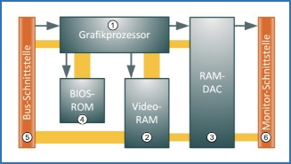

Der RAMDAC (Random Access Memory Digital/Analog Converter) ist ein Chip der auf der Grafikkarte für die Umwandlung von digitalen Videosignalen zu analogen Bildsignalen verantwortlich ist. Er wird nur benötigt wenn ein Monitor beispielsweise über VGA angeschlossen wird.

Der PCI-Express-Steckplatz, an dem 16 Lanes angeschlossen sind (PCIe x16), wird zur Anbindung der Grafikkarte verwendet. Dieser wird auch als PCI-Express for Graphics (PEG) bezeichnet. Mit PCIe 3.0 ergibt sich eine theoretische Übertragungsrate von 15,75GB/s.

### Monitorschnittstelle

#### VGA – Video Graphics Array

Die VGA-Buchse ist 15-Polig. VGA stellt neben den analogen Bildsignalen für die drei Farbauszüge Rot, Grün und Blau separate horizontale und vertikale Synchronsignale bereit, die den Monitor steuern. Außerdem kann dem PC über ein zusätzliches VGA-Signal mitgeteilt werden, ob ein Monitor angeschlossen ist. Auch der Betriebszustand des Monitors kann geändert werden.

##### DVI – Digital Visual Interface

DVI bietet die Möglichkeit, unter Umgehung des RAMDAC der Grafikkarte digitale Videosignale direkt an einen angeschlossenen Monitor zu übergeben. Ein Buchsentyp mit 5 zusätzlichen Kontakten kann auch die bisherigen Analogsignale ausgeben („digital and analog“).

Die von der kombinierten Buchse ausgegebenen Analogsignale entsprechen den bisherigen VESA-Standards ab VGA.

DVI beherrscht darüber hinaus Plug & Play und Hot-Plugging (Automatische Erkennung eines Bildschirms und Anschluss von Bildschirmen im laufenden Betrieb). Beide Versionen unterscheiden sich nicht in Form und Abmessungen. Digitale Monitore mit DVI-Stecker können folglich an beide Typen von DVI-Buchsen angeschlossen werden.

Eine mit 24 Kontakten versehene DVI-Buchse stellt ausschließlich Digitalsignale zur Verfügung („digital only“).

#### HDMI – High Definition Multimedia Interface

HDMI ist der Nachfolger von DVI Hier werden zusätzlich noch Audiosignale übertragen und der Kopierschutz HDCP hinzugefügt, der die Wiedergabe von HD-Inhalten auf dem Monitor zulässt. Praktischerweise ist HDMI auch rückwärtskompatibel, sodass man über einfache Adapter eine Verbindung zwischen Geräten mit DVI und HDMI herstellen kann.

#### HDMI-Buchse Typ A

In der Version 2.1 kann HDMI mit diversen Audio- und Videoformaten umgehen. Typ Breite x Höhe Pin Beschreibung.

A: Standard 15mm x 5,5mm 19 weit verbreiteter Standardstecker

B: Dual Link 21,3mm x 4,45mm 29 Dual-Link-fähig, nur im Profi-Bereich verbreitet

C: Mini 11,2mm x 3,2mm 19 per Adapter zu Typ A kompatibel

D: Micro 6,4mm x 2,8mm 19 noch kleiner als Micro-USB.

#### DisplayPort

Mit DisplayPort wurden die Bandbreiten und Geschwindigkeiten kontinuierlich erhöht, um neue Auflösungen wie 4K/8K zu ermöglichen.

Im Gegensatz zu HDMI überträgt DisplayPort keine Toninformationen.

#### Thunderbolt

Diese Schnittstelle ist der direkte Nachfolger von Mini DisplayPort. Sie ist mechanisch und elektrisch rückwartskompatibel mit Mini-DP.

Sie stellt nicht nur eine Videoverbindung dar, sondern überträgt Daten. Mit der Einführung von Thunderbolt 3 sind Übertragungen mit bis zu 40GBit/s über diesen Anschluss möglich. Intel nahm eine Steigerung auf 100GBit/s bis zum Jahr 2019 an. Damit steht Thunderbolt in direkter Konkurrenz zu USB 3.x, eSATA, FireWire, Gigabit-Ethernet und natürlich allen bisherigen digitalen Videoverbindungen. Intern kann Thunderbolt mit den Protokollen PCI Express oder DisplayPort arbeiten.

### Multiple Grafikausgabe

Sowohl der Multimonitorbetrieb mit mehreren Grafikkarten als auch Dual Head bzw. Multi Head mit einer einzelnen Karte müssen vom Betriebssystem und dem Grafikkartentreiber unterstützt werden. Dies ist bei Windows sowie Mac OS und Linux der Fall. Multi Head ist bei heutigen Grafikkarten Standard.

## Erweiterungssteckkarten
**Def:** Erweiterungskarten sind zusätzliche Komponenten, die dem PC weitere Funktionen zur Verfügung stellen

### Aufgaben von Erweiterungssteckkarten
Die Karten sind Platinen mit elektronischen Bauelementen, die in einem freien Steckplatz auf dem Mainboard platziert werden. Die Erweiterungsmöglichkeiten werden prinzipiell lediglich durch die Anzahl der verfügbaren Steckplätze -- und im Einzelfall durch die Leistung des verwendeten PC-Netzteils -- beschränkt. Erweiterungskarten bieten dem Anwender die Möglichkeit, sein PC-System genau dem gewünschten Funktionsbedarf anzupassen.

Zu den wichtigsten Aufgaben, die im PC von Erweiterungskarten wahrgenommen werden, gehören:
- die grafische Aus-/Eingabe über eine Grafikkarte
- eine Netzwerkanbindung über:
  - Netzwerkkarte
  - WLAN-Adapter
  - Modem oder ISDN-Karte
    - die Erzeugung und Ein-/Ausgabe von Audiosignalen mittels Soundkarte
    - die Anbindung weiterer Massenspeicher und Ausgabe-/Eingabegeräte über:
      - Controller für Laufwerke (SATA, IDE/PATA etc.)
      - Controller für externe Bussysteme (USB, FireWire etc.)

### Netzwerkkarten (NIC = Network Interface Card) (V;A)
#### Aufgaben der Netzwerkkarte
...werden benötigt, um PCs, Notebooks, Netzwerkspeicher oder Drucker an Netzwerke anzuschließen. Unter dem Begriff Netzwerk wird hier eine Gruppe von Computern verstanden, die untereinander verbunden sind und Ressourcen wie Daten, Programme oder Drucker gemeinsam nutzen.

Die Aufgabe einer Netzwerkkarte ist es, Datenpakete aus einem Netzwerk zu empfangen. zu senden und in ein für den PC interpretierbares Format umzuwandeln.
##### Fast Ethernet
Fast Ethernet bietet maximal 100 Megabit pro Sekunde Übertragungsgeschwindigkeit.

Der Anschluss erfolgt mittels Kategorie 5 Twisted-Pair-Kabel. Das sind einfache und kostengünstige Kabel, die über mehrere, jeweils miteinander verdrillte Leiterpaare verfügen.
##### Gigabit Ethernet
Mit Gigabit Ethernet ist es möglich, auf den gleichen Twisted-Pair-Kabeln wie bei Fast Ethernet Daten mit 1.000 Megabit per Sekunde (etwa 100 MB/s) im Vollduplex-Verfahren zu übertragen.

Erreicht wird dieser Geschwindigkeitszuwachs durch Nutzung aller Adern des Netzwerkkabels, während bei Fast Ethernet nur vier der acht Leitungen genutzt wurden.

Im Hinblick auf spätere Aufrüstungen sollte bei fest verlegten Kabeln CAT-6a oder CAT-7 in Betracht gezogen werden, die Mehrkosten im Vergleich zu den Gesamtkosten relativ gering sind.
##### 10 Gigabit Ethernet
Diese schnellen 10GE-Netzwerke benutzen Glasfaserleitungen und beim Standard 10GBASE-T bis 100 Meter auch herkömmliche Kupferkabel der Kategorie CAT-6a oder CAT-7.
##### WLAN -- drahtloses Netzwerk
Das WLAN (Wireless LAN) verbindet Computer in einem Netzwerk per Funk. Dabei geht die Verbindung normalerweise über einen zentralen WLAN Access Point (oft ein DSL-Router mit WLAN). Es kann aber auch eine direkte Verbindung zwischen zwei Geräten aufgebaut werden.

WLAN ist über USB, PCI oder PCIe nachrüstbar.

Durch die Übertragung per Funk kann die theoretische Übertragungsbandbreite auf maximal 600 Mbit/s ansteigen, aber in der Praxis bleiben davon häufig nur etwa 240 Mbit/s übrig.

Mit zunehmender Entfernung oder aufgrund von Störungen durch andere WLAN-Netze und Teilnehmer sowie bauliche Hindernisse nimmt die Übertragungsgeschwindigkeit stetig ab, bis sie schließlich ganz zusammenbricht. Wer auf eine stabile und zuverlässige Verbindung Wert legt, sollte Netzwerkkabel verwenden.
### Den PC mit dem Internet vebinden
Um sich mit dem Internet zu verbinden, werden externe Adapter (Erweiterungskarten, USB-Geräte etc.) oder PC-interne Komponenten eingesetzt, die analoge und digitale Telefonleitungen verwenden. Mögliche Verfahren dafür sind:
#### Modem
Steht nur ein normaler Telefonanschluss zur Verfügung, überträgt das
Modem Daten, indem es sie in (hörbare) Töne umsetzt (**Mo**dulation) und
diese zur Gegenstelle sendet. Auf der Empfängerseite werden die
empfangenen Töne wieder in digitale Informationen umgesetzt
(**Dem**odulation). Die erreichbaren Übertragungsgeschwindigkeiten sind
sehr gering. Im besten Fall werden 56 Kbit/s übertragen, also etwa 6
KB/s, fast immer ist es deutlich weniger.

Man unterscheidet zwischen Internen Modems (für PCI und PCIe) und
externen Modems (per USB an den PC angeschlossen)
#### ISDN-Karte (Integrated Services Digital Network
Mittlerweile benutzt man einen ISDN-Anschluss nur noch zur
Datenübertragung, wenn kein schnelleres Verfahren erhältlich ist.

Sprachsignale werden vor der Übertragung digitalisiert und auf der
Empfängerseite wieder in analoge Signale zurückgewandelt. Der besondere
Vorteil ist die gute Qualität der Sprachverbindung, ohne Rauschen und
Knacken. ISDN-Anschlüsse verfügen über 2 Kanäle mit jeweils 64 KB/s
Bandbreite. Beide Kanäle können zur Erhöhung der Bandbreite gebündelt
werden.
#### DSL (Digital Subscriber Line)
...beschreibt eine Technologie, bei der durch Nutzung eines
Frequenzbereichs oberhalb der analogen oder ISDN-Übertragung auf
herkömmlichen Telefonleitungen deutlich höhere Bandbreiten erreicht
werden.

#### ADSL (Asymmetric DSL)
Hierbei ist die Geschwindigkeit beim Empfang von Daten wesentlich höher
als beim Senden.

#### VDSL (Very High Speed DSL)
Verfügt über schnellere Datenübertragungsgeschwindigkeiten als ADSL.

#### SDSL (Symmetric DSL)
Verfügt über gleich schnelle Datenübertragungsgeschwindigkeiten in beide
Richtungen.

Heutzutage wurden DSL-Modems durch DSL-Router abgelöst, welche
DSL-Modem, Switch, Router und WLAN-Access Point in einem Gehäuse
vereinen

#### Internet über das Fernsehkabel
Eine Alternative zu DSL mit bis zu 500Mbit/s

#### Internet über Mobilfunk
##### 1.Generation (1G)
Verwenden noch eine analoge Sprachübertragung (A-C Netz).
Datenübertragungen waren noch nicht üblich.
##### 2. Generation (2G)
Mobilfunknetze der zweiten Generation verwenden die nachfolgenden
Standards:
- Global System for Mobile Communications (GSM)
  - findet über D- und E-Mobilfunknetze statt
- General Packet Radio Service (GPRS)
  - GPRS ist ein paketorientierter Übertragungsdienst mit einer Datenübertragungsrate von bis zu 55,6 kbit/s.
-  Enhanced Data Rates for GSM Evolution (EDGE)
   -  erweitert GPRS zu E-GPRS (Enhanced GPRS). Die Datenrate steigt auf bis zu 290,9 kbit/s.

##### 3. Generation (3G)
Die 3. Generation des mobilen Internets verwendet:

-   Universal Mobile Telecommunications System (UMTS) mit der
    Erweiterung High Speed Packet Access (HSPA)

-   Long Term Evolution (LTE) bis Cat 4

UMTS stellt die Basis für das mobile Internet dar. Die mobile
Datenübertragung wird unter dem Begriff HSPA (High Speed Packet Access)
zusammengefasst. Dieser Standard beinhaltet zwei separate Verfahren für
Upload (HS**U**PA) und Download (HS**D**PA).

Seit Generation 3.9 stand erstmalig auch Long Term Evolution (LTE) mit
150 Mbit/s und 50 Mbit/s im Upload zur Verfügung. Obwohl LTE, dem
Standard nach, höhere Geschwindigkeiten erreichen kann, wird LTE in
Deutschland gedrosselt betrieben. Im Gegensatz zu UMTS ermöglicht LTE
unterschiedliche Bandbreiten und eignet sich daher besser für den
zukünftigen Netzausbau.

##### 4. Generation (4G)
Hier kommen verbesserten LTE Technologien zum Einsatz:
- LTE Advanced (LTE-A)
    -   hebt theoretische Übertragungsgeschwindigkeiten auf 600 Mbit/s im Downstream und 75 Mbit/s im Upstream an.
- LTE Advanced Pro (LTE-AP)
  - verbessert den Downstream auf 1Gbit/s. Uploads können mit bis zu 500 Mbit/s durchgeführt werden.
##### 5. Generation (5G)
eine Weiterentwicklung des 4G-Netzes, erreichte nach Angaben der Telekom
eine Geschwindigkeit von 3Gbit/s und kann unter Idealumgebungen sogar
10Gbit/s erreichen

Trotz dieser enormen Geschwindigkeit geht es aber auch um weitere
Faktoren wie einer geringen Latenz, die für Echtzeitanwendungen (z. B.
autonomes Fahren/Kommunikation zwischen Maschinen) notwendig ist. 5G
benötigt allerdings eine dichtere Netzabdeckung mit mehr Sendestationen.
###### UMTS- und LTE-Endgeräte
Für den mobilen Einsatz und für Gebiete, in denen kein DSL verfügbar
ist, bietet sich die Datenübertragung über den Mobilfunkstandard UMTS
oder LTE an. Für die Datenübertragung wird ein Modem benötigt. Diese
sind in verschiedenen Bauformen erhältlich oder bereits im Computer als
Steckplatz vorhanden.

###### WLAN-Tethering
Hierbei arbeitet z.B ein Smartphone wie ein WLAN-Accesspoint, womit sich
der PC verbinden lässt und eine Internetverbindung entsteht

###### Internetzugang über Satellit
-   2-Wege-Satellitenverbindung hierbei handelt es sich um eine reine
    Satellitenverbindung mit Rückkanal über Satellit

-   1-Weg-Sattelitenverbindungen benutzen eine herkömmliche Technik wie
    UMTS, GRPS, ISDN oder analoge Modems für den Rückkanal. (Bis zu 50
    Mbit/s Download)

### Soundkarten (V;A)
Bei modernen PCs ist die Klangerzeugung bereits auf dem Mainboard
integriert, dennoch wird sie weiterhin oft als Soundkarte bezeichnet.

Wenn die digitalen Sounddaten jedoch im Computer decodiert und über die
analogen Ausgänge ausgegeben werden, entscheidet vor allem die Qualität
der verwendeten Digital/Analog-Wandler (DAC) über die Klangqualität.
#### Arbeitsweise von Soundkarten
Soundkarten der ersten Generationen waren einfache Schnittstellen
zwischen dem PC und extern angeschlossenen Lautsprechern bzw. einem
Kopfhörer. Sie dienten der Ausgabe akustischer Signale. In den
1990er-Jahren entwickelten sich PC-Audiokarten zu professionellen
Komponenten, die über folgende Funktionen verfügten:

-   Synthesizer zur Klangerzeugung
-   MIDI-Schnittstelle (über dem Gameport)
-   Analog/Digital-Konverter
-   Digital/Analog-Konverter

#### Synthesizer
| Verfahren | Beschreibung |
|:---------:|:-------------|
|FM-Synthese|**Frequenzmodulation**  Musikinstrumente werden durch die Überlagerung von mehreren Sinuswellen nachgeahmt.  Frequenz und Amplitude der Sinuswellen variieren.|
|Wavetable-Synthese|**Samples** Aufgezeichnete, im RAM gespeicherte Samples (Musterdateien) dienen als Ausgangsmaterial für die Klangerzeugung.|
|Physikalisches Modell|Klänge werden in einer Programmiersprache zusammengesetzt.|

Moderne Soundkarten und Onboard-Sound verwenden dafür seit Jahren
Software-Synthesizer. Damit wird die Klangqualität heutzutage am meisten
von der Qualität und dem Funktionsumfang der Treibersoftware
beeinflusst. Auf professionellen Soundkarten kommt weiterhin ein DSP
(digitaler Signalprozessor) zum Einsatz.

#### MIDI (Musical Instrument Digital Interface)
Ein in den 80er-Jahren entwickelter Standard für die Kopplung von
elektronischen Musikinstrumenten. Heutzutage wird es nur noch zu
Steuerungszwecken im Musikbereich eingesetzt.

#### Digital/Analog- und Analog/Digital-Konverter
Die Ausgabe von Klängen an einem Analogausgang der Soundkarte ist erst
möglich, nachdem digital gespeicherte Daten in analoge Audiosignale
umgewandelt wurden. Diese Aufgabe übernimmt der Digital/Analog-Konverter
(DA-Wandler, DAC) der Soundkarte. Die maximal erreichbare Qualität wird
dabei vom Format der digitalen Audiodateien bestimmt, genauer gesagt von
der Samplingrate (Abtastrate) in kHz und der Abtasttiefe (Auflösung,
Bittiefe oder Quantisierung) in Bit.

Umgekehrt müssen für eine digitale Aufnahme am PC alle eingehenden
Audiosignale im AD-Wandler digitalisiert werden. Dazu wird das
Audiosignal in bestimmten Zeitabständen gemessen. Die gemessenen Werte
werden in einen Bitwert umgerechnet, quantisiert und gespeichert. Die
Qualität dieses Samplings hängt von zwei Parametern ab: der
Sampling-Rate, also der Häufigkeit der Messung, und der Bittiefe, mit
der ein Sample quantisiert wird.

Durch S/PDIF, entweder über Koaxialkabel mit Cinch-Anschluss oder über
Lichtwellenleiter (TOSLINK), können digitale Audiosignale z. B. zu einer
Surroundanlage übertragen werden.

#### Surround-Sound
Fast alle PCs verfügen heute über mehrere farbige Anschlüsse, um sechs
oder mehr Lautsprecher anzuschließen. Im Fall eines 5.1-Surround-Sounds
werden über vier in den Raumecken und einen zentral vor dem Hörer
postierten Lautsprecher (Center) unterschiedliche Töne übertragen, um
einen räumlichen Klang zu erzeugen. Ein zusätzlicher Lautsprecher gibt
nur die tiefen Töne wieder (Subwoofer). Bei 7.1-Systemen werden zwei
weitere Frontlautsprecher eingefügt, bei 6.1 Systemen gibt es auch
hinten einen Center-Lautsprecher. Um räumliche Effekte auf
Surroundanlagen zu hören, müssen die Töne in einem digitalen
Surroundformat wie Dolby Digital (DD oder AC-3) oder DTS codiert sein.

#### Neue Audioformate DTS-HD, Dolby Digital Plus und Dolby TrueHD
Diese Audioformate sind auf Blu-ray Discs zu finden. Sie können digital
in unveränderter Form derzeit nur über HDMI ausgegeben werden. Bei einer
Ausgabe über S/PDIF muss das Format in Echtzeit in eines der älteren
Formate, z. B. DTS, konvertiert werden, da sonst die verfügbare
Bandbreite nicht ausreicht.

#### HDMI
Bei der Ausgabe über HDMI übernimmt die Grafikkarte auch die Funktion
einer Soundkarte, indem sie Bild und Ton über ein einziges Kabel zum
Fernseher oder Verstärker schickt.

### Controller (V)
Mit Hilfe von Controller Steckkarten, kann man fehlende Funktionen in
Ihrem PC nachrüsten. Es existiert eine breite Palette von einbaubaren
Controller für unterschiedliche Bus-Systeme

#### RAID-Controller (**R**edundant **A**rray of **I**ndependent **D**isks)
Insbesondere in leistungsfähigen PC-Workstations und Servern sind
oftmals RAID Controller im Einsatz. Dies ist insbesondere der Fall, wenn
die internen Anschlüsse für Datenspeicher nicht ausreichen oder ein
OnboardController nicht die benötigte Funktionalität bzw.
Leistungsfähigkeit bietet.

RAID-Systeme fassen mehrere einzelne Festplatten zu einem größeren
Verbund zusammen. Dabei sind verschiedene Verfahrensweisen möglich, die
als RAID-Level bezeichnet werden.

RAID-Controller gibt es für alle erhältlichen Festplattentypen

#### PCI Express SSDs
PCIe Controller zur Aufnahme von Solid State Disks oder M.2 Disks, die
direkt in den PCIe-Slot gesteckt werden können. Diese sind selbst unter
PCIe 2.0 zum Teil deutlich schneller als SATA-SSDs, da z. B ein
PCIe-x4-Steckplatz wesentlich höhere Transferraten zulässt als ein
SATA-Anschluss.

#### SATA-Controller
Falls die SATA-Anschlüsse auf dem Mainboard nicht ausreichen, kann man
einen SATA-Controller für PCIe-Slots verwenden.

#### IDE-(PATA)-Controller
Seit einiger Zeit ist auf Mainboards keine IDE-Schnittstelle mehr zu
finden. Falls man unbedingt solche Geräte anschließen möchte, kann man
mit IDE-Controllerkarten Abhilfe schaffen

#### SCSI/SAS-Controller (**S**erial **A**ttached **S**CSI)
Ausschließlicher Einsatz im Professionellen Serverbereich, woran auch
SATA-Geräte betrieben werden können

#### Controller für Bussysteme
Sind zur Aufrüstung von zusätzlichen USB- oder FireWire Schnittstellen
vorgesehen

#### USB-3.x-Controller
Die dritte USB-Generation ist mit ihren hohen Übertragungsraten viel zu
schnell für den alten PCI-Bus, daher gibt es keine USB-3.0-Karten für
den PCI-Slot. Erhältlich sind diese jedoch als PCIe-Karten. Diese sind
oft als Kombi-Karten mit eSATA oder FireWire ausgelegt.

#### eSATA-Controller
Bei eSATA handelt es sich um eine Erweiterung der SATA-Schnittstelle für
externe Datenträger. Die Buchsen sind nicht kompatibel zu den internen
SATA-Anschlüssen, es sind jedoch Adapter erhältlich. Als Alternative
kann auch ein Slotblech eingesetzt werden, das normale interne
SATA-Anschlüsse nach außen führt.

## Externe Schnittstelle

Im Allgemeinen ist eine Schnittstelle ein Übergabepunkt, an dem eine Verbindung zwischen zwei eigenständigen Komponenten hergestellt wird. Standardisierte Schnittstellen gibt es sowohl als Software als auch als Hardware, um bestimmte Geräte miteinander zu verbinden. Zu den ausgedienten, etablierten Schnittstellen zählen die seriellen Schnittstellen (RS232), der Parallel-Port (IEEE-1284) und die PS/2 Anschlüsse, welche heutzutage immer noch aus Kompatibilitätsgründen verbaut werden.

### PS/2 (Eingabe)

Der PS/2 Anschlüsse wurden mit der Einführung von ATX Mainboards zum
Anschluss von Tastatur und Maus von IBM bei der Personal-System-Reihe/ 2-Reihe
eingesetzt. Auf dem neuen Mainboard ist, wenn überhaupt, nur noch ein Kombi-
Anschluss verbaut, aber zum größten Teil komplett weggelassen.

Um die Abwärtskompatibilität zu gewährleisten, lassen sich PS/2 Geräte
über einen Adapter mit USB betreiben, wenn das Gerät beide Protokolle
unterstützt.

Lila steht normalerweise für die Tastatur und grün für die Maus

### USB (Ein- und Ausgabe)

Der “Universal Serial Bus” ist der am meisten verwendete Anschluss für externe Geräte. USB ist um ein wesentliches leistungsfähiger als die alte RS232 Schnittstelle und wird von allen aktuellen Betriebssystemen unterstützt. USB-Datenträger eignen sich daher gut für den Datenaustausch zwischen mehreren Geräten, da inzwischen viele Geräte eine USB-Verbindung besitzen. USB unterstützt bis zu 127 Geräte gleichzeitig, die alle eine eigene Geräte ID haben, dies ermöglicht die Verwendung von USB-Hubs, die mehrere Stecker besitzen und alle von einem Host verwaltet werden können.

#### USB 1.X

Das USB 1.0 kam 1996 auf den Markt und wurde 1998 mit USB 1.1 1998 überarbeitet. USB gab es in zwei Varianten, Low und Full- Speed mit jeweils 1,5 MBits und 12MBits desweiteren beherrst USB Plug and Play und Hot Swap

#### USB 2.0

USB 2.0 ist abwärtskompatibel zu USB 1.1 und bietet eine Datentransferrate von maximal 480 MBits. USB 2.0 findet sich auf fast jedem aktuellen Mainboard wieder. Falls dies nicht der Fall ist kann man PCi Erweiterungskarten benutzen

#### USB 3.0 (SuperSpeed)

2010 wurden erstmals Geräte mit USB 3.0 veröffentlicht, auch dieser Standard ist mit vorherigen Versionen kompatibel, weist in der ersten Version aber schon eine deutlich höhere Geschwindigkeit von 5 Gbit/s auf.

Im Laufe der Zeit wurden mehrere Abwandlungen der Spezifikation entwickelt wobei es häufig auch zu Umbenennungen kam, alle USB Versionen sind zur besseren Übersicht in einer Tabelle dargestellt:

#### USB 4

USB 4 basiert auf dem von Intel zur Verfügung gestellten Thunderbolt 3 Protokoll und kann ausschließlich mit Type-C Steckern genutzt werden. Dank Thunderbolt enthält USB 4 nun standardmäßig DisplayPort und PCIe. Vorherige Versionen wurden optional mit Displayport ausgestattet.

Die Geschwindigkeiten reichen von mindestens 20 Gbit/s bis 80 Gbit/s bei Version 2.

#### USB Kabel

In USB 1.x und 2.0 werden 4 sogenannte “Adern” (Kabel) verwendet. Zwei dienen der Datenübertragung und die anderen zwei der Stromleitung. Die Abschirmung des Kabels kann auch für verschiedene erwartete Datenübertragungsraten variieren.

Der Maximalstrom beträgt 2,5W (5V * 500mA) für 1.x und 2.0. Bei 3.0 wurde dieser auf 4,5W (5V*900mA) gesteigert , mit dem sich Festplatten auch nur mit einem Kabel betreiben und lesen lassen.

Mit USB “PowerDelivery” wurde ein neuer Standard vorgestellt, der mehr Energie zur Verfügung stellen kann. Es gibt zwei verschiedene Stufen, welche beide einen Type-C Stecker voraussetzen: Standard Power Range (SPR) stellt bis zu 100W zur Verfügung, während die "Extended Power Range” (EPR) bei 240W liegt.

#### USB Stecker

Die zwei ersten USB Stecker waren die Typen A und B.

Typ A wird heute noch weit verbreitet genutzt und ist als Host Konnektor gedacht. 1.x und 2.0 haben 4 Adern und 3.x hat 9, jedoch mit Abwärtskompatibilität. Der Typ B hingegen dient als “Slave” Stecker und wird an Peripheriegeräte angesteckt (Hauptsächlich Festplatten und bis heute noch Drucker). Diesen gibt es jedoch in der USB 1.x und 2.0 Version sowie in einer abgewandelten 3.0 Version, die jeweils nicht kompatibel miteinander sind.

Hinzu kommen weitere Client-Stecker, wie Mini-USB und Micro USB und später der aktuelle Type-C Stecker, die für kleinere oder mobile Endgeräte gedacht sind.

#### USB Hubs

Es gibt aktive und passive USB-Hubs. Aktive Hubs versorgen oft mobile Endgeräte und dienen zugleich als Schnittstelle für Datentransfer von Daten und Video Signal. Dies ist praktisch, um zum Beispiel einen Laptop zu laden und zugleich die Anschlüsse zu vervielfältigen. Passive Hubs sind hingegen einfacher und dienen nur als Vervielfältigung der USB Anschlüsse.

### Thunderbolt (Ein- und Ausgabe)

Thunderbolt entstand als Kollaboration zwischen Intel und Apple und wurde 2011 vorgestellt. Mittlerweile hat der Standard auch in Windows Notebooks von Intel seinen Platz gefunden. Der Standard überträgt USB, PCI-E, Ethernet sowie Displayport-Signale über ein Kabel.

Thunderbolt 1 überträgt 10 Gbit/s, Thunderbolt 2 schafft 20 Gbit/s und Thunderbolt 3 erreicht 40Gbit/s an Throughput.

Thunderbolt 1 & 2 benutzen einen eigens entwickelten Stecker, jedoch wurde mit der dritten Generation auf einen USB-C Stecker gewechselt.

Ein Thunderbolt Kabel mit Kupferkabeln kann maximal 3 Meter lang sein, jedoch kann dies mit Glasfaser deutlich verlängert werden (jedoch mit entsprechend hohen Preisen.

### eSATA (Ein- und Ausgabe)

Der einzige Unterschied besteht im Geschirmten Kabel, zudem hält eine größere mechanische Belastung aus, die beim An und Aus stecken auftreten können. Je nach SATA Controller können Daten mit Geschwindigkeiten von 150 MB/s bis 600 MB/s übertragen werden.

Die SATA Verbindung ist theoretisch Hot-Plug-fähig, dies hat in der Praxis aber nur halbwegs funktioniert.

eSATA liefert keinen Strom, man benötigt also einen zusätzlichen Anschluss für die Stromversorgung.

Insgesamt konnte sich eSATA nicht durchsetzen

### FireWire (Ein- und Ausgabe)

Die FireWire Schnittstelle wurde 1995 von Apple eingeführt, an das serielle Bussystem können bis zu 63 Geräte angeschlossen werden. Der Vorteil von FireWire ist die OpenHCI-Schnittstelle. Verbundene Geräte können Daten untereinander austauschen. FireWire ist zudem HotPlug-fähig und wird in erster Linie zur Verbindung von digitaler Unterhaltungselektronik verwendet. 

Die Datenübertragungsrate reicht von 400 MBits bei FireWire 400 bis 800 MBits bei FireWire 800. Die letzten Apple Produkte mit FireWire kamen 2011 auf den Markt.

## Massenspeicher

### Einteilung von Speichermedien

In der IT unterscheiden wir zwischen drei Speicherarten.

|Name | Beschreibung |
|:----|:-------------|
| Online-Speicher | Online-Speicher sind einerseits RAM-, Kern- oder Arbeitsspeicher eines Rechners,  andererseits Festplatten oder auch externe Medien, die fest verbunden sind (z. B. ein initialisierter USB-Stick).  Diese Speicher sind während der Datenverarbeitung ständig aktiv (online) und speichern sofort wieder benötigte Daten.  Sie bieten deshalb die kürzeste Zugriffszeit.  Beispiel: Festplatten, USB-Sticks, Disketten. |
| Nearline-Speicher | Hier werden Daten gespeichert,  die immer wieder gebraucht werden,  aber nicht durchgehen und nicht im Moment. |
| Offline-Speicher  | Ein Offline-Speicher ist meist nicht fest im eigentlichen System integriert. Er enthält Daten, die nur selten benötigt werden,  wie z.B. ein Backup. Beispiele: Externe Festplatten, DVD/CDs  |

Speichermedien unterscheiden sich bezüglich Ihrer:

- Speicherkapazität

- Lese-/Schreibgeschwindigkeit

- Datenhaltbarkeit

- Datensicherheit

### Flash-Speichermedien

Flash-Speicher sind nicht flüchtige Speicher auf Halbleiterbasis (ohne eigene Stromversorgung) und ohne mechanische Bauelemente. Obwohl keine eigene Stromversorgung benötigt wird, können hohe Speicherkapazitäten erreicht werden.
Beispiele: USB-Sticks und SD-Karten.

### Festplattenlaufwerke

Definition:
Ein Speichermedium, welches Daten zuverlässig und mit hoher Verfügbarkeit (Abrufbarkeit) speichert.
Aufbau und Funktion:
HDD (Hard Disk Drive)
Bestandteile:

1. Speichermedium (Disk, Platte) 

2. Spindel

3. Beweglicher Plattenarm

4. Lese-/Schreibköpfe

5. Schnittstelle (z.B. SCSI)

6. Stromversorgung

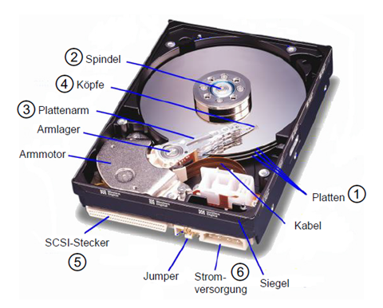

Festplatten bestehen aus mindestens einem scheibenförmigen Speichermedium (Disk, Platte 1), das im Betrieb um eine Achse (Spindel 2) rotiert. An einem beweglich gelagerten Plattenarm (3) sind Schreib-/Leseköpfe (4) angebracht, die auf einem Luftpolster über die Plattenoberfläche gleiten. Die Schreib-/Leseköpfe magnetisieren die Plattenoberfläche und speichern so Daten darauf ab, die später wieder ausgelesen werden können.
Die Köpfe sind über ein flexibles Kabel mit einer elektronischen Baugruppe verbunden, die aus den Signalen der Köpfe Daten zurückgewinnt und an einer Schnittstelle (5) dem Computer zur Verfügung stellt. Ein zweiter Stecker stellt die Verbindung zur Stromversorgung des Computers her (6).

Aufteilung der Plattenoberfläche und Speicherkapazität
Um Daten auf einer Festplatte anordnen und lokalisieren zu können wird die Plattenoberfläche auf folgende Weise unterteilt:

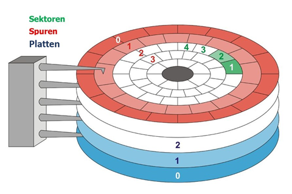

Jede Platte hat einen eigenen Arm mit Schreib- /Leseköpfen.
Diese tasten die **Plattenoberfläche** nach
magnetisierten Daten ab, oder fügen neue hinzu. Dabei fährt jeder Arm auf
seiner Platte feste kreisförmige **Spuren** ab.
Jede Spur ist unterteilt in einzelne Sektoren. Ein Sektor kann 512 Byte an
Daten speichern. Die Spuren der verschiedenen Platten liegen übereinander und
werden daher in Zylindern zusammengefasst. Alle Spuren eines Zylinders können
gleichzeitig gelesen oder beschrieben werden.

Eigenschaften von Festplatten
Die Leistungsfähigkeit von Festplatten wird unter anderem an folgenden Kriterien festgemacht:

| Name | Beschreibung |
|:-----|:-------------|
| Umdrehungs-Geschwindigkeit | Gibt die Umdrehungen in der min an. Je höher die Umdrehungszahl,  desto schneller ist der Datentransferrate und auch die Lautstärke. z.B. 4200,5400,7200, 10000 und 15000 U/min |
| Cache-Kapazität | Kleiner Zwischenspeicher vor und nach dem Zugriff auf die Festplatte,  der den Datentransfer optimiert.  Die Kapazitäten liegen zwischen 512 KB und 256 MB.  Ein größerer Cache bietet schnellere Transferraten. |
| Average Seek Time | Die Average Seek time gibt die Durchschnittszeit in Millisekunden an,  die der Arm benötigt um sich in Position zu bewegen.  Beispielsweise brauchen moderne Festplatten zwischen 3 und 12 ms. |
| Schnittstellentyp | SCSI, SAS (Serial Attached SCSI), SATA (Serial-ATA),  FireWire (IEEE 1394), USB |

**Für die Auswahl einer Festplatte ist der geplante Einsatz ausschlaggebend:**

Für Büroanwendungen braucht man nicht die schnellste
Festplatte, sondern eher etwas Leiseres, da sehr viel auf das Medium
zugegriffen werden muss.

Bildbearbeitung und Videoschnitt, brauchen sehr viel
Speicher. Daher lohnt es sich hier eher eine Leistungsstärkere Festplatte zu
kaufen.

Für Serversysteme die im
Dauerbetrieb laufen wird empfohlen auf
Enterprise-Modelle zu setzen um die MTBF (Mean Time Between Failures) so lang
wie möglich zu halten.

Serial Attached SCSI

SAS = Serial Attached SCSI (DE: Seriell angeschlossen
SCSI)

SAS ist die nächste Generation von SCSI.

SAS wurden hauptsächlich in Servern oder
Netzwerkspeichersystemen eingesetzt

### Solid State Drive (SSD)

Im Vergleich zu einer HDD-Festplatte, werden die Daten
auf einem SDD in Speicherblöcken (Flash-Array) abgelegt.

Vorteile:

Schnellere Zugriffszeiten (Transferraten)

Geringerer Stromverbrauch

Keine Geräuschentwicklung

Kaum Anfälligkeit gegenüber Erschütterungen

Nachteile:

Kurze Lebensdauer ist je nach Nutzung

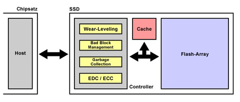

Speichervorgang:

Beim Speichern einer neuen Datei in einem Zellenblock,
wird zuerst der gesamte Zellenblock gelöscht und dann komplett neu beschrieben.

Wear-Leveling:

Der Flash-Controller verteilt die Daten gleichmäßig über
die freien Speicherblöcke im Flash Array.

Das steigert die Lebenserwartung des SSD.

Bad Block Management:

Das Bad Block / Defect Management überwacht die
Speicherzellen auf Abnutzung. Wird eine Speicherzelle zu stark abgenutzt und
droht auszufallen, wird der ganze Zellenblock gesperrt und durch einen
Zellenblock aus der Reserve ersetzt. Die Reserve-Kapazitäten reichen von 2-7%
der Gesamtspeicherkapazität.

Durch das Bad Block Management verliert ein SSD auch nach
Jahren unter großer Beanspruchung keine Speicherkapazität.

Error Correction Code / Error Detection Code:

Bei ECC und EDC geht es um das Erkennen und die Korrektur
von Bitfehlern. Je häufiger eine Speicherzelle genutzt wird, desto öfter treten
Bitfehler auf. Bitfehler können zu Datenverlust oder inkonsistenten Daten
führen.

Garbage Collection:

Hinter Garbage Collection steckt ein Hintergrundprozess,
der vom Betriebssystem mit dem TRIM-Befehl angestoßen wird. Da beim Löschen
einer Datei nur der Name im Dateisystem gelöscht wird und die eigentlichen
Informationen in den Speicherzellen erhalten bleiben, kann das Betriebssystem
nicht geleerte Speicherzellen prüfen und leeren lassen.

**Hybride Festplatten:**

Ist eine Mischung einer klassischen HDD (Hard Disk Drive)
und einer SSD (Solid State Drive). Sie werden auch SSHD genannt. Sie haben
durch die HDD eine hohe Speicherkapazität und wegen der SSD einen schnellen
Zwischenspeicher für oft verwendete Dateien.

Steckkarten auf PCIe Basis:

Das sind SSDs, die per PCIe an die CPU angebunden sind,
was eine deutlich höhere Geschwindigkeit erlaubt, als die durch SATA eingeschränkten
SSDs.

**M.2 SSDs:**

M.2 SSDs sind PCIe gebundene SSDs, die mit aktuelleren
PCIe Versionen (PCIe 3.0 oder höher) laufen und dadurch noch schneller sind.
Bei PCIe 3.0 können dadurch sogar Übertragungsgeschwindigkeiten von bis zu 32
GBit/s möglich sein. Intel hat 2012 Next Generation Form Factor (NGFF)
vorgestellt, was Steckkarten auf PCIe Basis war, die aber kleiner waren und
auch in Notebooks passten. NGFF wurde dann in M.2 umbenannt. Alle M.2 SSDs sind
22 mm breit und können eine Länge von 30, 42, 60, 80 oder 110 mm aufweisen.
Eine M.2 SSD mit der Bezeichnung 2260 ist demnach 22 mm  
breit und 60 mm lang. Es gibt verschiedene Kodierungen, die bei der Wahl einer
M.2 SSD eine große Rolle spielen. Die Kodierung des M.2 Moduls, sorgt dafür,
dass nur passende Module mit dem 75 poligen Anschluss verbunden werden können.
Gebräuchlich sind die Kodierungen B, M und B+M.

| Anbindung                      | SATA 3    | PCIe 2.0 x2 | PCIe 2.0 x4 | PCIe 3.0 x2 | PCIe 3.0 x4 |
| ------------------------------ | --------- | ----------- | ----------- | ----------- | ----------- |
| Theoritische Geschwindigkeit   | 6 GBit/s  | 10 Gbit/s   | 20 GBit/s   | 16 GBit/s   | 32 GBit/s   |
| Geschwindigkeit inkl. Overhead | ~550 MB/s | ~800 MB/s   | ~1600 MB/s  | ~1600 MB/s  | ~3200 MB/s  |

**Serial ATA:**

SATA ist ein heute nicht mehr ganz neuer Standard, der
die IDE- Schnittstelle abgelöst hat.

SATA wird verwendet um Festplatten und SSDs an das
Mainboard anzuschließen.

Es sind mit SATA3 Datentransferraten bis zu 6 GB/s
möglich. SATA-Festplatten sind verhältnismäßig günstig und werden deshalb oft
neben einer SSD für das Betriebsystem als Massenspeicher verwendet.

**Externe Festplatten:**

Externe Festplatten mit USB-Anschluss eignen sich als
mobile Datenträger und haben eine deutlich höhere Kapazität als
Flash-Speichermedien. Parallel dazu gab es solche Festplatten auch mit dem
FireWire-Anschluss, der sich gegen USB jedoch nicht durchsetzen konnte und
zunehmend vom Markt verschwindet.

### Raid Systeme

Der Aufbau von einem RAID-Systeme

Obwohl einzelne Festplatten mit z.B. 6 TB oder mehr
ausreichend Speicherplatz für leistungsfähige PC-Systeme bieten, bleiben
bestehen:

2. Der Defekt von Festplatten kann das ganze System beschädigen.

3. Die Datentransferrate ist auf die Leistung einer einzelnen Platte beschränkt.

Für diese Probleme gibt es RAID-Systeme. RAIDs ist eine
Einheit die aus mehreren Festplatten besteht.  Die Festplatten sind zu einem gemeinsamen Massenspeicher verbunden.

RAID = Redundant Arras of Independent (Inexpensive) Disks

Ein RAID-System besteht aus mehreren baugleichen
Festplatten. Außerdem gibt es im RAID auch noch einen Controller der alles
steuert. Den gibt es einmal als Hardware Komponente auf dem Mainboard oder als
Erweiterungskarte aber es gibt ihn auch als Software z.B. in  dem Betriebssystem.

Raids können in RAID-Level unterschieden werden die von
deinem Ziel abhängig sind wenn du z.B. ein RAID haben willst das auf hohe
Performance optimiert läuft brauchst du ein bestimmtes RAID-Level:

|Name|Bezeichnung|
|:--:|:----------|
| RAID 0 | Die zu speichernde Daten werden über mehrere Festplatten verteilt.  Das ermöglicht eine höhere Datentransverrate da,  Daten gleichzeitig geschrieben und gelesen werden können.  Bezeichnung: Disk Striping                                |
| RAID 1 | Die Daten werden einmal als Original gespeichert  und eine Kopie auf einer externen Festplatte gespeichert.  Wenn eine Platte defekt ist gibt es immer noch Kopie auf der anderen Festplatte. Wird auch Spiegelung oder Mirroring genannt.|
| RAID 5 | Funktioniert wie RAID 0 nur das zusätzlich werden beim Schreiben  der Daten zur Fehlerkorrektur berechnet und ebenfalls auf alle Festplatten verteilt.  Be einem Ausfall kann man fehlende Daten mit Strip Sets mit Parity rekonstruieren.|
| RAID 10 | Dieser RAID-Level spiegelt zwei RAID 0 Strips (auch RAID 0+1).  Er bietet so die gleiche Performance wie ein Strip Set  und paart sie mit der Ausfallsicherheit vin Spiegelsätzen. |

Vorteile

- Unterschiedliche RAID Level

- Meistens Bessere Datenübertragung

- Hohe Sicherheit

Nachteile

Kann davon abhängig sein das auch mal die
Schreibgeschwindigkeit bei RAID 1 langsamer ist da es gleichzeitig gleichgroße
Dateien geschrieben wird.

### Optische Medien

Optische Speichermedien:

| Bezeichnung | Ausgescrieben          | Max. Layer        | Speicherkapazität |
| ----------- | ---------------------- | ----------------- | ----------------- |
| CD          | Compact-Disk           | 1 Layer           | Max. 900MB        |
| DVD         | Digital Versatile Disk | 2 Layer           | Max. 17GB         |
| BD (BDXL)   | Blu-ray disk           | 2 Layer (4 Layer) | Max. 50GB (128GB) |

Speichervorgang:

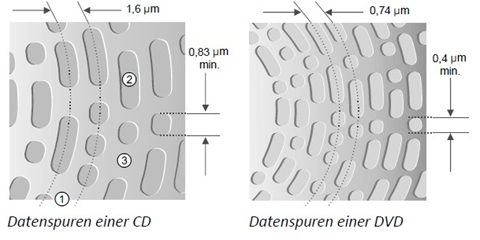

Die gestrichelten Linien (1) entsprechen dem Abtastungsweg, den der Lesekopf des Laufwerks auf der CD nimmt. Die Einbuchtungen auf der Oberfläche stellen die sogenannten Pits (2) dar, während der Rest als Lands (3) bezeichnet wird.
In der Anordnung und Reihenfolge der Pits und Lands wird die zu speichernde Information codiert.
Bei allen drei Medien, wird ein Laser-Lesekopf verwendet, um Daten zu lesen oder zu schreiben.

## Ein- und Ausgabegeräte **Fehlt**
